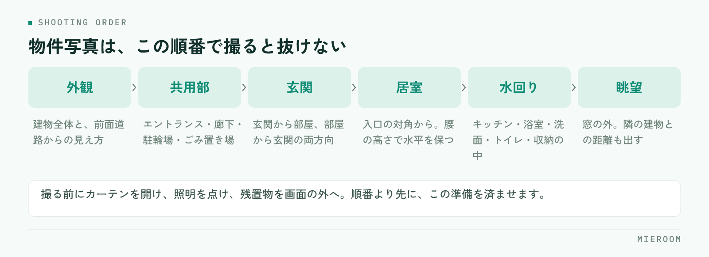

<!--META
{
  "title": "賃貸物件の写真の撮り方｜反響が変わる撮影の順番とNG",
  "date": "2026-09-24",
  "category": "集客・広告",
  "excerpt": "賃貸物件の写真は、撮る前の準備と撮る順番を決めるだけで、担当者が変わっても質が揃います。部屋別のコツ、媒体ごとの枚数と並べ方、やってはいけない加工、撮影を店舗の作業として回す方法までまとめました。",
  "hook": "撮る順番を決めれば、写真の質は担当者で揃う",
  "tags": ["物件写真", "撮影", "ポータル掲載", "反響", "賃貸仲介"]
}
META-->

賃貸物件の写真の撮り方で結果を分けるのは、カメラの性能ではありません。**撮る前の準備と、撮る順番を店舗で決めてあるかどうか**です。同じ部屋でも、担当者によって写真の出来が大きく変わる店舗は、機材ではなく手順が揃っていないだけということがよくあります。

<h4>この記事の結論</h4>
物件写真は、<strong>部屋の入口の対角から、明るい時間帯に、広角で高さを一定にして撮る</strong>のが基本です。そのうえで撮る順番を固定すれば、誰が行っても抜けのない枚数が揃います。加工で明るさを足しすぎると、内見時の落差につながるので注意してください。

## 写真が決めているのは、問い合わせの前の数秒

ポータルサイトの一覧を見る人は、まず写真を見ます。間取りと家賃で絞り込んだ後に並ぶ物件は、条件がほとんど同じです。そこから開く1件を選ぶ判断材料は、最初に表示される1枚になります。

紹介文をどれだけ丁寧に書いても、写真で通り過ぎられれば読まれません。逆に、写真で「ここを見てみたい」と思わせられれば、その後の文章が効いてきます。**写真は集客の入口であり、文章より先に判断されている**という順番を押さえておいてください。

暗い、狭く見える、何の部屋か分からない。この3つのどれかに当てはまる写真が1枚目になっている物件は、条件が良くても埋もれます。まずは自店の掲載を一覧表示で眺め、他社の並びの中で自社の物件が沈んでいないかを確認するところから始めてください。

## 撮る前に、部屋を整える

撮影の良し悪しは、シャッターを切る前におおむね決まっています。現地に着いたら、次の順で整えます。

- カーテンとブラインドをすべて開ける。外の光を最大限に入れます
- 部屋の照明をすべて点ける。昼間でも点けます。天井照明がない部屋は、その旨を紹介文に書く材料になります
- 前の入居者の残置物、清掃道具、脚立、自分の荷物を画面の外に出す
- トイレのふたを閉める。浴室の排水口のふたや洗面台の物を片付ける
- 鏡やガラスに自分が映り込む位置を確認しておく
- 窓や鏡の汚れ、床の細かなごみを落とす。撮影後に気づいても直せません

**時間帯を選べるなら、その部屋の窓が明るい時間に行きます**。南向きなら日中、北向きなら光がまわる正午前後です。雨の日や夕方に撮った写真は、後から加工で持ち上げても不自然になります。撮り直しが難しい遠方の物件ほど、この判断が効きます。

## 撮る順番を固定する

順番を決めておくと、担当者が変わっても同じ構成の写真が揃います。現地での迷いも減ります。

<figure class="fig"><figcaption>内見で案内する順番とほぼ同じです。1枚目に出す写真だけは、物件ごとに選び直します。</figcaption></figure>

この流れは、内見で案内するときの順番とほぼ同じです。見る人は、写真を上から順にたどることで、実際に歩いたときの感覚をつかめます。

1枚目に何を持ってくるかは、物件によって変えてください。築浅でリビングが広い物件なら居室の全景、外観がきれいな物件なら外観、設備に特徴があるならその設備です。**1枚目は「一番強い1枚」を選び直す**という作業を、掲載のたびに必ず入れます。

## 部屋ごとの撮り方のコツ

部屋の種類ごとに、押さえる位置が決まっています。

- **居室**：入口の対角の隅に立ち、部屋の奥へ向けて撮ります。壁の隅が画面の端に入る位置です。天井と床が両方入る高さにすると、広さが伝わります
- **キッチン**：作業台の面が見える角度で。シンクとコンロの位置関係が分かるように撮ります。上部の収納も入れると使い勝手が伝わります
- **浴室・洗面**：ドアの外から撮ると全体が入ります。鏡に自分が映らない立ち位置を先に確認してください
- **玄関**：玄関から部屋を見た方向と、部屋から玄関を見た方向の両方。収納の扉は開けた状態も1枚
- **収納**：扉を開けて中を撮ります。奥行きが分かるよう、正面ではなく少し斜めから
- **窓からの眺望**：窓の外を撮ります。隣の建物が近い場合も含め、実際の見え方を出します

共通して効くのは、**カメラの高さを腰の位置あたりに固定し、水平を保つ**ことです。高い位置から見下ろすと床ばかりが写り、狭く見えます。スマートフォンのグリッド表示を出して、壁の縦線がまっすぐになるように構えてください。広角で撮ると広く写りますが、端に寄せた被写体が歪みます。歪みが目立つ場合は、少し引いて撮ります。

## 枚数と並べ方を、媒体ごとに決める

撮った写真をすべて同じ順で流し込むと、媒体ごとの見え方に合いません。

| 掲載先 | 重視すること | 並べ方 |
|--------|------------|--------|
| ポータルサイト | 一覧での1枚目 | 強い1枚→居室→水回り→外観 |
| 自社サイト | 物件の理解 | 外観→共用部→動線の順に通しで |
| 業者間サイト | 条件の確認 | 間取り図と設備が分かる写真を優先 |

枚数は、掲載できる上限まで出すより、**同じ部屋の似た写真を並べない**ことのほうが大事です。同じ居室を角度違いで4枚並べるより、居室・キッチン・浴室・収納・眺望と種類を散らすほうが、判断材料が増えます。

写真に加えて間取り図があると、位置関係が一気に伝わります。間取り図の作成と掲載は、写真とセットで運用を決めておくと抜けがなくなります。

## やってはいけない加工と、表示のきまり

明るさやゆがみの軽い補正は問題ありません。ただし、**現況と違って見える加工は表示のきまりに触れます**。

- 実際より明るく加工しすぎる。内見時の落差が大きくなり、決定率が落ちます
- 家具を合成する。イメージであることが分からない形での掲載は避けます
- 隣接する建物や電柱を消す。眺望や日当たりの判断を誤らせます
- 別の部屋・別の号室の写真を流用する。階数や向きで見え方は変わります
- 空室になる前の入居中の写真を、現況として使い続ける

!撮影時期が古い写真にも注意

数年前に撮った写真をそのまま使い続けていると、設備の入れ替えや外壁の改修で現況と食い違うことがあります。掲載を再開するタイミングで、写真が現状と合っているかを確認してください。成約済み物件の掲載を下げる手順とあわせて、担当と時期を決めておくと抜けません。

事実を隠さないほうが、結果的に問い合わせの質が上がります。線路沿い、前面道路が狭い、隣の建物が近い。こうした条件は写真に写る形で出しておけば、許容できる人だけが問い合わせてきます。

## 撮影を、店舗の作業として回す

写真の質が担当者で揃わないのは、撮影が個人の裁量になっているからです。作業として組み込めば安定します。

✓回すための4つの決めごと

撮影のチェックリストを1枚作る／撮る順番と枚数の下限を決める／撮った写真の保存場所と命名を統一する／掲載から一定期間反響のない物件は1枚目を差し替える。この4つが決まっていれば、機材を揃えなくても質は上がります。

差し替えの判断には、どの物件のどの掲載から反響が来ているかの記録が要ります。記録がないと、写真を直した効果が分からず、見直しが続きません。媒体ごとの見方は[媒体別ROI](./media-roi.html)に、反響の数え方は[反響管理の方法](./hankyo-kanri-hoho.html)に整理しています。

撮影の担当を決めるときは、写真が上手い人ではなく、**手順どおりに漏れなく回せる人**を選んでください。チェックリストがあれば、経験の浅いスタッフでも一定の質に届きます。

スマートフォンのカメラでも大丈夫ですか？

十分です。近年の機種は広角で明るく撮れます。むしろ効くのは、カーテンを開ける・照明を点ける・水平を保つ・明るい時間に行くという撮影前の条件です。機材を買い替える前に、この4つを徹底してください。

空室ではなく入居中の物件はどう撮りますか？

入居者の私物が写らない角度に限られるため、撮れる範囲が狭くなります。無理に室内を撮るより、外観・共用部・同じ間取りの別号室（別号室である旨を明記）と間取り図で補い、空室になった時点で撮り直す前提にしておくのが現実的です。

写真は何枚くらい載せるべきですか？

媒体の上限まで埋めることを目標にせず、種類を散らして揃えることを目標にしてください。居室・キッチン・浴室・洗面・トイレ・収納・玄関・外観・共用部・眺望。この種類が一通りあれば、枚数そのものは多くなくても判断材料になります。

## まとめ：手順を決めれば、写真は店舗の資産になる

賃貸物件の写真の撮り方は、撮る前に部屋を整え、明るい時間に行き、入口の対角から水平に撮る。そして順番と枚数を固定する。この繰り返しです。加工で足すのではなく、撮影時の条件で稼ぐほうが、内見時の落差も生まれません。

写真を直した効果を確かめるには、**どの物件のどの媒体から反響が来ているかを、店舗で数えられている状態**が前提になります。ここが曖昧だと、撮り直しの判断が勘に戻ります。

[ミエルーム](../index.html)は、反響の自動取込から接客・申込・売上までを1つの画面でつなぐ、賃貸仲介向けの業務管理SaaSです。媒体ごとの反響を記録して分析できるため、掲載写真を差し替えた結果を数字で追えます。間取り作成や物件コンバータもあわせてお使いいただけます。デモアカウントをご用意していますので、いまの運用に合うかどうか、お気軽にご相談ください。
