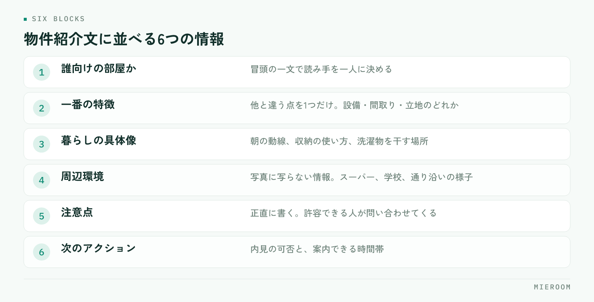

<!--META
{
  "title": "物件紹介文の書き方｜問い合わせにつながる情報の並べ方",
  "date": "2026-09-23",
  "category": "集客・広告",
  "excerpt": "物件紹介文は、書き出しで読み手を決め、条件を暮らし方に翻訳して並べると問い合わせにつながります。情報の並べ方、書き写しから抜ける方法、表示のきまり、媒体ごとの使い分け、見直しの回し方までまとめました。",
  "hook": "条件の羅列を、暮らし方の言葉に翻訳する",
  "tags": ["物件紹介文", "ポータル掲載", "集客", "反響", "賃貸仲介"]
}
META-->

物件紹介文の書き方は、**書き出しで読み手を一人に決め、条件を暮らし方の言葉に翻訳して並べる**の2点に尽きます。テンプレートのまま使い回している紹介文が反響につながらないのは、文章が下手だからではありません。検索条件の欄にすでに書いてある情報を、もう一度並べているからです。

<h4>この記事の結論</h4>
紹介文の役割は、条件表の繰り返しではなく<strong>条件だけでは分からないことを伝える</strong>ことです。誰向けの部屋かを冒頭で示し、写真に写らない周辺環境や使い勝手を具体的に書けば、問い合わせの数だけでなく質も変わります。

## 反響が来ない紹介文に共通すること

掲載文を見比べていくと、反響の少ない紹介文にはいくつか同じ特徴があります。

- 条件欄の繰り返しになっている：「2LDK、駅徒歩8分、バストイレ別」。すでに一覧に出ている情報です
- 主語が物件しかない：設備の名前だけが並び、そこで誰がどう暮らすのかが書かれていません
- 抽象的な形容が多い：「閑静な住宅街」「使いやすい間取り」。どの物件にも当てはまる言葉は、読み飛ばされます
- 全部の物件で同じ文章：テンプレートの地名と数字だけを差し替えた文は、読み手にも伝わります
- 情報の順番が固定されていない：担当者ごとに書き方が違い、比較しづらくなります

紹介文を読む人は、条件で絞り込んだ後の人です。**条件は合っている前提で、決め手を探しに来ている**。ここに条件を繰り返しても、判断材料が増えません。

## 情報の並べ方を、店舗で1つに決める

書く内容の順番を決めておくと、担当者が変わっても品質が揃います。上から順に、読み手の関心が移る順です。

<figure class="fig"><figcaption>読み手の関心が移る順に並べます。一番の特徴は1つに絞るほど印象に残ります。</figcaption></figure>

1. 誰向けの部屋か：冒頭の一文。「一人暮らしを始める学生の方へ」「在宅勤務の時間が長い方へ」
2. この部屋の一番の特徴：他と違う点を1つだけ。設備でも、間取りでも、立地でも構いません
3. 暮らしの具体像：朝の動線、収納の使い方、洗濯物を干す場所など、生活の場面で書きます
4. 周辺環境：写真に写らない情報。スーパー、コンビニ、学校、通り沿いの様子
5. 注意点：正直に書きます。後述しますが、これが問い合わせの質を上げます
6. 次のアクション：内見の可否、案内できる時間帯

この順に並べると、読む人は上から読むだけで判断材料が揃います。**一番の特徴を1つに絞る**のが肝心です。3つも4つも押し出すと、印象に残るものがなくなります。

## 条件を「暮らし方」に翻訳する

紹介文が書けないという相談の多くは、書く材料がないのではなく、条件のままで止まっていることが原因です。条件を暮らしの言葉に置き換えます。

- 「南向き」→「洗濯物が午前中に乾きます。日中は照明をつけずに過ごせる明るさです」
- 「独立洗面台」→「朝の支度が洗面所で完結するので、二人暮らしでも動線が重なりません」
- 「駅徒歩12分」→「駅までは平坦な道です。自転車なら5分ほど、駐輪場は屋根付きです」
- 「角部屋」→「窓が2面あるため、風が通ります。隣室は片側だけです」

翻訳のコツは、**その設備があると1日のどこが変わるかを書く**ことです。設備の名前は条件欄が伝えてくれます。紹介文が伝えるのは、その先にある生活です。

内見に来た人からよく出る質問も、そのまま材料になります。現地で聞かれることは、掲載を見た人が知りたいことと重なります。聞かれた質問を記録しておき、紹介文に先回りして書いておけば、問い合わせの段階が1つ進みます。

## 短所を書くと、問い合わせの質が上がる

紹介文に不利な情報を書くのをためらう気持ちは分かります。ただ、隠しても内見で必ず分かります。**内見で判明する短所は、そこまでの案内時間をすべて無駄にします**。

書き方には工夫の余地があります。事実を書いたうえで、それが問題にならない人を示します。「線路沿いのため、日中は電車の音が聞こえます。日中は外出されている方であれば気にならない範囲です」。こう書けば、音を許容できない人は問い合わせず、許容できる人だけが来ます。

✓短所を書く効果

問い合わせの件数だけを見ると減ることがあります。しかし内見からの決定率と、1件あたりにかける時間が変わります。件数ではなく、内見から申込までの進み方で判断してください。反響の数え方は<a href="./hankyo-kanri-hoho.html">反響管理の方法</a>に整理しています。

## 表示のきまりを外さない

賃貸の広告には、不動産の表示に関する公正競争規約という業界共通のルールがあります。紹介文でも同じく適用されます。外すと掲載が止まるだけでなく、店舗の信用に関わります。

- 徒歩の分数は、道路距離80mを1分として計算します。端数は切り上げます
- 成約済みの物件を掲載し続けない。いわゆるおとり広告にあたります
- 「日本一」「最高」「完全」などの最上級表現や、根拠のない断定は使えません
- 「新築」と書けるのは、建築後1年未満で未入居のものに限られます
- 実際の面積・築年・設備と異なる記載をしない。撮影時期の古い写真も、現況と違えば同じ問題になります

!掲載を止める仕組みも決めておく

おとり広告は、悪意がなくても起こります。申込が入った物件の掲載を誰がいつ下げるかが決まっていないと、成約済みの部屋が残り続けます。申込のステータスが変わったら掲載を確認する、という手順を業務の側に組み込んでください。

## 媒体ごとに書き分ける

同じ文章をすべての媒体に流し込むと、それぞれの見え方に合いません。表示される文字数と、読む人の状態が違うからです。

| 掲載先 | 読み手の状態 | 重視すること |
|--------|------------|-------------|
| ポータルサイト | 複数物件を比較中 | 冒頭の一文で差を出す。短所も書く |
| 自社サイト | 店舗を選んだうえで見ている | 周辺環境や地域の情報を厚く |
| 業者間サイト | 同業者が条件で判断する | 条件・取引条件を正確に。装飾は不要 |

とくにポータルサイトでは、一覧に表示されるのは先頭の数十文字です。**最初の一文に、その部屋の一番の特徴を入れてください**。挨拶文や物件名から始めると、一覧では何も伝わりません。どの媒体から反響が来ているかは[媒体別ROI](./media-roi.html)の考え方で確かめられます。

## 書きっぱなしにせず、見直しを回す

紹介文は一度書いて終わりにせず、反応を見て直します。難しい分析は不要です。

- 掲載から2週間、問い合わせが0件の物件を洗い出す
- その物件の紹介文の冒頭一文を読み、誰向けかが書かれているか確かめる
- 同じエリア・同じ条件で反響のある物件の紹介文と見比べる
- 直すのは冒頭の一文と、一番の特徴の2か所だけ。全体を書き直さない
- 直した日付を記録し、2週間後にまた見る

**一度に1か所だけ直す**のが原則です。まとめて書き換えると、何が効いたのか分からなくなります。この見直しを月に一度の作業として決めておけば、紹介文の質は店舗全体で上がっていきます。

紹介文は何文字くらいが適切ですか？

媒体の表示上限に収まる範囲で、書くことがある分だけ書いてください。文字数を埋めるための一般的な表現を足すと、かえって読み飛ばされます。中身のある300字は、薄い800字に勝ります。

生成AIに紹介文を書かせてもよいですか？

下書きの整形には有効です。ただし現地を見ていないAIは、周辺環境や使い勝手を推測で書きます。それが事実と違えば表示のきまりに触れます。現地で確認した事実をこちらから渡し、文章の形にしてもらう使い方に留めてください。

同じ物件の紹介文を使い回しても問題ありませんか？

同一物件の別部屋であれば、共通部分の使い回しは問題ありません。ただし階数・向き・間取りで暮らし方は変わります。冒頭の一文と一番の特徴だけは、部屋ごとに書き分けてください。

## まとめ：紹介文は、条件表が伝えられないことを書く

物件紹介文の書き方は、冒頭で読み手を決め、一番の特徴を1つに絞り、条件を暮らし方に翻訳し、短所も正直に書く。この順番です。表示のきまりを守り、媒体ごとに書き分け、反響のない物件だけを月に一度見直す。特別な表現力は要りません。

紹介文の質を保つうえで効いてくるのは、**どの媒体のどの物件から反響が来ているかを、店舗で数えられている状態**です。数えられていないと、直した効果が分からず、見直しが続きません。

[ミエルーム](../index.html)は、反響の自動取込から接客・申込・売上までを1つの画面でつなぐ、賃貸仲介向けの業務管理SaaSです。媒体ごとの反響を記録して分析できるため、紹介文を直した結果を数字で追えます。申込の状況と掲載の管理も同じ流れで扱えます。デモアカウントをご用意していますので、いまの運用に合うかどうか、お気軽にご相談ください。
