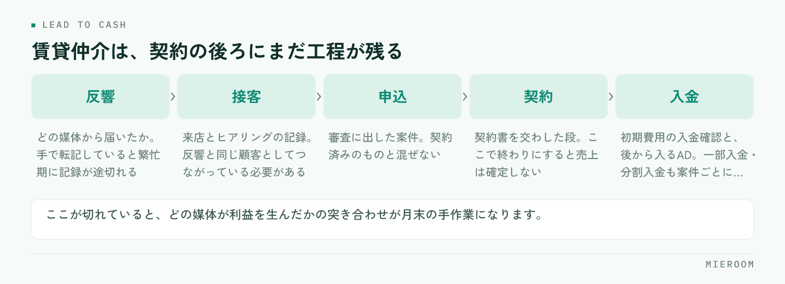

<!--META
{
  "title": "賃貸仲介の顧客管理（CRM）の選び方｜反響から契約・入金までつながる条件",
  "date": "2026-09-29",
  "category": "DX",
  "excerpt": "賃貸仲介の顧客管理（CRM）の選び方を、反響から契約・入金までがつながるかという観点で整理しました。一般的なCRMとの違い、確かめる5つの条件、導入前に決めておくことまでまとめています。",
  "hook": "反響と契約が別管理だと判断が遅れる",
  "tags": ["顧客管理", "CRM", "DX", "反響管理", "ツール選定"]
}
META-->

反響は増やしたい。追客も漏らしたくない。そう考えて顧客管理（*CRM*）の導入を検討すると、候補がいくつも出てきて決めきれなくなります。賃貸仲介の場合、選ぶ基準はひとつに絞れます。**反響から契約・入金までが、1本の線でつながるかどうか**です。

<h4>この記事の結論</h4>
賃貸仲介の顧客管理は、反響を溜めるだけでは足りません。<strong>反響・接客・申込・契約・入金が同じ場所でつながっている</strong>ことが条件です。ここが切れていると、どの媒体が利益を生んだかが月末まで分からず、判断が1か月遅れます。

## 賃貸仲介の顧客管理が、一般的なCRMと違うところ

一般的なCRM（顧客関係管理）は、見込み客との接点を記録し、営業の進み具合を管理するための仕組みです。商談のフェーズを進めていき、受注したら完了。多くの業種ではこれで足ります。

賃貸仲介は、受注（契約）の後にまだ工程が残ります。申込を受けて審査に出し、契約書を交わし、初期費用の入金を確認する。さらに、貸主・管理会社からのAD（広告料）が後から入ってくることもあります。**契約して終わりではなく、入金まで追わないと売上が確定しない**という構造です。

もうひとつの違いは、繁忙期の集中です。同じ時期に反響と来店が重なり、1人が並行して何件も抱えます。入力に手間のかかる仕組みは、いちばん必要な時期に真っ先に使われなくなります。

## 反響から入金までが切れていると、何が起きるか

反響の管理はポータルの管理画面、接客のメモは個人のノート、申込と入金はExcel。この形は珍しくありません。それぞれの場所では動いていますが、つながっていないことで次のような状態になります。

<figure class="fig"><figcaption>一般的なCRMが完了とみなすのは契約の段です。賃貸仲介は入金まで追わないと売上が確定しません。</figcaption></figure>

**どの媒体が利益を生んだか分からない**。反響数は媒体ごとに出せても、そこから何件契約になり、いくらの売上になったかが別管理だと、突き合わせは手作業になります。結果、掲載の増減は感覚で決めることになります。

**追客の漏れに気づけない**。反響の一覧と、接客の記録が別だと、返信した／していないの判定が担当者の記憶に依存します。一次返信の考え方は[反響への返信スピード](./lead-response-speed.html)にまとめています。

**売上の見込みが立たない**。申込が入っている案件と、契約済みで入金待ちの案件が同じ表に混ざっていると、今月確定している売上がいくらなのかが分かりません。

## 選ぶときに確かめる5つの条件

賃貸仲介で顧客管理の仕組みを選ぶとき、機能一覧の長さではなく次の5点を確かめてください。

- **反響が自動で取り込まれるか**。ポータルからのメールやフォームを手で転記している限り、入力の手間は減りません。反響の取り込みが自動なら、繁忙期でも記録が途切れません。
- **反響と接客と申込が、同じ顧客としてつながるか**。別々のIDで管理されていると、媒体ごとの成果が追えません。
- **入金まで記録できるか**。一部入金・分割入金、後から入るADを案件ごとに記録できるか。ここが無いと、結局Excelが残ります。
- **確定した売上と見込みが分けて見られるか**。混ざったままでは、月中の判断に使えません。
- **スタッフごとの成績が出せるか**。反響の配分が偏っていないか、来店率と成約率のどちらに課題があるかを見るために要ります。

この5つのうち、実際に使い始めてから不足に気づきやすいのは3つ目と4つ目です。導入前の比較では見落とされやすく、月末の集計で初めて「結局Excelに書き写している」と分かります。

## 一般的なCRMと、賃貸仲介向けの業務管理システムの違い

同じ「顧客管理」という言葉でも、想定している業務の範囲が違います。

| | 一般的なCRM | 賃貸仲介向けの業務管理 |
|---|---|---|
| 主な対象 | 見込み客と商談 | 反響・接客・申込・契約・入金 |
| 完了の地点 | 受注した時点 | 入金を確認した時点 |
| 反響の取り込み | 手入力かフォーム連携 | ポータルのメール・フォームの自動取込 |
| 売上の扱い | 受注金額を1行で持つ | 仲介手数料・ADなど中身ごとに分ける |
| 分析の単位 | 案件・担当者 | 媒体・店舗・スタッフ・案件 |

一般的なCRMが劣っているという話ではありません。商談の管理としては十分に作り込まれています。ただ、賃貸仲介では契約の後ろに工程が残るため、そこを別のExcelで持つことになり、二重入力が生まれます。ツールの見直し全般の考え方は[賃貸仲介の業務改善ツール](./chintai-gyomu-kaizen-tool.html)にまとめています。

## 導入前に決めておくこと

**誰が入力するか**を先に決めます。反響の取り込みが自動でも、接客の記録は人が残します。担当が入れるのか、事務が入れるのか。ここが曖昧なまま始めると、記録の粒度が担当者ごとにばらつきます。

**どこまでを移行するか**も決めておきます。過去の案件をすべて移すのか、今月以降の新規だけにするのか。全部を移そうとして止まる例は多く、期首や繁忙期の入りに合わせて新規から始めるほうが進みます。

**判断に使う数字を1つ決める**のも有効です。最初から全部の数字を見ようとせず、たとえば媒体ごとの成約件数だけを毎週見る、と決めます。見る数字が決まっていると、入力の優先順位も自然に決まります。

✓比較の前に、今の手間を書き出す

候補を並べる前に、今どこで何分かかっているかを1週間分だけ記録してください。反響の転記、月末の集計、入金の消し込み。時間のかかっている順に並べると、どの機能が自社に効くかが決まります。機能の多さで選ぶより外れません。

## 定着しない店舗に共通すること

導入したものの使われなくなる場合、原因は機能ではなく運用側にあることがほとんどです。

**入力の場所が二重になっている**。新しい仕組みに入れつつ、これまでのExcelも残している状態です。どちらが正かが決まっていないため、両方が中途半端になります。移行したら、古い表は閉じてください。

**入れた数字を誰も見ていない**。入力だけを求められて、結果が返ってこない状態が続くと、現場の入力は必ず雑になります。週に一度でよいので、出てきた数字を朝礼で共有する場を作ると変わります。

**繁忙期に始めた**。最も忙しい時期に新しい手順を足すと、元のやり方に戻ります。始めるなら閑散期です。閑散期にやることは[閑散期にやっておくこと](./kansanki-yarukoto.html)にまとめています。

Excelでの管理を続けるのは難しいですか？

店舗が1つで、担当者が数名までであれば、Excelでも回ります。難しくなるのは、同じファイルを複数人で同時に触るようになったとき、店舗が増えたとき、そして過去の月と比べたくなったときです。ファイルが分かれ始めたら、そろそろ切り替えの時期だと考えてください。

反響の自動取込は、どのポータルでも使えますか？

仕組みによって対応の範囲が違います。メールの本文から読み取る方式と、フォームから直接受け取る方式があり、現在お使いの媒体で動くかどうかは事前に確認が必要です。検討の段階で、反響の届き方（どの媒体から、どんな形式で来るか）を一覧にしておくと話が早く進みます。

これから開業する場合、最初から入れるべきですか？

最初から入れておくほうが、後の移行が要らない分だけ楽です。ただし、開業直後は反響も件数も少ないため、機能を使い切ることは考えなくて構いません。反響と接客の記録から始め、申込・入金は件数が出てきてから使う、という順でも問題ありません。開業準備の全体像は<a href="./fudosan-kaigyo-junbi-checklist.html">不動産開業の準備チェックリスト</a>にまとめています。

## まとめ：つながっているかどうかで選ぶ

賃貸仲介の顧客管理（CRM）の選び方は、機能の数ではなく、反響から契約・入金までが1本につながるかどうかで決まります。つながっていれば、どの媒体が利益を生んだかが月中に分かり、翌月の掲載の判断が早くなります。切れていれば、月末の手作業が残り、判断はいつも1か月遅れます。

選ぶ前に、今かかっている手間を1週間分だけ書き出してください。そのうえで、この記事の5つの条件を1つずつ当てていくと、候補は自然に絞れます。他社の仕組みとの比較は[業務管理システムの比較](../compare.html)にまとめています。

反響の自動取込から接客の記録、申込・入金の管理、確定売上と見込みの分離までを一か所でつなぎたい場合は、[ミエルーム](../index.html)が対応しています。デモアカウントの発行と、既存のExcelデータの取り込み・初期設定の代行にも対応していますので、今の管理のしかたを見てほしいという段階でもお気軽にご相談ください。
