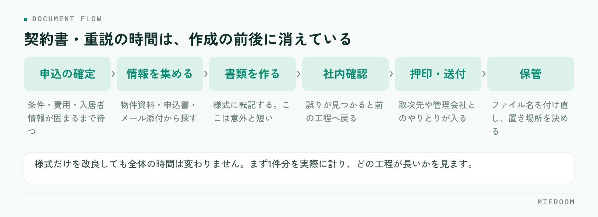

<!--META
{
  "title": "賃貸の契約書・重説の作成時間を短くする方法｜転記をなくす仕組み",
  "date": "2026-09-08",
  "category": "業務効率化",
  "excerpt": "契約書と重要事項説明書の作成が遅いのは、書く速さではなく転記と確認の往復が原因です。時間が消えている場所の分解、一次情報を1か所に置く考え方、誤りが出やすい項目のチェックの型まで整理しました。",
  "hook": "書類の時間は転記をなくすところから縮む",
  "tags": ["契約書", "重要事項説明書", "業務効率化", "賃貸仲介", "書類作成"]
}
META-->

契約書と重要事項説明書（重説）の作成に時間がかかるのは、**文章を書くのが遅いからではありません**。同じ情報を何度も別の様式に書き写し、そのたびに元の資料を探して確認しているからです。この記事では、時間が消えている場所を分解し、転記を減らす手順を順に整理します。

  <h4>この記事の結論</h4>
  
書類作成の時間は、様式を速く埋める工夫ではなく<strong>一次情報を1か所に集め、転記を1回に減らすこと</strong>で縮みます。物件・申込者・条件の情報が案件ごとに1か所にあれば、書類はそこから展開するだけになります。

## 契約書・重説の作成が遅くなる本当の理由

契約書類の作成が長引く店舗ほど、担当者は速く手を動かしています。それでも終わらないのは、作業の中身が「書く」ではなく「探す」と「確かめる」で埋まっているからです。

物件の面積や構造は資料のどこか、賃料と初期費用は申込書、入居者の情報はメールの添付、火災保険の内容は取次先の書類。**一次情報が5か所に散らばっていれば、書類1通につき5回探すことになります**。

さらに、探した情報を書き写した時点で、その値は二重に存在します。あとから条件が変わったとき、どちらを直したか分からなくなる。これが差し戻しと再確認を生み、作成時間をもう一度膨らませます。

## 時間が消えている場所を分解する

まず、自店の作業を工程に分けて、どこに時間がかかっているかを見ます。感覚ではなく、実際に1件分を計ってみるのが早い方法です。

<figure class="fig"><figcaption>長いのは作成そのものではなく、その前後の工程です。</figcaption></figure>

多くの店舗で長いのは、書類を作っている時間そのものではなく、その前後です。申込内容の確定待ち、社内確認の往復、押印と送付、保管とファイル名の付け直し。ここを見ずに様式だけ改良しても、全体の時間は変わりません。

## 転記を1回に減らす考え方

時間を縮める原則はひとつです。**同じ値を2回書かない**。そのために、案件ごとの一次情報を先に確定させてから書類に展開します。

- **一次情報の置き場所を1つに決める**：物件情報、申込者情報、契約条件、費用の内訳をひとまとめにします
- **書類は展開先と考える**：契約書も重説も、一次情報の見せ方が違うだけと捉えます
- **確定していない値は空欄で残す**：仮の数字を入れると、そのまま最終版に残ります
- **変更は一次情報だけを直す**：書類側を直すと、次の書類にまた古い値が入ります

この形にすると、条件変更が入っても直す場所が1か所で済みます。申込から契約までを1行で追う考え方は[申込管理表の作り方](./moushikomi-kanrihyo-tsukurikata.html)と同じで、契約書類はその行の続きにあると考えると設計しやすくなります。

## 書類を作る前にそろえておく項目

作成に着手する前に、次の項目が確定しているかを確かめます。ここが埋まっていない状態で作り始めると、必ず途中で止まります。

- **物件**：所在地、建物名、部屋番号、面積、構造、築年、設備
- **契約条件**：契約期間、賃料、共益費、敷金・礼金、更新条件、特約
- **費用**：初期費用の内訳、支払期日、振込先の指定
- **入居者**：氏名、生年月日、勤務先、連絡先、同居人、緊急連絡先
- **保証・保険**：保証会社と審査結果、火災保険の内容と加入方法
- **関係先**：管理会社、オーナー、取次する保険会社、鍵の受け渡し方法

✓特約は先に文言を決めておく

特約は案件ごとに文言を考えると時間がかかり、表現も揺れます。よく使う特約は文言を決めて一覧にしておき、案件では選ぶだけにします。新しい文言を追加するときだけ、内容を確認します。

## 誤りが出やすい項目とチェックの型

急いで作った書類で間違いが出る場所は、店舗が違ってもほぼ同じです。チェックは思いつきではなく、決まった順番で見ます。

| 確認する項目 | よくある誤り | 見るときの基準 |
|---|---|---|
| 面積・構造・築年 | 別部屋の資料から転記 | 募集図面ではなく謄本・原本で確認 |
| 契約期間 | 開始日と入居日の混同 | 鍵の引渡日と契約開始日を分けて書く |
| 賃料・共益費 | 交渉後の金額が反映されていない | 申込の最終合意メモと突き合わせる |
| 初期費用 | 日割りの計算月がずれる | 起算日と日数を式のまま残す |
| 氏名・生年月日 | 旧字体、西暦と和暦の混在 | 本人確認書類の表記に合わせる |
| 特約 | 前の案件の文言が残る | 案件ごとに読み上げて確認する |

!「前回の書類をコピーして直す」がいちばん危ない

前の案件のファイルを複製して作る方法は速い代わりに、直し忘れが必ず起きます。特に特約と初期費用の欄は、消したつもりで残ります。複製ではなく、空の様式に一次情報から入れる形にしてください。

## Excelとワープロで運用するときの工夫

すぐに仕組みを入れ替えられない場合でも、運用の工夫で時間は縮みます。

まず、**様式のファイルを1か所に置き、複製は禁止**にします。担当者の手元にコピーが増えると、古い様式で作られた書類が混ざります。次に、入力する欄と印刷される欄を分け、入力欄に入れた値が各所に反映される形にします。同じ値を複数箇所に手で入れる様式は、そこが誤りの発生源です。

保管も決めておきます。**ファイル名の付け方を1つに固定する**だけで、探す時間は目に見えて減ります。契約日・物件名・部屋番号・入居者名の順など、店舗で1つ決めれば十分です。Excelでの管理が限界に近づくときの見分け方は[Excel管理から仕組みへ移すとき](./excel-to-saas.html)にまとめています。

## よくある質問

書類作成を担当者ごとにやるか、1人にまとめるか、どちらがよいですか？

作成の型が決まっていない段階では、1人にまとめたほうが誤りが減ります。ただし属人化するため、様式と確認手順を文書にしたうえで、担当を交代できる形にしてください。型が固まれば、担当営業が作っても品質は保てます。

重説の読み合わせの時間も短くできますか？

読み合わせそのものは省略できません。短くできるのは準備側です。書類の完成が直前になると、当日に修正が入り、説明の時間まで延びます。前日までに確定させる運用にすると、当日は説明に集中できます。

社内で使っている独自の契約書式でも仕組みに載せられますか？

店舗ごとに書式が違うのは通常のことです。大切なのは、書式を変えることではなく、書式に流し込む一次情報を1か所に持つことです。既存の書式を使いながら、入力の起点だけを統一する形から始められます。

## まとめ：様式を速く埋めるより、転記を減らす

契約書と重説の作成時間は、入力の速さではほとんど変わりません。縮むのは、**一次情報を1か所に集め、書類はそこから展開する形にしたとき**です。物件・条件・費用・入居者の情報が案件ごとにまとまっていれば、書類作成は探す作業ではなくなります。

今日からできるのは3つです。複製して作るのをやめること、よく使う特約の文言を決めておくこと、確認の順番を紙1枚にして全員で同じ順に見ること。これだけでも、差し戻しは目に見えて減ります。

[ミエルーム](../features.html)は、申込から契約までの情報を案件ごとに1か所で持ち、社内の契約フォーマットの自動取込に対応しています。Excelデータの取り込みと初期設定の代行、デモアカウントの発行、最短即日でのスタートが可能です。今の書式のまま運用を整えたい段階からご相談ください。
