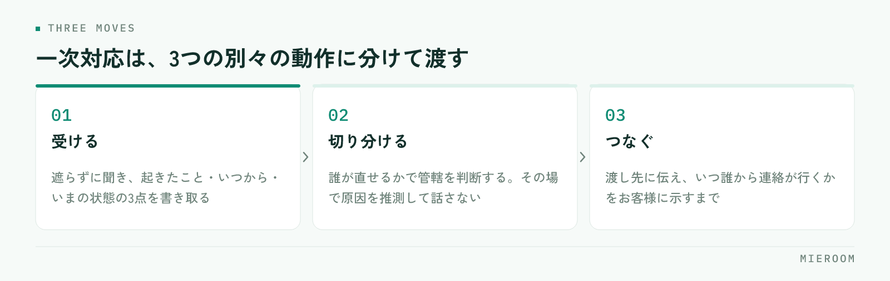

<!--META
{
  "title": "賃貸仲介のクレーム対応｜一次対応の型と、店舗で記録を残す範囲",
  "date": "2026-10-07",
  "category": "業務効率化",
  "excerpt": "賃貸仲介の店舗に入るクレームを、一次対応の型と記録の残し方の両面から整理しました。誰が直せるかで切り分ける基準、入居後の連絡を受けたときの言い方、残す記録と残さない記録の線引きまでまとめています。",
  "hook": "切り分けの基準を決めれば、対応は止まらない",
  "tags": ["クレーム対応", "賃貸仲介", "店舗運営", "業務効率化", "記録"]
}
META-->

賃貸仲介の店舗に入るクレームは、担当者の力量の差が出やすい業務です。ただし差の正体は話し方ではなく、**受けた内容を誰に渡すかの基準が決まっていない**ことにあります。基準がないと、担当者はその場で判断を迫られ、抱え込むか、たらい回しにするかのどちらかになります。

<h4>この記事の結論</h4>
一次対応は「受ける・切り分ける・つなぐ」の3つに分けられます。鍵になるのは、切り分けの基準を<strong>誰が直せるか</strong>の一点に置くことです。店舗で直せるのか、管理会社やオーナーでなければ直せないのかが決まれば、その場で答えを出す必要はなくなります。

## クレームが担当者任せになると、同じことが繰り返される

クレームの対応が担当者ごとに違うと、起きる問題は2つあります。

1つは、対応の品質がばらつくことです。すぐ管理会社につなぐ人、自分で解決しようとして時間を使う人、折り返しを約束して忘れる人が同じ店の中に混在します。お客様から見れば、どの担当に当たるかで経験が変わります。

もう1つは、再発が止まらないことです。対応した内容が本人の記憶にしか残らないため、同じ原因のクレームが別のお客様から入っても、店として気づけません。設備の説明が足りていない、特定の管理会社で連絡が遅い、といった傾向は、1件ずつ見ても見えず、並べて初めて分かります。

**クレーム対応を仕組みにする目的は、担当者を守ることと、再発の芽を見つけること**の2つです。接客の記録が担当者の頭の中にしか残らない問題は、[来店時のヒアリングで聞く項目](./raiten-hearing-koumoku.html)でも触れたとおり、どの工程でも同じ形で起こります。

## 一次対応は「受ける・切り分ける・つなぐ」の3つ

一次対応を1つの作業として教えると、新人は覚えきれません。3つに分けて、それぞれ別の動作として渡します。

<figure class="fig"><figcaption>1つの作業として教えると覚えきれません。動作を分けると新人でも迷いません。</figcaption></figure>

**受ける**は、話を遮らずに最後まで聞き、起きたこと・いつから・いまどうなっているかの3点を書き取るところまでです。この段階で原因を推測して話さないでください。推測を先に出すと、後で違っていたときに「最初と話が違う」になります。

**切り分ける**は、内容が誰の管轄かを判断する動作です。基準は次の章にまとめます。

**つなぐ**は、相手に渡して終わりではなく、いつ誰から連絡が行くかをお客様に伝えるところまでを指します。ここが抜けると、待たされている時間がそのまま不満になります。

## 切り分けの基準は「誰が直せるか」の一点

賃貸仲介の店舗には、本来は管理会社やオーナーの管轄である連絡も入ります。紹介した店に連絡するのが、お客様にとっていちばん自然だからです。断るのではなく、渡し先を決めるのが店舗の仕事になります。

| 内容 | 主な渡し先 | 店舗がやること |
|---|---|---|
| 設備の故障、水漏れ、鍵の不具合 | 管理会社（緊急時は指定の連絡先） | 連絡先を伝え、つないだ事実を記録する |
| 騒音、近隣とのトラブル | 管理会社・オーナー | 内容を記録し、直接の当事者間交渉は勧めない |
| 契約内容や費用の説明と実際の違い | 店舗（自社） | その場で判断せず、契約書類を確認してから回答する |
| 担当者の対応、連絡の遅れ | 店舗（店長） | 担当者本人ではなく、店長が受ける |
| 退去時の原状回復の費用 | 管理会社・オーナー | 一般的な考え方のみ伝え、個別の金額判断はしない |

迷ったときの基準は1つです。**その場で直せるのが自社かどうか**。自社で直せないものは、速く正確につなぐことが最良の対応になります。無理に間に入ると、伝言が1往復増えるだけで、解決は遅くなります。

!契約内容に関わる指摘だけは、別扱いにする

「聞いていない費用がある」「説明と違う」といった内容は、重要事項説明や契約書の記載に関わります。担当者がその場で記憶を頼りに答えると、後から覆る可能性があります。いったん受けて、書面を確認してから店長または有資格者が回答する流れを固定してください。

## 入居後の連絡を受けたときの言い方を決めておく

切り分けの基準があっても、伝え方が悪いと「突き放された」と受け取られます。店舗で決めておきたいのは、断る言い方ではなく、つなぐ言い方です。

言い方の骨組みは3つです。

1. **受け止める**：「ご不便をおかけしています。状況を確認させてください」
2. **役割を伝える**：「設備の修理は管理会社の◯◯が窓口になっています」
3. **次の動きを示す**：「こちらから連絡を入れます。本日中に管理会社からお電話が入る形で進めます」

このうち3番目がもっとも重要です。**渡した先から連絡が来る時期を示さないまま電話を切ると、お客様は宙に浮いた状態になります**。時間が読めないときは「本日中に、見込みだけでもこちらからご連絡します」と、自店の動きを約束してください。

緊急性の判断も決めておきます。水漏れ、ガス、鍵が開かない、エアコンが真夏に止まったといった内容は、営業時間や通常の順番を待たせない扱いにします。この区分を貼り出しておくと、新人でも迷いません。

## 記録に残す範囲を、先に決めておく

クレームの記録は、残しすぎても残さなすぎても困ります。線引きを決めてから運用を始めてください。

残すのは、次の5項目で十分です。

- 受けた日時と受けた担当者
- 相手と物件（契約との結びつきが分かる範囲）
- 内容の要約（お客様の言葉に近い形で）
- 渡し先と、渡した日時
- 完了したかどうか、完了した日

逆に、残さないほうがよいものもあります。担当者の主観的な評価（「理不尽な要求」など）、お客様の人物評、未確認の推測です。記録は社内で共有され、後から他の担当者も読みます。主観が混ざると、次に対応する人の見方が歪みます。

✓記録の目的は「犯人探し」ではない

担当者が記録を避けるようになるのは、記録が評価に直結すると感じたときです。件数が多い担当者ほど件数の多い業務を担っている、という場合もあります。記録は、再発の原因を見つけるためのものだと最初に伝えてください。工程ごとに数字を分けて見る考え方は<a href="./staff-seiseki-kanri.html">スタッフの成績管理</a>でも整理しています。

## 月に一度、並べて原因を見る

1件ずつの対応が終わっても、そこで止めると再発は減りません。月に一度、その月の記録を並べて、次の2つだけを見ます。

**同じ原因が2件以上あるか**。同じ設備、同じ管理会社、同じ説明項目が繰り返し出ていれば、個別対応ではなく手前の工程を直す対象です。

**契約前に防げたものはどれか**。費用の内訳、入居時期、設備の有無、更新や解約の条件といった説明は、契約前の時間の使い方で減らせます。契約書類の説明に時間を足すのか、案内資料を1枚作るのかは、出てきた傾向で決めます。

この2つを見るだけなら、店長が月末に30分取れば回ります。手間をかけるべきなのは記録を細かくすることではなく、並べて見る時間を毎月確保することです。

入居後のクレームは、仲介した店舗が対応する義務がありますか？

設備の修繕や近隣トラブルなど、建物の管理に関わる事柄は管理会社やオーナーの管轄です。仲介した店舗に法的な修繕義務はありません。ただし、契約前の説明内容に関わる指摘（費用や条件の説明と実際が違うなど）は仲介会社自身の問題になります。管轄で分けて考えるのが実務的です。

担当者を名指しでのクレームが入ったとき、誰が対応すべきですか？

担当者本人ではなく、店長が受けてください。本人が受けると、事実確認と弁明が混ざり、話が前に進みにくくなります。本人からは、受けた後に別途ヒアリングします。その際も、対応の良し悪しの前に、何をどう伝えたかという事実から確認する順番にすると、再発防止につながりやすくなります。

記録はどこまで細かく残せばよいですか？

日時・相手と物件・内容の要約・渡し先・完了の5項目で十分です。細かく書くことを求めると記録そのものが止まります。大切なのは1件ごとの詳しさではなく、すべての件が同じ形で残っていることです。後から並べて傾向を見られるかどうかが基準になります。

## まとめ：基準と記録があれば、対応は担当者任せでなくなる

賃貸仲介のクレーム対応は、話し方の訓練より先に、切り分けの基準を決めるほうが効きます。誰が直せるかで渡し先を決め、つなぐときは次に連絡が来る時期まで伝える。記録は5項目に絞り、主観を混ぜない。これだけで、担当者ごとの差はかなり小さくなります。

そのうえで、月に一度だけ記録を並べて、同じ原因が重なっていないかを見る。**1件ずつの対応で終わらせないことが、翌月の件数を減らす唯一の方法**です。

接客や申込の記録を担当者の手元ではなく店舗で共有する形にしたい場合は、[ミエルーム](../index.html)の接客管理・申込管理の画面もあわせてご覧ください。デモアカウントの発行もできますので、いまの運用に合うかどうかから確認いただけます。
