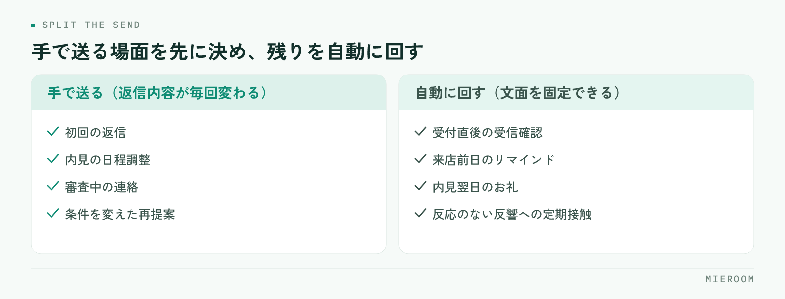

<!--META
{
  "title": "賃貸仲介の追客をLINE・SMSで自動化する方法｜来店率を落とさない配信設計",
  "date": "2026-09-06",
  "category": "集客・広告",
  "excerpt": "賃貸仲介の追客をLINE・SMSで自動化するときは、送る本数より「手で送る分をどこに残すか」を先に決めると来店率が落ちません。自動と手動の線引き、LINEとSMSの使い分け、配信のタイミング設計、止める条件、効果の見方まで整理しました。",
  "hook": "送る本数より、手で送る場面から決める",
  "tags": ["追客", "LINE", "SMS", "賃貸仲介", "自動化"]
}
META-->

賃貸仲介の追客をLINE・SMSで自動化するとき、成果を分けるのは配信の本数ではなく、**手で送る分をどこに残すか**です。全部を自動に寄せると反応が落ち、全部を手で送ると続きません。この記事では、自動と手動の線引き、LINEとSMSの使い分け、配信のタイミング設計、止める条件、効果の見方を順に整理します。

  <h4>この記事の結論</h4>
  
追客の自動化で先に決めるのは配信の本数ではなく、<strong>手で送る場面と止める条件</strong>です。この2つが決まっていれば、送信の手間を減らしても来店率は落ちません。

## 追客の自動化で最初に決めるのは「手で送る分」

自動化の相談で最初に出るのは「何本送るか」ですが、先に決めるべきは逆です。**手で送ると決めた場面を書き出し、残りを自動に回す**。この順番だと、自動化しても来店率が落ちにくくなります。

<figure class="fig"><figcaption>全部を自動に寄せると反応が落ち、全部を手で送ると続きません。</figcaption></figure>

手で送るのは、相手の状況が個別で、返信内容が毎回変わる場面です。初回の返信、内見の日程調整、審査中の連絡、条件を変えた再提案。ここを自動文面に置き換えると、返ってくるはずの反応が返らなくなります。

自動に回すのは、内容が毎回ほぼ同じで、送り忘れが起きやすい場面です。受付直後の受信確認、来店前日のリマインド、内見翌日のお礼、しばらく反応のない反響への定期接触。どれも文面が固定でき、送るタイミングも機械的に決まります。

初動の速さが成約に効く理由は[反響の初動5分](./lead-response-speed.html)で扱っています。自動化はその初動を代わりにやるものではなく、**初動に人手を集中させるために、それ以外を引き受ける仕組み**だと考えてください。

## LINEとSMSの使い分け

両方を同じように使うと、届く率と読まれ方の違いを取りこぼします。役割を分けます。

| 見るところ | LINE | SMS |
|---|---|---|
| 向く相手 | 友だち登録が済んだ顧客 | 電話番号しか分かっていない顧客 |
| 向く用件 | 継続的な追客、物件の提案 | 来店前日のリマインド、折り返しの依頼 |
| 送れるもの | 画像・物件のURL・長めの文章 | 「日時」「場所」「短い依頼」まで |
| 経緯の追いやすさ | 1つのトークに残り、担当が代わっても追える | 残りにくい |

使い分けの基準は単純です。**登録済みならLINE、未登録ならSMS**。長い提案はLINEかメールに回します。

実務では、SMSで一度連絡してからLINE登録へ誘導する流れが扱いやすくなります。登録後はLINEに一本化し、**同じ用件を両方から送らない**ようにしてください。二重に届くと、読まれないだけでなく不信感につながります。

## 配信のタイミングと本数を設計する

自動配信は、送る間隔と本数をあらかじめ決めておきます。反響の種類ごとに1本の流れを作り、そこに全部を当てはめる形が管理しやすくなります。

1. 受付直後：受信確認と、次に連絡する時間の予告。自動でよい部分です
2. 来店予約が入ったら：前日にリマインド。場所と持ち物、変更時の連絡先を入れます
3. 内見の翌日：お礼と、検討状況を聞く一文。返信が来たらそこから手動に切り替えます
4. 反応がないとき：数日おきに間隔を広げながら定期接触。同条件の新着物件など、内容がある配信に限ります
5. 入居希望時期が先の反響：月に一度程度まで間隔を空け、時期が近づいたら通常の追客へ戻します

本数を増やすほど成果が出るわけではありません。**内容のない配信は、送るほど登録解除を招きます**。「新着がなければ送らない」という条件を入れておくと、無理に送る配信が減ります。追客の段階そのものの決め方は[賃貸仲介の反響管理の方法](./hankyo-kanri-hoho.html)にまとめています。

## 自動で送る文面の作り方

自動配信の文面は、手で書くメッセージとは作り方が違います。誰に届いても不自然にならない形にします。

- 冒頭で店舗名を名乗る：登録から時間が空いた相手に「誰からの連絡か」を伝えます
- 差し込むのは、確実に埋まる項目だけ：氏名、来店日時、物件名など。空欄になり得る項目を文中に入れると、抜けた文面のまま送信されます
- 1通1用件：リマインドとお知らせを混ぜない。用件が2つあると、どちらも中途半端に読まれます
- 返信できる終わり方にする：「ご都合はいかがですか」「この日時で変更ありませんか」など、一言で返せる問いで閉じます
- 送信元が分かるようにする：担当者名を入れるか、店舗の代表名義に統一するかを決めておきます

作った文面は、必ず自分の端末に一度送って確認します。改行の位置、URLの見え方、絵文字の表示は、実機で見ると印象が変わります。

## 止める条件を先に決める

自動配信で最も苦情になりやすいのは、**止まるべきときに止まらない配信**です。設定する前に、次の停止条件を決めておきます。

- 顧客から返信が来たら、自動配信を止めて手動に切り替える
- 来店・申込・成約に進んだら、追客の自動配信から外す
- 見送り・他社決定が分かったら、その時点で全配信を止める
- 配信停止の申し出があったら即時に止め、他の経路からも送らない
- 深夜・早朝には送らない時間帯を決めておく

停止の申し出は、どの経路で受けても一箇所に反映されることが大切です。LINEで止めたのにSMSが届く状態は、管理表と配信の設定が別々になっているときに起きます。**顧客1件に対して配信状態が1つ**になっているかを、設定前に確認してください。

また、広告や勧誘にあたる配信を送る場合は、あらかじめ同意を得たうえで、停止の方法を分かりやすく示す必要があります。登録時の案内文に、何を送るか・どう止められるかを書いておきます。

## 効果はどう見るか

自動化の効果は、送信数や開封の多さではなく、来店につながったかで見ます。見る数字を絞ります。

- 自動配信を経由した来店数：どの配信の後に来店予約が入ったか
- 返信率：返信が来た配信と、来なかった配信の差。文面を直す手がかりになります
- 登録解除・停止の件数：増えていれば、本数か内容のどちらかが合っていません
- 手動に切り替わった件数：自動配信が「人が動くきっかけ」を作れているかを表します
- 未対応のまま残った反響の件数：自動化しても減らないなら、原因は配信ではなく管理側にあります

数字は媒体別・反響の種類別に分けて見ます。同じ文面でも、ポータル経由と自社サイト経由では反応が変わることがあるためです。まず1つの流れで2〜3か月続け、返信率の低い配信から順に文面を差し替えていくのが現実的な進め方です。

## よくある失敗

- 初回返信まで自動にしてしまう：最初の一通が定型文だと、その後の反応が鈍ります
- 本数を増やして反応を取りにいく：解除が増え、届く相手そのものが減ります
- 停止条件を決めずに走らせる：成約後の顧客に追客が届き、信頼を損ないます
- 管理表と配信設定が別々：どの顧客にどの配信が届いたか分からず、二重送信が起きます
- 効果を送信数で見る：送るほど成果が出ているように見えて、来店が増えていないことに気づけません

## よくある質問

自動配信は何通くらいが適切ですか？

通数に決まった正解はありません。反響の種類ごとに1本の流れを作り、内容のある配信だけを残すのが基本です。「新着がなければ送らない」という条件を入れておくと、無理に送る配信が自然に減ります。

LINEとSMSのどちらから始めるべきですか？

まずSMSで来店前日のリマインドだけを自動化し、そこからLINE登録へ誘導する流れが始めやすい形です。用件が短く、効果も来店率で確かめやすいためです。

自動配信にすると、返信が減りませんか？

初回返信まで自動にすると減ります。初回と日程調整は手で送り、自動は受信確認やリマインドなど文面を固定できる場面に限ってください。返信が来た時点で自動を止めて手動に切り替える設定も必要です。

## まとめ：自動化は「止め方」まで含めて設計する

賃貸仲介の追客をLINE・SMSで自動化する要点は、手で送る場面を先に決め、自動は内容が固定できる場面に限り、止める条件を設定前に決めておくことです。この3つが揃っていれば、送信の手間を減らしながら来店率を保てます。申込より後ろの管理は[賃貸仲介の申込管理表の作り方](./moushikomi-kanrihyo-tsukurikata.html)を参考にしてください。

[ミエルーム](../features.html)は、この流れをそのまま画面にした賃貸仲介向けの業務管理SaaSです。フォームやメールから反響を自動で取り込み、LINE・SMSの自動追客を反響1件ごとの状況とつなげたまま運用できます。接客・申込・入金まで同じ顧客として追えるので、成約後も配信が残り続けることがありません。いまの追客の流れに合うか確かめたい方は、デモアカウントをご用意しますのでお気軽にご相談ください。
