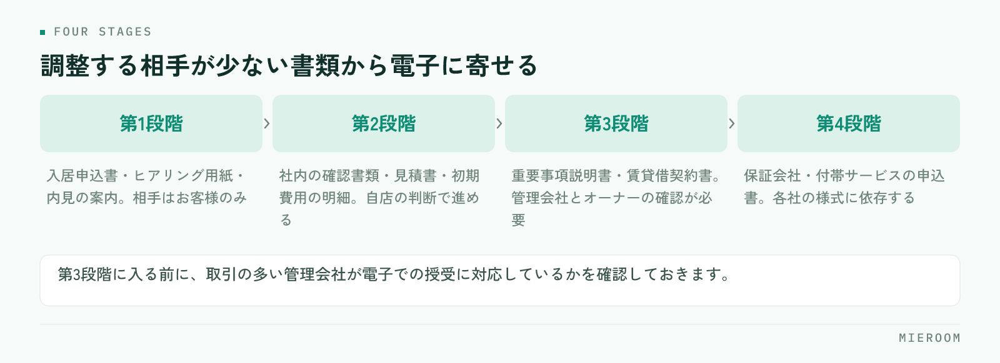

<!--META
{
  "title": "賃貸契約の電子化はどこから始めるか｜電子契約・IT重説の進め方",
  "date": "2026-10-06",
  "category": "DX",
  "excerpt": "賃貸契約の電子化について、電子契約とIT重説の違い、どの書類から始めるか、相手方の承諾の取り方、店舗側の準備と当日の段取りまで整理しました。全部をいちどに電子化しない進め方をまとめています。",
  "hook": "電子契約、どこから始めるか",
  "tags": ["電子契約", "IT重説", "業務効率化", "DX", "店舗運営"]
}
META-->

電子契約を入れたいが、何から手を付ければよいか分からない。契約書だけ電子化すればよいのか、重要事項説明もオンラインにするのか。**賃貸契約の電子化でつまずくのは仕組みの選定ではなく、どの書類をどの順番で電子化するかを決めないまま始めてしまう**ところです。

<h4>この記事の結論</h4>
電子化は<strong>全部をいちどに切り替えず、自店で完結する書類から始める</strong>のが現実的です。管理会社やオーナーの承諾が必要な書類は後回しにし、まず社内で完結する申込書・案内書類から電子に寄せていきます。

## 電子契約とIT重説は別のもの

まず用語を分けます。混同したまま検討すると、必要な準備が見えません。

- **電子契約**：契約書や重要事項説明書といった書類を、紙に印刷せず電磁的な方法で交付・締結すること
- **IT重説**：重要事項説明をオンライン（ビデオ通話など）で行うこと。説明の方法の話です

つまり、電子契約は「書面の渡し方」、IT重説は「説明の場所」の話です。この2つは別々に導入できます。オンラインで説明したうえで書面は郵送する形も、来店して対面で説明したうえで書面を電子で渡す形も成り立ちます。

宅地建物取引業法は2022年5月の改正により、重要事項説明書と契約締結時に交付する書面を電磁的方法で提供できるようになりました。ただし**相手方の承諾を得ることが前提**です。重要事項説明をオンラインで行うIT重説も、賃貸取引で認められています。制度の細かな要件は運用の指針が更新されることがあるため、導入時点で最新の内容を確認してください。

✓電子化できない書類もあると考えて設計する

自社の書式は電子化できても、管理会社やオーナーが紙の提出を求める書類、保証会社が所定の様式を指定している書類が残ります。「全部が電子になる」前提で段取りを作ると、紙が1枚残った時点で工程が止まります。紙と電子が混在する期間が続くことを前提に、どちらでも回る手順にしておくのが実務的です。

## どの書類から始めるか

着手の順番は、相手の数で決めます。承諾や調整が必要な相手が少ない書類から電子に寄せていきます。

<figure class="fig"><figcaption>着手の順番は、承諾や調整が必要な相手の数で決めます。</figcaption></figure>

| 段階 | 対象になる書類 | 調整が必要な相手 |
|---|---|---|
| 第1段階 | 入居申込書、ヒアリング用紙、内見の案内書類 | お客様のみ |
| 第2段階 | 社内の確認書類、見積書、初期費用の明細 | お客様と自店のみ |
| 第3段階 | 重要事項説明書、賃貸借契約書 | お客様・管理会社・オーナー |
| 第4段階 | 保証会社・付帯サービスの申込書 | 各社の様式に依存 |

第1段階と第2段階は、自店の判断だけで進められます。ここを先に電子化すると、**紙を触る回数は減り、工程の順番は変わらない**ため現場の負担が小さくなります。

第3段階から相手が増えます。管理会社が電子での受領に対応していない物件では紙が残るため、物件ごとに対応の可否が分かれます。この段階に入る前に、取引の多い管理会社に電子での授受が可能かを確認しておくと、案件ごとに迷わなくなります。

## 相手方の承諾をどう取るか

電子で書面を渡すには、お客様の承諾が必要です。ここを口頭で済ませると、後から「紙でほしかった」という話になります。

段取りは3つです。

1. **申込の段階で希望を聞く**。契約直前に聞くと、紙に戻す時間が足りません
2. **承諾を記録に残す**。いつ、誰が、どの方法で承諾したかを案件の記録として残します
3. **紙を希望された場合の手順も用意しておく**。選択肢として提示し、どちらでも進められる状態にします

重要なのは、**電子を勧めることと、電子しか選べないことを分ける**という点です。お客様の年齢や環境によって、紙のほうが進みやすい場合があります。電子化の目的は店舗の工数を減らすことですが、お客様が操作に戸惑って電話で何度も対応するなら、紙のほうが早く終わります。

!法人契約では承諾の相手が変わる

法人契約や社宅の案件では、契約者が会社になるため、承諾を取る相手が入居者本人ではありません。会社の総務や社宅代行会社が窓口になる場合、電子での受領が社内規程で認められていないこともあります。法人契約の進め方は<a href="./houjin-keiyaku-shataku-taio.html">賃貸の法人契約・社宅対応の進め方</a>に整理していますが、電子化の可否も最初の確認項目に入れておくと手戻りが減ります。

## 店舗側の準備

導入前に決めておくことは、機器やソフトよりも運用のほうが多くなります。

- **誰が送信するか**：接客した担当者か、事務担当か。送信権限と確認の役割を分けるかを決めます
- **送る前の確認を誰がするか**：金額、氏名、物件名の誤りは電子でも紙でも起きます。送信前のチェックを工程に入れます
- **保存場所を1か所に決める**：署名済みの書類が担当者のメールの中にしか残らない状態を避けます
- **お客様への案内文を用意する**：操作の案内を毎回書くと時間がかかります。定型文にします
- **通信と機器を確認する**：IT重説を行うなら、通話できる環境と、書面を画面で見せられる準備が必要です

いちばん見落とされるのが保存場所です。電子化しても、**どの案件のどの書類がどこにあるか分からない状態なら、紙を探していたときと手間は変わりません**。案件ごとに書類がぶら下がる形で残るようにしてください。

## IT重説の当日の段取り

IT重説を行う場合、当日の進め方を型にしておくと説明の抜けが防げます。

前日までに、重要事項説明書をお客様の手元に届けておきます。画面共有だけで初めて見る書類の説明を受けるのは、お客様にとって負担が大きく、確認の時間が長くなります。

当日は、本人確認、通信状態の確認、書類が手元にあるかの確認を先に済ませます。説明の途中で接続が切れた場合の連絡方法も、始める前に伝えておきます。説明が終わったら、質問の有無を記録に残してください。

終わったあとに残す記録は、実施した日時、対応した担当者、説明した書類、お客様から出た質問の4点です。後から確認を求められたときに、この4点があれば説明できます。契約書類の作成そのものを速くする方法は<a href="./chintai-keiyakusho-jusetsu-jitan.html">賃貸の契約書・重説の作成時間を短くする方法</a>にまとめています。

## 電子化で削れる時間と、削れない時間

期待と実際のずれを先に押さえておきます。

削れるのは、印刷、製本、郵送、返送待ち、保管場所への出し入れ、そして書類を探す時間です。返送を待つ工程がなくなると、契約までの日数が短くなります。

一方で削れないのは、内容を確認する時間と、お客様に説明する時間です。電子にしても、金額の計算や物件情報の転記が手作業なら、そこは変わりません。**電子化は紙を扱う手間を減らしますが、情報を転記する手間は別の問題**です。

ここを分けて考えないと、「電子契約を入れたのに忙しさが変わらない」という結果になります。転記の手間を減らしたいなら、申込から契約、入金までの情報が1か所につながっている状態を先に作る必要があります。紙とExcelが混在した状態からの進め方は<a href="./kami-excel-konzai-ikou.html">紙とExcelが混在する店舗の移行手順</a>に整理しています。

電子契約を導入すると印紙代が不要になりますか？

建物の賃貸借契約書は、もともと印紙税の課税対象となる文書ではありません。そのため賃貸仲介の場合、印紙代の削減を電子化の理由にはできません。土地の賃貸借など取り扱う契約の種類によって扱いが変わるため、課税対象かどうかは契約の内容ごとに確認してください。電子化で実際に減るのは、印刷・郵送・保管にかかる手間と費用です。

紙と電子が混在すると管理が複雑になりませんか？

書類の置き場所を分けると複雑になります。避ける方法は、紙の書類もスキャンして案件の記録にぶら下げ、「案件を開けば書類がそろっている」状態に寄せることです。原本の保管は紙のまま続けても、確認するときに見る場所を1か所にできれば、混在していても探す手間は増えません。

お客様が電子での手続きに不慣れな場合はどうすればよいですか？

無理に電子で進めず、紙の選択肢を残してください。操作の問い合わせ対応で時間を取られるなら、電子化の目的から外れます。案内の文面をあらかじめ用意し、開き方と署名の手順を画像付きで送ると、問い合わせは減ります。それでも難しい場合は、来店いただいたうえで店舗の端末で操作を一緒に進める形も現実的です。

## まとめ：自店で完結する書類から始める

賃貸契約の電子化は、電子契約とIT重説を分けて考え、相手の数が少ない書類から順に進めるのが現実的です。申込書や案内書類のように自店で完結するものから始め、管理会社やオーナーの承諾が必要な契約書類は確認を取りながら広げていきます。

そして、紙と電子が混在する期間は続きます。混在していても困らない形にする鍵は、書類の置き場所と案件の記録を1か所にまとめることです。電子化によって削れるのは紙を扱う時間で、情報を転記する時間は別に手を打つ必要があります。

申込の進捗、契約書類、請求と入金の予定を案件ごとに1か所で追える形を探している場合は<a href="../index.html">ミエルーム</a>が対応しています。デモアカウントの発行と、既存のExcelデータの取り込み・初期設定の代行にも対応していますので、いまの書類の残し方からお気軽にご相談ください。
