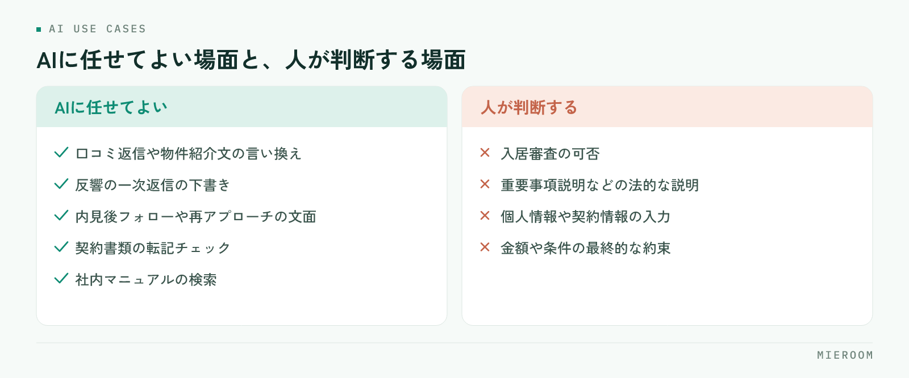

<!--META
{
  "title": "不動産会社のAI活用｜反響対応・追客・書類作成で今すぐ使える場面と注意点",
  "date": "2026-09-04",
  "category": "DX",
  "excerpt": "不動産会社のAI活用は、反響の一次返信・追客文面・書類の照合など「文章を作る仕事」から始めるのが近道です。任せてはいけない場面、小さく始める順番、店舗で決めておく利用ルールまで整理しました。",
  "tags": ["AI活用", "反響対応", "追客", "書類作成", "賃貸仲介DX"]
}
META-->

不動産会社のAI活用は、反響の一次返信や追客メッセージ、契約書類の照合といった**「文章を作る・照らし合わせる」作業**から始めるのが近道です。審査や法的な説明のような判断は人に残し、下書きと確認をAIに任せる。この記事では、賃貸仲介の業務の流れに沿って今すぐ使える場面と、店舗で先に決めておきたい利用ルールを整理します。

## 不動産会社のAI活用は「文章の下書き」から始める

賃貸仲介の一日は、思った以上に文章を書く仕事でできています。反響への返信、物件の提案文、内見後のお礼、口コミへの返信、契約書類の確認。ChatGPT・Claude・Gemini といった生成AIが得意なのは、この「下書きを作る」「要約する」「言い回しを整える」「二つの情報を照らし合わせる」という作業です。

<figure class="fig"><figcaption>任せるのは文章の下書きまで。判断と説明は人の仕事として残します。</figcaption></figure>

一方で、AIは物件の空室状況も、お客様の事情も、最新の法令も知りません。だからこそ、**判断と責任は人に残し、手を動かす部分だけを任せる**という線引きが、不動産会社のAI活用では最初の設計になります。他社の活用事例を探すより、自店の業務の流れを上から順に眺め、「ここは文章仕事だ」という場面に印をつけるほうが確実に効きます。

## 反響対応：一次返信と物件提案文の下書きに使う

反響対応でAIが効くのは、返信の速さと質を両立できることです。ポータルから届いた反響メールの本文（希望条件・入居時期・問い合わせ物件）と、店舗で使っている返信テンプレートを渡し、「この条件に合わせて一次返信の下書きを作って」と頼む。あとは担当者が空室と条件を確認して整え、送るだけです。初動の速さが成約を左右する理由は [反響の初動5分。返信スピードが成約率を左右する理由。](./lead-response-speed.html) で詳しく書いています。

物件提案文も同じ要領です。物件の特徴を箇条書きで渡し、お客様の条件（駅距離、予算、ペット可など）に沿った紹介文を作らせます。このとき「事実にない魅力を足さない」「断定的な表現を避ける」と指示しておくと、誇大な文面になりにくくなります。**空室・賃料・設備の事実確認は必ず人が行う**。ここだけは省けません。

## 追客と内見後フォロー：賃貸仲介のAI追客の使いどころ

追客は、続けることがいちばん難しい仕事です。AIには二つの使い方があります。ひとつは、接客記録をもとに個別の文面を作ること。内見時に気にされていた点（日当たり、周辺環境、初期費用）を箇条書きで渡し、「不安に答えつつ次の内見を提案する文面を」と頼めば、担当者の言葉を残したまま内見後フォローの下書きがすぐにできます。返信が途絶えたお客様への再アプローチ文も、経緯と時期を渡せば案が出ます。

もうひとつは、ツールに組み込まれた自動追客です。反響直後の自動送信、決めた日数ごとの順送り、テンプレを送り切ったあとのAIによる文面生成は、人が忙しい週でも止まりません。**個別の文面は汎用AIで、漏れをなくす定期フォローは組み込みAIで**。この役割分担が、賃貸仲介のAI追客を無理なく続けるコツです。

## 書類・口コミ・社内マニュアル：事務の負担を軽くする

契約書類では、AIを「作る」より「照らし合わせる」役に使います。申込内容と契約書の下書きを渡し、氏名・住所・賃料・契約期間・特約の転記ミスや表記ゆれを指摘させる。人の目で見落としやすい桁や日付の食い違いを拾えます。ただし最終確認は担当者が行い、**重要事項説明そのものは宅建士の仕事**であることは変わりません。

口コミ返信は、AIをもっとも安全に使える場面のひとつです。感謝、具体的な言及、次につながる一言という型を決めておき、口コミの本文を渡して下書きを作らせます。厳しい口コミにも感情的にならず、事実を確認したうえで返せます。お客様が特定される情報を返信に含めないことだけ注意してください。

社内マニュアルや過去の対応記録をAIに読ませ、「この場合はどうする？」に答えさせる仕組み（社内データ検索）も有効です。新人からの質問が減り、店長の時間が守られます。

## AIに任せてはいけない場面：審査・法的説明・個人情報

使える場面より大切なのが、使わない場面です。まず入居審査の判断。お客様の属性を渡して可否を出させるような使い方は、偏った判断や説明できない結果につながります。審査は店舗の基準に沿って人が行い、AIは申込書類の不備チェックまでにとどめます。

次に法的な説明。契約条件の解釈、特約の意味、原状回復の考え方などをAIに答えさせ、そのままお客様に伝えるのは危険です。AIの回答は古い情報や誤りを含むことがあり、説明責任は店舗にあります。

そして個人情報。氏名・勤務先・年収・保証人といった情報を、個人契約の汎用AIに貼り付けてはいけません。入力内容が学習に使われない設定や法人向けプランを使い、それでも必要最小限にとどめます。**AIの出力は下書きであり、送る前に人が読む**。この一行を店舗の鉄則にしてください。

## 小さく始める順番と、店舗で決めておく利用ルール

順番は「個人情報を含まず、失敗しても取り返せる」場面からです。

1. 口コミ返信や物件紹介文の言い換えなど、個人情報を含まない文章仕事
2. 反響の一次返信の下書き（テンプレートと希望条件だけを渡す）
3. 内見後フォローや再アプローチの追客文面
4. 契約書類の転記チェック
5. 社内マニュアルの検索

並行して、店舗の利用ルールを一枚にまとめます。決めるのは次の五つです。

- 入力してよい情報と、してはいけない情報の線引き
- 使うツールとアカウント（個人アカウントの業務利用は避ける）
- 出力を確認する人と、確認の仕方
- うまくいった指示文（プロンプト）の共有場所
- 定期的に使い方を見直す場

効果は感覚ではなく、反響数・接客数・成約率の推移で確かめます。導入した月と、その前の月を同じ指標で並べる。変わらなければ、使い方か対象にした業務のどちらかが合っていません。数字で見る考え方は [成績を「見える化」したら、離職とギスギスが減った話。](./staff-visualization.html) にまとめています。

## ツールに組み込まれたAIと汎用AIの使い分け

最後に、ChatGPT のような汎用AIと、業務ツールに組み込まれたAIの使い分けです。汎用AIは、相手ごとに変わる一回性の文章や、言い換え・要約・アイデア出しに向いています。組み込みAIは、反響メールの自動取込、自動追客、媒体出力用のPRコメント生成、領収書の読み取りのように、毎日同じ形で繰り返す作業を漏れなく回し、結果がそのまま管理表につながります。

判断基準はひとつ。**「毎日同じ形で繰り返す」なら組み込み、「相手ごとに変える」なら汎用**です。文章の下書きから小さく始め、任せない場面を先に決め、効果は反響数と接客数で確かめる。この順番を守れば、AI活用は現場の負担を増やさずに定着します。そしてどちらのAIも、反響・接客・申込・入金の記録に結びついてはじめて経営の数字になります。

繰り返す側をまとめて引き受ける道具として、賃貸仲介向けの業務管理SaaS「ミエルーム」があります。フォームやメールの自動取込で反響の入力をなくし、LINE・SMSの自動追客で接点を切らさず、社内契約フォーマットへの自動取込で書類の転記を減らします。結果は申込・入金管理までひとつながりで残るため、自動化した分がそのまま数字として見えます。どの機能が自店の業務に当たるかは [ミエルームの機能・事例](../features.html) にまとめています。AI活用の入口を業務ツールの側から作りたいときは、初期設定の代行も含めて一度ご相談ください。
