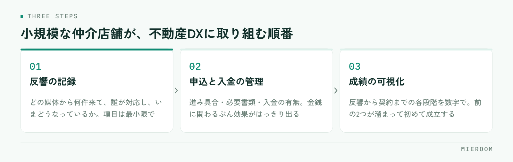

<!--META
{
  "title": "不動産DXとは何をすることか｜小規模な仲介店舗が現実的に取り組む順番",
  "date": "2026-09-25",
  "category": "DX",
  "excerpt": "不動産DXという言葉が何を指すのか、小規模な賃貸仲介店舗の目線で整理しました。デジタル化との違い、着手する順番、うまくいかない店舗に共通するつまずき方、最初の1か月で進められることまでまとめています。",
  "hook": "DXは一気にやらない。効く順番がある",
  "tags": ["不動産DX", "賃貸仲介", "業務効率化", "システム導入", "店舗運営"]
}
META-->

不動産DXと言われても、何から手をつければいいのか分からない。小規模な賃貸仲介店舗では、これがふつうの感覚だと思います。**不動産DXとは、店舗の業務を「記録が残り、後から見返せる形」に置き換えていくこと**です。最新のツールを入れることそのものではありません。

<h4>この記事の結論</h4>
不動産DXは、<strong>紙とExcelで持っている情報を、一か所に集めて共有できる状態にする</strong>ところから始まります。小規模店舗が取り組む順番は、反響の記録 → 申込・入金の管理 → 成績の可視化。いきなり全部を変えようとすると、必ず途中で止まります。

## 不動産DXとは、道具の話ではなく記録の話

DX（*Digital Transformation*）という言葉は幅が広く、業界によって指す内容も変わります。賃貸仲介の現場に引き寄せて言えば、**これまで人の頭と紙の中にあった情報を、誰でも見られる記録に変えること**です。

店舗を回しているのは、たいてい個々のスタッフの記憶です。あの反響は誰が追っているか、あの申込は書類がどこまで揃っているか、今月の売上はいくらになりそうか。聞けば分かるけれど、聞かないと分からない。この状態が続くと、担当者が休んだ日に業務が止まり、人が増えても引き継ぎに時間がかかります。

記録に変わると、確認のための会話が減ります。そのぶん、接客と物件探しに時間を使えるようになる。これが不動産DXで最初に得られる変化です。

## デジタル化とDXは、どこが違うのか

紙をPDFにする、FAXをメールに変える。これらは**デジタル化**であって、それ自体はDXではありません。違いは、業務の進め方そのものが変わるかどうかです。

| | デジタル化 | DX |
|---|---|---|
| やること | 紙や手作業を電子に置き換える | 業務の流れと分担を組み替える |
| 変わる範囲 | その作業だけ | 前後の工程・確認のしかた |
| 例 | 申込書をPDFで保存する | 申込の進み具合を全員が同じ画面で見る |
| 効果の出方 | 保管場所が減る | 確認の手間と抜け漏れが減る |

申込書をスキャンしてフォルダに入れただけでは、「あの申込どうなってる？」という会話はなくなりません。**どこまで進んでいるかが画面を見れば分かる**状態になって初めて、その会話が不要になります。

デジタル化はDXの前段階として必要ですが、そこで止まると手間だけが増えます。この違いは、[Excel管理からの卒業](./excel-to-saas.html)でも具体的に触れています。

## 小規模店舗が取り組む順番

一度に全部を変えようとすると、入力の負担が増えた割に何も見えない、という状態になります。順番があります。

<figure class="fig"><figcaption>順番が逆になると、見るべき数字が出てこないまま画面だけが増えます。</figcaption></figure>

はじめに手をつけるのは**反響の記録**です。どの媒体から何件来て、誰が対応し、いまどうなっているか。ここが残っていないと、広告費の判断も、追客の抜け漏れの把握もできません。入力項目は最小限で構いません。

次が**申込と入金の管理**です。申込の進み具合、必要書類の揃い具合、入金の有無。金銭に関わる部分なので、記録に変えたときの効果がはっきり出ます。

最後が**成績の可視化**です。反響から契約までの各段階が数字で見えるようになると、指導の材料になります。ただしこれは、前の2つが記録として溜まっていないと成立しません。順番が逆になると、見るべき数字が出てこないまま画面だけが増えます。

## つまずくのは、たいてい同じ3か所

!止まりやすい3つのパターン

ひとつ目は、入力項目を最初から細かくしすぎること。埋まらない欄が並ぶと、誰も入力しなくなります。ふたつ目は、既存のExcelと新しい仕組みを並行させること。二重入力になり、どちらも信用できなくなります。みっつ目は、店長だけが使っている状態。全員が同じ画面を見ないと、確認の会話は減りません。

もうひとつ、見落とされやすいのが**過去データの扱い**です。これまでのExcelを捨てる必要はありませんが、どこまでを新しい仕組みに移すかは最初に決めてください。「全部移す」と決めて作業が終わらず、そのまま自然消滅するのがよくある流れです。**動かすのは今月分から、過去は参照用に残す**。この割り切りが、定着するかどうかを分けます。

定着そのものについては、[業務改善ツールを定着させる](./gyomu-kaizen-tool-teichaku.html)で手順をまとめています。

## 最初の1か月で進められること

大がかりな計画は要りません。次の順に進めると、1か月で形になります。

1. いまの業務のうち、「聞かないと分からない情報」を3つ書き出す
2. その3つが、どこに記録されているか（人の記憶・紙・Excel・メール）を確認する
3. 記録先を一か所に決める。最初は反響だけで構わない
4. 入力する項目を5つ以内に絞り、いつ入力するかを決める（来店直後・その日の終わり、など）
5. 2週間続けて、埋まらない項目を削る。足りない項目を足す

大事なのは、**最初から完成形を目指さないこと**です。入力する人が続けられる形に削っていく作業が、そのまま自店に合った運用になります。

✓判断の基準

新しい仕組みを入れるかどうかは、「入力の手間が、確認の手間より小さいか」で判断してください。入力に5分かかっても、電話や口頭での確認が10分減るなら続きます。逆に、入力しても誰も見ない画面は、どれだけ高機能でも使われなくなります。

## 人が増える前に、記録の形を決めておく

不動産DXが必要になるのは、たいてい人が増える少し前です。スタッフが2〜3名のうちは、会話で足ります。ここから増えると、会話だけでは追えなくなります。

新しく入った人に「このやり方を覚えてください」と示せるものがあるかどうか。記録の形が決まっていれば、引き継ぎは画面の見方を教えるだけで済みます。決まっていなければ、前任者の頭の中を聞き取る作業から始めることになります。

開業したばかりの店舗や、これから人を増やす段階であれば、**業務が複雑になる前に記録の形を決めるほうが、後から直すより楽です**。成績の見え方が店舗にどう働くかは、[成績を「見える化」した話](./staff-visualization.html)も合わせて読んでみてください。

## よくある質問

スタッフが2名の店舗でも、DXに取り組む意味はありますか？

あります。少人数のほうが、ひとりが休んだときの影響が大きいためです。ただし取り組む範囲は絞ってください。反響の記録だけを先に始めて、申込や成績は後回しにする形で十分に効果が出ます。

パソコンが苦手なスタッフがいても進められますか？

入力項目を絞り、入力するタイミングを固定すれば進められます。自由記述の欄を減らし、選ぶだけで終わる形にすると負担が下がります。最初の2週間は店長が一緒に画面を見て、詰まった箇所を聞き取ってください。

いまのExcelは捨てないといけませんか？

捨てる必要はありません。参照用に残したうえで、新しい記録は新しい場所に一本化してください。二重に入力する期間を作らないことが、定着させるうえで最も重要です。移行の際は、これまでのExcelデータを取り込む形で始めることもできます。

## まとめ：順番を決めれば、DXは特別なことではない

不動産DXとは、店舗の情報を記録に変え、誰でも見返せる状態にすることです。道具を入れることが目的ではなく、確認の会話を減らし、接客に時間を戻すことが目的になります。

小規模な仲介店舗であれば、反響の記録から始めて、申込と入金、最後に成績の可視化へ。この順番を守れば、入力の負担が増えるだけで終わることはありません。過去データは参照用に残し、今月分から動かす。それで十分に前へ進みます。

ミエルームは、反響管理・申込管理・売上管理・接客成績の可視化を一つの画面でつなぐ、賃貸仲介向けの業務管理システムです。Excelデータの取り込みと初期設定の代行にも対応しており、最短即日でスタートできます。どの機能がどこまでできるかは[機能・事例のページ](../features.html)でご確認いただけます。実際の画面を見てから判断したい場合は、デモアカウントの発行もご相談ください。
