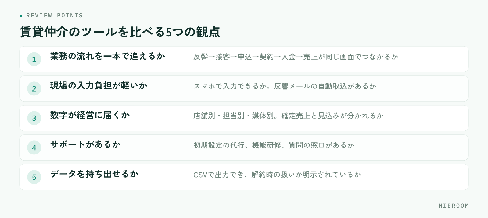

<!--META
{
  "title": "不動産の業務ツール見直しチェックリスト｜乗り換えの判断基準と移行の順番",
  "date": "2026-09-04",
  "category": "DX",
  "excerpt": "不動産会社の業務ツール見直しは、5つのサインの確認から。乗り換えない判断基準、賃貸仲介のツール比較で見る観点、並行運用から切替・旧データの扱いまでの移行手順と失敗例をチェックリストで整理しました。",
  "tags": ["業務ツール見直し", "システム乗り換え", "ツール比較", "DX", "賃貸仲介"]
}
META-->

不動産の業務ツール見直しは、「今のツールに不満がある」というだけで動かないことが、失敗を避ける第一歩です。二重入力や数字のズレといった**見直しのサインが揃っているか**を確かめ、乗り換えない選択肢も含めて判断基準で決める。そのうえで、並行運用から切替、旧データの扱いまでを順番どおりに進めれば、現場を止めずに移行できます。この記事は、その手順をチェックリストにしたものです。

## 不動産の業務ツール見直しが必要になる5つのサイン

まず、今の運用に次のサインが出ていないかを確認します。Excelでもクラウドのシステムでも、見るところは同じです。

- 二重入力がある。反響管理、申込管理、会計に同じ顧客や金額を打ち直している
- 数字が合わない。申込管理表の売上と入金の合計、反響数と接客数が、突き合わせないと一致しない
- 月末に人が張り付く。各店舗から数字を集めて整える作業に、毎月決まって誰かの時間が消える
- 退職で情報が消える。個人のExcelや個人のLINEに、顧客・案件・後ADの入金予定が残っている
- スマホで見られない。外出先で申込の状況や未入金を確認できず、事務所に戻ってから処理している

二つ以上当てはまるなら、見直しの検討段階です。とくに月末の集計は、ツールの性能より**情報の置き場所が分散していること**が原因で、人手を足しても解消しません。集計を「待たない」体制の考え方は [月末集計に半日。「数字まとめ地獄」から抜け出す方法。](./month-end-closing.html) で詳しく書いています。

## 乗り換えを「しない」ほうがよい判断基準

サインが出ていても、乗り換えが正解とは限りません。次のどれかに当てはまるなら、先に今の環境を直すほうが早く効きます。

- 不満の原因が設定と運用にある。機能はあるのに使っていない、入力の仕方が人によって違う
- 現場の入力ルール自体が決まっていない。誰が・いつ・何を入力するかが曖昧なままでは、ツールを変えても同じ結果になる
- 困りごとが一つだけで、既存ツールの追加機能や運用の工夫で解決できる
- 繁忙期の直前で、設定と教育の時間が取れない

実務的なやり方は、困りごとを全部書き出し、「今のツールの設定変更や運用ルールで消せるもの」に線を引くことです。**線を引いても残った困りごとが、乗り換えの本当の理由**になります。残ったものが「業務の流れが一本でつながらない」「数字が経営に届かない」という構造的なものなら、次の比較に進みます。

## 賃貸仲介のツール比較で見る5つの観点

不動産のシステム乗り換えで比較表を作ると、機能の数で選びがちです。賃貸仲介の店舗で本当に効くのは、次の五つの観点です。

<figure class="fig"><figcaption>とくに1と3は、後から機能を足しても埋めにくい部分です。</figcaption></figure>

1. 業務の流れを一本で追えるか。反響→来店・接客→申込→契約→入金→売上が、同じ画面のなかでつながっているか
2. 現場の入力負担が軽いか。スマホで入力できるか、フォームやポータルの反響メールからの自動取込があるか
3. 数字が経営に届くか。店舗別・担当別・媒体別に見られ、確定売上と見込みが分かれ、後ADや一部入金を案件ごとに追えるか
4. サポートがあるか。導入時の設定を手伝ってもらえるか、機能研修や質問の窓口があるか
5. データを持ち出せるか。CSVなどで出力でき、解約時のデータの扱いが明示されているか

とくに1と3は、後から機能を足しても埋まらない部分です。後AD・一部入金・付帯の売上まで扱えるかは、候補の機能説明で必ず確認してください。「売上管理あり」と書かれていても、契約時に一括で計上する設計だと、入金までの期間が長い後ADはこぼれます。見るべきは機能名ではなく、入金予定日と残額を案件ごとに持てるかどうかです。

主なサービスをこの5つの観点で並べたものは、[賃貸仲介の業務管理システム比較](../compare.html)にまとめています。

## 候補はデモ画面で「自店の案件」を通して検証する

観点が決まったら、資料ではなくデモ画面で検証します。手順は次のとおりです。

1. 直近の実案件を数件選ぶ。反響から申込まで進んだ案件、後AD待ちの案件、一部入金の案件を含める
2. 各社のデモ環境で、反響の登録から接客、申込、入金、売上の確定まで一連で入力する
3. 入力の手数、スマホでの見え方、後AD・一部入金の記録のしやすさを確認する
4. 入力したその場で、店舗別・担当別の数字が出るかを見る
5. 入力したデータをCSVで出力してみる

このとき、経営者だけでなく毎日入力する現場スタッフにも触ってもらい、率直な感想を聞くことが大切です。**入力する人が「これなら続く」と言えるか**が、定着を左右します。

## 移行の順番：並行運用→切替→旧データの扱い

移行は三段階に分けます。

1. 並行運用。新規の反響と新規の申込だけを新ツールに入力し、進行中の案件は旧ツールで完了まで進める。並行期間は短く区切り、終わりの日を先に決めておく
2. 切替。月次の締め日に合わせて、すべての入力を新ツールに一本化する。入力ルールを一枚にまとめ、店舗ごとに責任者を決める
3. 旧データの扱い。進行中の案件（未入金・後AD待ち・分割入金の途中）は必ず移す。過去の完了案件は、集計に必要な粒度だけをインポートで取り込む。旧ツールは閲覧専用で一定期間残し、解約前にすべて出力しておく

並行運用の落とし穴は、両方に入力させ続けて現場が疲弊することです。**並行期間の終わりを先に決める**ことで防げます。Excelからの移行で何が変わるかの全体像は [Excel管理からの卒業。SaaS導入で変わる5つのこと。](./excel-to-saas.html) も参考にしてください。

## ツール乗り換えでよくある失敗と防ぎ方

- 全機能を一度に使おうとして現場が止まる。最初は申込管理と反響管理の二つに絞り、慣れてから広げる
- 経営者だけで決めて現場が知らない。比較の段階から入力担当を入れ、切替日と理由を全員に共有する
- 移す前にデータを整えない。顧客や物件の重複、表記ゆれを旧データの段階で消しておく
- 解約してから出力できないと気づく。出力は解約の前、できれば比較の段階で試す
- 乗り換えた理由を忘れる。「残った困りごと」の一覧を残し、導入後に一つずつ消えたかを確認する

失敗に共通するのは、ツールの問題ではなく**準備と合意の不足**です。逆に言えば、この記事のチェックリストを上から順に埋めていけば、ほとんどは防げます。

## まとめ：見直しは「乗り換え」ではなく「流れをつなぐ」ため

最後に、チェックリストをまとめます。

- サインの確認：二重入力・数字のズレ・月末の張り付き・退職で消える情報・スマホで見られない
- しない判断：原因が設定や運用にある、入力ルールが未整備、困りごとが一つだけ、繁忙期の直前
- 比較の観点：流れが一本か、入力負担、数字が経営に届くか、サポート、データの持ち出し
- 移行の順番：並行運用の終わりを決める、締め日に切替、進行中案件は必ず移す

業務ツール見直しの目的は、新しいツールに乗り換えることではなく、反響から入金までの流れを一本につなぎ、数字を経営に届けることです。

候補のひとつとして、ミエルームをこの五つの観点で説明しておきます。株式会社TENERAMENTE が賃貸仲介向けに開発・運用している業務管理SaaSで、反響管理・接客管理・申込管理表・売上管理がひとつの流れでつながり、後ADや一部入金を案件ごとに記録でき、確定売上と見込みを分けて集計できます。Excelデータのインポートに対応し、導入時は初期設定の代行も行います。機能ごとの画面と使い方は [ミエルームの機能・事例](../features.html) で確認できます。乗り換えるかどうかを決めきれない段階でも構いません。線を引いても残った困りごとを添えてご相談いただければ、検証の進め方からご案内します。
