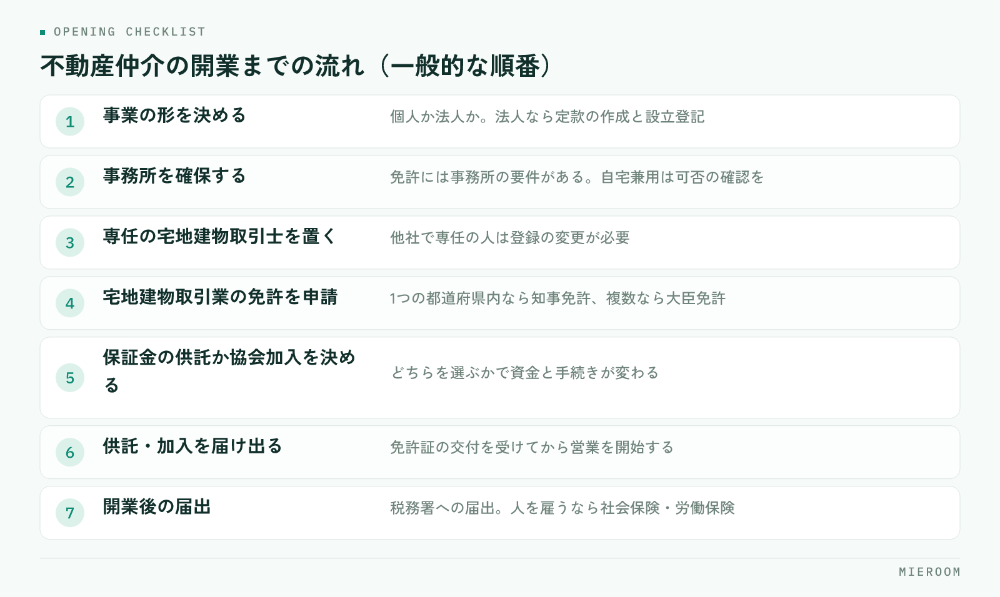

<!--META
{
  "title": "不動産の開業準備チェックリスト｜免許・事務所・業者間サイト・管理ツール",
  "date": "2026-09-04",
  "category": "組織・育成",
  "excerpt": "賃貸仲介で開業する方向けに、法人設立から宅建業免許の申請、営業保証金や保証協会、専任の宅建士、集客と業者間サイトの準備、反響・申込・売上・入金を1つで追う管理の仕組みまで、開業準備の流れをチェックリストにしました。",
  "tags": ["不動産開業", "開業準備", "宅建業免許", "賃貸仲介", "業者間サイト"]
}
META-->

不動産の開業準備で見落とされやすいのは、免許や事務所のような「開業に必要なもの」ではなく、開業した後に毎日回す「集客と管理の仕組み」です。免許の申請は手順が決まっていて窓口も案内してくれますが、反響をどこで取り、申込と入金をどう追うかは、自分で決めるしかありません。この記事では、賃貸仲介で開業する方向けに、法人設立から管理ツールまでの流れをチェックリストにまとめます。

## 宅建業の開業までの流れをチェックリストで確認する

全体の流れは次のとおりです。金額や日数、必要書類は改正や地域で変わるため、所管の窓口（都道府県の宅建業担当課など）や行政書士・税理士など専門家に必ず確認してください。

<figure class="fig"><figcaption>要件や手続きは変わることがあります。最新の条件は所管の窓口や専門家にご確認ください。</figcaption></figure>

1. 事業の形を決める。個人か法人か。法人なら定款の作成と設立登記
2. 事務所を確保する。免許には事務所の要件があり、自宅兼用やシェアオフィスは可否の確認が要る
3. 専任の宅地建物取引士を置く。自分が宅建士でなければ雇用する。他社で専任の人は登録の変更が必要
4. 宅地建物取引業の免許を申請する。事務所が1つの都道府県内なら知事免許、複数にまたがるなら大臣免許
5. 営業保証金の供託か、宅地建物取引業保証協会への加入かを決める。どちらかで資金と手続きが変わる
6. 免許の通知後、供託または協会加入を済ませて届け出る。免許証の交付を受けてから営業開始
7. 開業後の届出。税務署への開業届や法人設立の届出、人を雇うなら社会保険・労働保険の手続き

協会加入は免許の通知後に動くと待ち時間が生まれるため、**免許申請と並行して入会手続きを進めておく**のが一般的です。

## 事務所と設備：後から困らない選び方

事務所は免許の要件を満たすことが第一ですが、それだけでは足りません。開業後に困らない視点で選びます。

- 免許の要件：他の事業や住居と区切られた独立した空間で、継続して業務ができること。標識（業者票）と報酬額表の掲示、帳簿と従業者名簿の備え付けも法令で決まっている
- 立地：来店型の賃貸仲介なら、駅や大学、企業の近くなど狙う客層が通る場所。看板の見え方も確認する
- 接客スペース：申込や重説（重要事項説明）を落ち着いて行える席と、お客様の書類を扱える最低限のプライバシー
- 設備：業者間サイトを使うパソコン、図面や契約書を印刷する複合機、固定電話、インターネット回線、鍵の保管場所
- 管理の仕組み：反響・申込・売上・入金を記録する場所を開業日までに決めておく

後回しにされやすいのが最後の項目です。パソコンと複合機は開業前に揃うのに、数字を記録する仕組みは「忙しくなってから考える」になりがちです。

## 集客の準備：ポータル・Googleビジネスプロフィール・自社サイト

開業直後の反響は待っていても来ません。免許取得の前から準備できることがあります。

- ポータルサイト：掲載契約に免許番号が要ることが多いため、免許取得後すぐ掲載できるよう、物件の候補、写真、紹介文を先に用意する。媒体ごとの費用と反響数は初月から記録する
- Googleビジネスプロフィール：店舗名、住所、営業時間、外観と店内の写真を整え、口コミに返信する。「地域名＋賃貸」で検索する人の入口になる
- 自社サイト：問い合わせフォームとLINEの友だち追加を置き、ポータルからの流入を受け止める
- 反響の受け口：どの媒体から来ても同じ一覧に入り、誰が対応したかが分かる状態にする

媒体が増えると、費用がどこで利益になっているかが分からなくなります。初月から媒体別に反響と成約を記録すれば、広告費の増減を根拠で決められます。考え方は[反響は取れているのに利益が残らない。原因は「媒体別ROI」の不在。](./media-roi.html)で解説しています。

## 業者間サイトと物件確認の準備

賃貸仲介の商品は、管理会社や元付業者が募集する物件です。仕入れの経路を開業前に整えます。

- 業者間サイト：管理会社が募集情報を出す業者向けサイトの利用を申し込む。宅建業者であることの確認（免許番号など）が求められるのが一般的なので、免許取得後すぐ申請できるよう書類を揃えておく
- 指定流通機構（レインズ）：利用手続きを、加入する協会や所管の機関に確認する
- 物確（物件確認）の型：募集状況を確認したら日時・担当者・結果を残す。掲載終了や条件変更に気づける仕組みを決める
- 図面と初期費用：募集図面（マイソク）の作り方と初期費用の見積の出し方を決めておく。接客中にその場で出せるかで印象が変わる
- 管理会社との関係：AD（広告料）の条件や申込書の様式は管理会社ごとに違う。やり取りの結果を案件に残し、引き継げるようにする

業者間サイトと連携する管理ツールなら、物件の手入力を減らし、物確の結果も同じ場所に残せます。

## 管理の仕組みを最初から整える：反響・申込・売上・入金を1つで追う

開業直後は案件が少なく、Excelやノートで十分に見えます。しかし案件が少ない時期こそ記録の型を作る好機で、忙しくなってから型を変えるのは開業時に作るよりはるかに難しくなります。

- 反響：媒体・受付日・担当・初動の返信・追客の履歴
- 申込：申込管理表に、審査状況・契約予定日・仲介手数料・AD・付帯を案件ごとに
- 売上：確定売上と見込みを分ける。契約しても入金が終わるまで確定にしない
- 入金：仲介手数料・AD・付帯それぞれの入金と残額。後ADは入金予定日を登録し、予定日を過ぎた未入金を抽出する

四つが1つの案件に紐づいていれば、**どの媒体の反響がいくらの売上になったか**が自動で分かり、開業初年度の広告費の配分に根拠が持てます。開業時にツールを選ぶなら、1店舗だけで完結する軽さと、後ADや一部入金まで案件単位で扱えるかの二つを基準にしてください。ツールの選び方は[賃貸仲介の業務改善ツール完全ガイド](./chintai-gyomu-kaizen-tool.html)にまとめています。

## 開業直後に起きがちな失敗

開業してしばらくの間につまずくポイントは決まっています。

- 反響が来るまでの間に管理の型を作らず、忙しくなってから手が回らなくなる
- ポータルの掲載枠を「とりあえず」で増やし、どの媒体が利益になっているか分からないまま費用が増える
- 後ADの入金予定を記録せず、入金されていないことに気づかない
- 物確の結果や管理会社ごとの条件が自分の頭の中だけにあり、人を雇ったときに引き継げない
- 契約書や重説を案件ごとに一から作り、転記ミスと作成時間が増える
- 保証協会や届出の順番を誤り、営業開始の日程がずれる

どれも、開業前に記録する場所と手順を決めておけば防げる失敗です。免許の準備と同じ熱量で、開業後の毎日の仕組みを準備してください。一人で開業する場合の省力化は[一人で始める不動産仲介の開業｜最初に揃えるツールと省力化の設計](./hitori-fudosan-kaigyo-tool.html)にまとめています。

## まとめ：不動産の開業準備は、免許と同じくらい「仕組み」を

不動産の開業準備は、法人設立・事務所・専任の宅建士・免許申請・保証協会または供託・開業後の届出という制度の流れと、集客・仕入れ・管理という運営の流れの二本立てです。制度の部分は窓口と専門家に確認しながら進め、運営の部分は自分で決めて開業日までに形にします。

運営の部分を1つにまとめる選択肢のひとつが、賃貸仲介向けの業務管理SaaS [ミエルーム](../index.html) です。反響管理・接客管理・申込管理表・売上管理を1つの画面にまとめ、後ADの案件ごとの記録、一部入金・分割入金、確定売上と見込みの分離まで扱えます。業者間サイト連携、社内契約フォーマットへの自動取込、LINE・SMSの自動追客もあり、1店舗の開業時から使え、開業日に合わせて最短即日で始められます。免許や事務所の準備と並べて画面を確かめておきたい方は、デモアカウントの発行からお声がけください。
