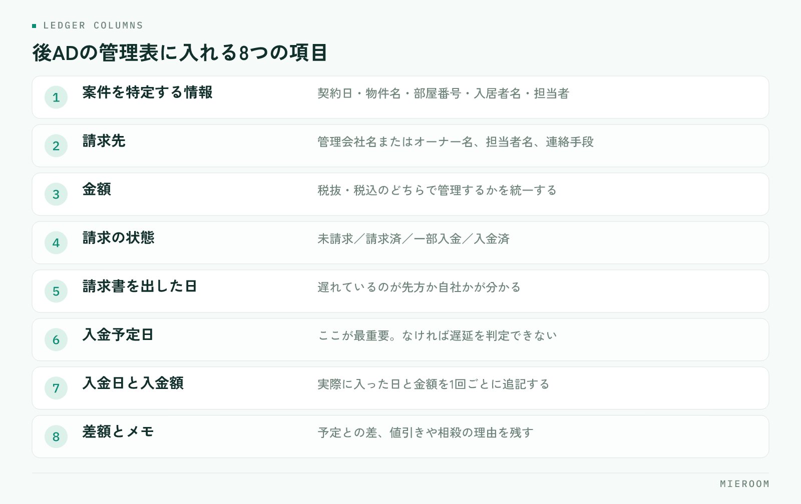

<!--META
{
  "title": "後ADの未入金を防ぐ管理表の作り方｜案件ごとの記録と月次チェック",
  "date": "2026-09-07",
  "category": "売上管理",
  "excerpt": "後ADの取りこぼしは、担当者の記憶に頼るほど増えます。案件ごとに請求先・金額・入金予定日を記録する管理表の項目設計、月次で未入金を洗い出す手順、Excelで作るときの注意点、督促の進め方まで整理しました。",
  "hook": "後ADの取りこぼしは記憶ではなく記録で防ぐ",
  "tags": ["後AD", "入金管理", "売上管理", "賃貸仲介", "未入金"]
}
META-->

後ADの未入金は、担当者の意識が低いから起きるわけではありません。**入金予定日が案件ごとに記録されていない**から、誰も未回収に気づけないだけです。この記事では、後ADを取りこぼさない管理表の項目、月次で未入金を洗い出す手順、督促の進め方を順に整理します。

  <h4>この記事の結論</h4>
  
後ADの未入金を防ぐ鍵は督促の強さではなく、<strong>案件ごとに入金予定日を持たせること</strong>です。予定日が入っていれば、未入金は月次で自動的に浮かび上がります。

## 後ADの未入金が起きる3つの原因

後ADは、契約が終わってからしばらく経って入金されます。この「間が空く」ことが、そのまま取りこぼしの原因になります。

ひとつ目は、**契約時点で記録が終わってしまう**ことです。契約管理表は契約日で完結し、その後の入金までは追いません。契約が済んだ案件は担当者の関心から外れ、入金の確認が誰の仕事でもなくなります。

ふたつ目は、**入金予定日が案件に紐づいていない**ことです。「だいたい翌月末」という共通認識はあっても、案件ごとの日付として書かれていなければ、遅れているかどうかを判断できません。

みっつ目は、**通帳の入金と案件が突き合わされていない**ことです。まとめて振り込まれた金額を見て「入っている」と判断すると、その中に足りない案件が混ざっていても気づけません。契約と売上が同じではない理由は[「契約＝売上」ではない前提](./go-ad-management.html)で扱っています。

## 管理表に必ず入れる項目

後ADの管理表は、契約管理表とは別に持つか、契約管理表に列を足す形にします。どちらでも構いませんが、**1案件が1行で最後まで追える**ことが条件です。

<figure class="fig"><figcaption>抜けやすいのは入金予定日と差額です。この2つがないと未入金に気づけません。</figcaption></figure>

- **案件を特定する情報**：契約日・物件名・部屋番号・入居者名・担当者
- **請求先**：管理会社名またはオーナー名、担当者名、連絡手段
- **金額**：後ADの金額（税抜・税込のどちらで管理するか統一する）
- **請求の状態**：未請求／請求済／一部入金／入金済
- **請求書を出した日**
- **入金予定日**：ここが最重要の列です
- **入金日と入金額**：実際に入った日と金額
- **差額とメモ**：予定と実際の差、値引きや相殺があればその理由

このうち抜けやすいのが**入金予定日と差額**です。予定日がないと遅延が判定できず、差額の列がないと一部入金がそのまま忘れられます。申込から契約までを1行で追う考え方は[申込管理表の作り方](./moushikomi-kanrihyo-tsukurikata.html)と同じで、後ADはその行の続きだと考えると設計しやすくなります。

## 案件ごとに「いつ請求するか」を決める

後ADは、請求のタイミングが取引先ごとに違います。管理会社の締め日、入居日基準か契約日基準か、請求書の提出方法。ここを取引先ごとに一度調べて表にしておくと、案件が発生するたびに迷わなくなります。

| 決めておくこと | 記録する場所 | 決めていないと起きること |
|---|---|---|
| 請求の基準日（契約日／入居日） | 取引先ごとの一覧 | 請求が早すぎて差し戻される |
| 締め日と支払サイト | 取引先ごとの一覧 | 入金予定日を計算できない |
| 請求書の提出先と方法 | 取引先ごとの一覧 | 送ったつもりで届いていない |
| 案件ごとの入金予定日 | 管理表の行 | 遅延に気づけない |

この表を一度作れば、案件登録のときに**基準日から入金予定日を計算して入れるだけ**になります。予定日を入れる作業は数十秒ですが、これがないと月次のチェックが成り立ちません。

✓請求書を出した日も残す

「請求書はいつ送りましたか」と聞かれて答えられないと、督促の会話が進みません。送付日を記録しておくと、遅れているのが先方なのか自社なのかがすぐ分かります。

## 月次チェックの手順

月に一度、決まった日に同じ手順で確認します。担当者任せにせず、**店長が見る会**にするのが定着のコツです。

1. 入金予定日が過ぎていて「入金済」でない行を抽出する
2. その行について、請求書を出しているかを確認する（未請求ならまず請求する）
3. 請求済で入金がない行を、遅延の日数順に並べる
4. 通帳の入金と管理表の行を突き合わせ、金額が合わない行に印を付ける
5. 一部入金の行は、残額と次回の入金予定日を書き足す
6. 翌月に予定日が来る案件を眺め、請求漏れがないかを見る

手順4を飛ばすと、**一部入金が「入金済」として処理されます**。これが後から見つかりにくい取りこぼしです。月末の集計を短くする考え方は[月末の締め作業を早くする](./month-end-closing.html)にまとめています。

## Excelで管理表を作るときの注意点

Excelでも十分に運用できますが、崩れ方には型があります。先に手を打っておけば長く使えます。

- **年度でファイルを分けない**：後ADは年をまたぐため、分けた瞬間に追えなくなります
- **行を消さない**：入金済の行も残します。消すと過去の突き合わせができません
- **同じ列に複数の意味を入れない**：金額欄に「値引き」と文字を書くと集計できなくなります
- **セルの色で状態を表さない**：色は集計もフィルタもできません。状態は文字の列で持ちます
- **編集する人を決める**：複数人が同時に開く運用は、上書きで記録が消えます

!ファイルが分かれ始めたら限界のサイン

「最新版はどれか」を確認してから開くようになったら、Excelでの管理が限界に近づいています。担当者の手元にコピーが増えている状態も同じです。

## 未入金が見つかったときの進め方

督促は、強さではなく順番で決まります。感情的にならず、事実だけを確認する流れにします。

まず自社側を確認します。請求書を出しているか、宛先と金額は合っているか、先方の指定する様式で出しているか。**未入金の一定数は、自社側の請求漏れや様式違い**です。ここを確かめずに連絡すると、関係を損ないます。

次に先方へ確認します。「◯月◯日にお送りした◯◯号室の件、入金予定日を教えていただけますか」と、案件と日付を特定して聞きます。管理表に請求日と予定日があれば、この一文がすぐ書けます。

回答があったら、**新しい入金予定日を管理表に書き換えます**。口頭で聞いた日付を記録に反映しないと、翌月また同じ確認をすることになります。取引先ごとに遅れが繰り返されるなら、請求のタイミングか提出方法を見直す合図です。

## よくある質問

後ADは契約時点で売上に計上してよいですか？

計上の考え方は顧問税理士の方針に従ってください。管理上は、契約が決まった段階の見込みと、入金が確認できた確定分を分けて見ると、実態に近い数字になります。混ぜて集計すると、入っていないお金を売上として見てしまいます。

一部入金や分割での入金はどう記録しますか？

1回の入金ごとに、入金日と入金額を追記できる形にします。行を上書きすると経緯が消えるため、残額と次回の入金予定日を必ず書き足してください。残額が0になった時点で入金済にします。

管理表は誰が更新するのが適切ですか？

請求書の発行と入金確認をする人が更新するのがいちばん漏れません。担当営業が入力する運用にすると、契約後の関心が薄れる分だけ更新が止まります。入力する人を1人決め、月次のチェックだけ店長が見る形が続きやすい形です。

## まとめ：予定日が入っていれば、未入金は自然に浮かぶ

後ADの取りこぼしは、督促の強さではなく記録の型で決まります。**案件ごとに入金予定日を持たせ、月に一度その日付で並べ替える**。この2つだけで、未入金は探さなくても目に入るようになります。

Excelで始めても構いません。年度で分けない、行を消さない、状態を文字の列で持つ。この3つを守れば、しばらくは十分に回ります。ファイルの最新版を探すようになったら、そのときが仕組みに移す時期です。

[ミエルーム](../index.html)は、申込から契約・入金・後ADまでを案件ごとに1行で追えるようにしています。一部入金や分割入金の記録、確定した売上と見込みの分離にも対応しており、Excelデータの取り込みと初期設定の代行、デモアカウントの発行、最短即日でのスタートが可能です。後ADの管理表づくりからご相談ください。
