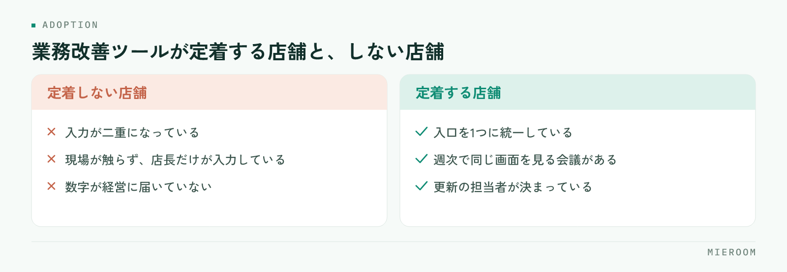

<!--META
{
  "title": "賃貸仲介の業務改善ツール｜定着する店舗と失敗する店舗の違い・選び方",
  "date": "2026-09-04",
  "category": "業務効率化",
  "excerpt": "賃貸仲介の業務改善ツールは、入れた後に現場が使い続けるかで成果が決まります。失敗する店舗の共通点、定着する店舗が実践していること、選び方のチェックリスト、乗り換え時の移行手順を現場目線でまとめました。",
  "tags": ["業務改善ツール", "賃貸仲介", "業務効率化", "ツール導入", "Excel移行"]
}
META-->

賃貸仲介の業務改善ツールは、どれを選ぶかより「入れた後に現場が使い続けるか」で結果が決まります。機能不足で失敗する店舗は少なく、多くは入力が二重になったり、数字が経営に届かなかったりして、気づけばExcelの申込管理表に戻っています。この記事では、定着する店舗と失敗する店舗の違いを整理し、導入前のチェックリストと、Excelや他のツールから乗り換えるときの移行手順までまとめます。

## 失敗する店舗に共通する3つの状態

業務改善ツールが定着しない店舗では、機能への不満より前に、運用の形が崩れています。共通するのは次の三つです。

<figure class="fig"><figcaption>違いは機能ではなく運用です。入口・会議・担当者の3つで決まります。</figcaption></figure>

- **入力が二重になっている。** Excelの申込管理表を残したまま新しいツールにも入力し、現場は「仕事が増えた」と感じる。どちらが正しい数字か分からなくなり、結局Excelに戻る
- **現場が触らない。** 店長や事務担当だけが入力し、スタッフは自分の反響や申込の状況をツールで見ない。入力が「上に報告する作業」になり、忙しい月から止まる
- **数字が経営に届かない。** 入力はされているのに、月次の会議は別に作った集計資料で進む。ツールの数字を誰も判断に使わないので、入力の精度も上がらない

三つに共通するのは、ツールが業務の流れの外側に置かれていることです。反響を受け、接客し、申込を取り、入金を確認する毎日の流れの中に組み込まれていなければ、どれだけ機能が揃っていても続きません。

## 定着する店舗がやっていること①：入口を1つに統一する

定着している店舗は、まず記録する場所を1つに決めています。反響・接客・申込・入金の記録先をツールに統一し、**ツールに入っていない案件は存在しないものとして扱う**というルールを店舗全体で共有します。

そのうえで、Excelの申込管理表は締めた月分までで止め、進行中の案件だけをツールへ移します。過去のデータは参照用として残せば十分で、すべてを移そうとすると移行作業そのものが負担になります。

入力の負担を減らす工夫も欠かせません。ポータルの反響メールや来店予約フォームを自動で取り込めるツールなら、反響の登録という最初の入力がそもそも不要になります。転記が減るほど、現場は入口を守りやすくなります。

## 定着する店舗がやっていること②：週次で数字を見る会議

二つ目は、ツールの画面をそのまま映して行う週次の会議です。未返信の反響、申込中の案件、審査待ち、未入金の後ADを、集計資料を別に作らず画面上で確認します。

この形にすると、入力していない案件は会議で必ず見つかります。**入力しないと自分が困る**という状態が自然にでき、指示しなくても入力が習慣になります。逆に、会議用の資料を別に作っている限り、ツールの数字は参考値のままで、経営判断には使われません。

会議の中身も変わります。数字を集めて報告する時間が消え、追客の優先順位、媒体ごとの反響の質、未入金の督促といった「次に何をするか」に時間を使えるようになります。数字が経営に届くとは、この状態のことです。

## 定着する店舗がやっていること③：担当者を決める

三つ目は、店舗内にツールの担当者を1人置くことです。役割は、入力ルールの決定、項目を増やすかどうかの判断、スタッフからの質問への対応です。担当が曖昧なままだと、入力の仕方が人によってばらつき、集計が合わなくなります。

導入直後の期間は、担当者が未入力の案件を毎日確認し、その場で本人に声をかけます。大切なのは、入力しない人を責めるのではなく、**入力しにくい原因を画面や項目の側で直す**ことです。必須項目が多すぎる、選択肢が業務と合っていない、スマホで開きにくいといった原因が見つかれば、設定を変えるだけで解決することが少なくありません。

担当者は店長本人でなくても構いません。事務担当や数字に関心のある若手が担うと、現場の目線で運用が整っていきます。

## 賃貸仲介の業務改善ツール、選び方チェックリスト

定着を前提にすると、選ぶときの基準も変わります。賃貸の業務改善システムを選ぶときは、機能の数ではなく次の項目で確認してください。

1. 後AD・一部入金・分割入金を案件ごとに記録できるか
2. 確定売上と見込みを分けて集計できるか
3. 反響から接客・申込・契約・入金までが1つの流れでつながっているか
4. ポータルの反響メールやフォームを自動で取り込み、転記を減らせるか
5. 毎日触る画面が軽く、スマホでも確認できるか
6. 1店舗でも複数店舗でも同じ使い方ができるか
7. 契約前に試せる環境があり、実際の案件を入れて確かめられるか
8. 導入後に質問できる窓口があるか

とくに1と2は、賃貸仲介の商習慣に合わせて設計されているかを見分ける項目です。汎用の業務効率化ツールは、契約と入金のずれや後ADを前提に作られていないことがあり、そこで運用が崩れます。確認するときは、資料の機能名ではなく実際の画面を開き、後ADの入金予定日を入れる欄と、一部入金の残額が出る欄があるかを見てください。この2つが無いツールは、導入後もExcelを併用することになります。機能の全体像は[賃貸仲介の業務改善ツール完全ガイド](./chintai-gyomu-kaizen-tool.html)にまとめています。

各サービスがこのチェックリストのどこに強いかは、[賃貸仲介の業務管理システム比較](../compare.html)で整理しています。

## 乗り換え時の移行手順（Excel・他ツールから）

移行で失敗する店舗は、すべてを一度に移そうとします。順番を決めて範囲を絞るのがコツです。

1. 移す範囲を絞る。進行中の案件と未入金の案件だけを対象にし、過去の案件はExcelを閲覧用に残す
2. 項目の対応表を作ってから入力する。使っていない列は捨て、後ADの入金予定日など取っていなかった項目はここで足す。担当者ごとに自分の案件を入れれば、移行と同時に使い方を覚えられる
3. 並行運用は締め1回分に区切り、切替日にExcelを閲覧のみにする。編集できる状態で残すと、必ず誰かが戻る

Excelからの移行で何が変わるかは、[Excel管理からの卒業。SaaS導入で変わる5つのこと。](./excel-to-saas.html)で整理しています。乗り換えの判断基準と移行の順番は[不動産の業務ツール見直しチェックリスト｜乗り換えの判断基準と移行の順番](./fudosan-gyomu-tool-minaoshi.html)で詳しく解説しています。

## まとめ：定着は機能ではなく仕組みで決まる

賃貸仲介の業務改善ツールが定着するかどうかは、入口を1つにする、週次で画面を見る、担当者を決める、という三つの仕組みでほぼ決まります。選ぶ段階では、後ADや一部入金といった賃貸ならではのお金の流れを扱えるか、転記を減らせるか、試してから決められるかを確認してください。

その三つの仕組みを前提に作られているのが、賃貸仲介向けの業務管理SaaS「ミエルーム」です。反響から接客・申込・入金までを1つの画面で追えるので「入口を1つにする」運用がそのまま形になり、申込管理表では後ADを案件ごとに記録し、一部入金・分割入金にも対応し、確定売上と見込みを分けて集計できます。フォームやメールの自動取込があるため、反響の登録という最初の入力そのものを減らせます。機能ごとの画面は [ミエルームの機能・事例](../features.html) にまとめています。定着の段取りから相談したい店舗さまは、初期設定の代行も含めてお問い合わせいただければ、入力ルールの決め方からご一緒します。
