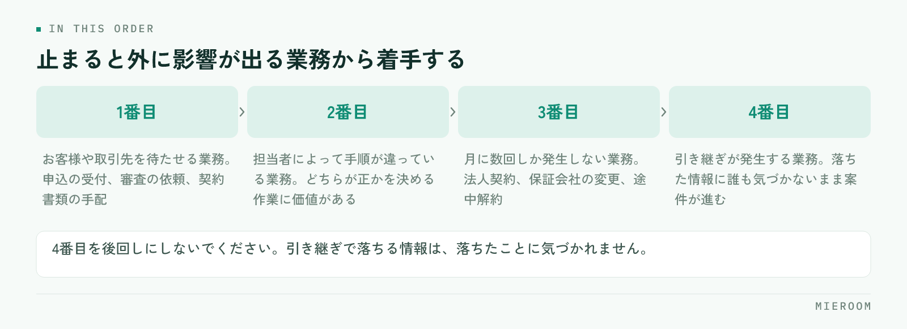

<!--META
{
  "title": "賃貸仲介の業務マニュアルの作り方｜使われる粒度と置き場所の決め方",
  "date": "2026-10-09",
  "category": "組織・育成",
  "excerpt": "賃貸仲介の業務マニュアルの作り方を、着手する業務の選び方から粒度の決め方、置き場所、更新の担当の決め方までまとめました。作っても使われないマニュアルにしないための運用に重点を置いています。",
  "hook": "作るより、使われる形にするほうが難しい",
  "tags": ["業務マニュアル", "手順書", "新人育成", "賃貸仲介", "店舗運営"]
}
META-->

マニュアルを作ったのに、結局は口頭で教えている。そういう店舗は少なくありません。原因は書いた内容の出来ではなく、**開かなくても仕事が進んでしまう置き場所に置いてあること**です。作る前に決めるのは、文章の体裁ではなく、どの業務を・どの粒度で・どこに置くかの3点です。

<h4>この記事の結論</h4>
業務マニュアルは、全業務を網羅するより<strong>迷いが起きる場面だけを先に書く</strong>と使われます。粒度は「その場で開いて見るか、読んで覚えるか」で分け、置き場所は実際に作業する画面のすぐ隣にします。

## マニュアルが使われない理由は、置き場所と粒度にある

使われないマニュアルには共通点があります。1つは、作業している場所から遠いこと。共有フォルダの階層の奥にあるファイルは、忙しい時間帯には開かれません。開くより先輩に聞いたほうが速いからです。

もう1つは、粒度が合っていないことです。業務の全体像を説明した長い文書は、初めて読むときには役に立ちますが、繁忙期に「この書類は誰に回すんだったか」を確かめたい場面では使えません。逆に、手順だけを箇条書きにした紙は、確認には使えても、なぜその手順なのかが分からないため例外に対応できません。

**この2つは、どちらも作る前の設計の問題です**。文章を書き直しても解決しません。先に、どの場面で開かれるものを作るのかを決めてください。

## 作る前に決める3つのこと

着手の前に、紙1枚に次の3つを書き出します。

**1つめは、対象にする業務**。すべてを書こうとすると終わりません。選ぶ基準は「同じ質問が繰り返し出ている業務」です。店長に同じことを月に何度も聞かれているなら、その業務が最初の対象になります。

**2つめは、読む人**。入って1週間の人向けか、ひととおり経験した人の確認用か。この2つは同じ文書にできません。前者には前提の説明が必要で、後者には手順と判断基準だけが必要です。新人向けに何から渡すかの順番は[新人育成の順番](./shinjin-ikusei-junban.html)で整理しています。

**3つめは、置き場所**。印刷してカウンターに置くのか、共有フォルダなのか、業務に使っているシステムの画面から開けるようにするのか。ここを後回しにすると、作ったあとに「どこに置くか」で止まります。

## 書く順番：迷いが起きる場面から

全体を体系的に並べてから書き始めると、完成しないまま時間が過ぎます。着手の順番は次のとおりです。

<figure class="fig"><figcaption>全体を体系的に並べてから書き始めると、完成しないまま時間が過ぎます。</figcaption></figure>

1. **お客様や取引先を待たせる業務**：申込の受付、審査の依頼、契約書類の手配。止まると外に影響が出る業務から
2. **担当者によって手順が違っている業務**：同じ作業を別のやり方でしている箇所は、どちらが正かを決める作業そのものに価値があります
3. **月に数回しか発生しない業務**：法人契約、保証会社の変更、途中解約。頻度が低いぶん毎回調べ直しているはずです
4. **引き継ぎが発生する業務**：担当が変わるときに情報が落ちる箇所

**4番目を後回しにしないでください**。引き継ぎのときに落ちる情報は、落ちたことに誰も気づかないまま案件が進みます。

✓1業務1ページを守る

1つのファイルに複数の業務を書くと、更新するときにどこを直せばよいか分からなくなり、結果として更新されません。1業務1ページに分けておくと、変更があった業務だけを差し替えられます。ページが増えること自体は問題になりません。探せる形で並んでいれば十分です。

## 粒度は「その場で見るか、読んで覚えるか」で分ける

同じ業務でも、使われる場面によって必要な粒度が違います。3つに分けて作るのが現実的です。

| 種類 | 使う場面 | 書く内容 |
|---|---|---|
| チェックリスト | 作業しながら手元で確認する | 項目だけ。抜けの防止が目的で、理由は書かない |
| 手順書 | 初めてやる作業を1人で進める | 操作の順番、入力する値、次に渡す相手 |
| 判断の基準 | 例外や判断が必要な場面 | どういうときにどう扱うか、誰に確認するか |

この3つを1つの文書に混ぜると、どの場面でも使いにくくなります。**先に作るべきはチェックリストです**。作る手間がいちばん軽く、効果が出るのが早いためです。申込の受付のように抜けが起きやすい業務では、チェックリストだけで不備が減ります。書類の不備を減らす観点は[申込書の不備を減らす](./moushikomisho-fubi-herasu.html)にまとめています。

## 置き場所は、作業する画面の隣に

マニュアルは、作業している場所から1〜2回の操作で開ける位置に置きます。判断の目安は「先輩に聞くより速いか」です。遅いなら開かれません。

置き方には3つあります。

- **印刷してカウンターや各席に置く**：電話を受けながら見る内容に向きます。更新のときに差し替え漏れが出るため、日付を入れて古い紙を回収する手順まで決めてください
- **共有フォルダに置く**：量が増えても置けますが、階層が深いと開かれません。業務名で検索して1つに当たるファイル名にします
- **業務で使っているシステムの画面から開く**：いちばん開かれやすい形です。申込の入力画面を開いているときに、その業務の手順が同じ画面から見えるのが理想です

紙と画面の両方に同じ内容を置くのは避けてください。片方だけが更新され、どちらが正しいか分からなくなります。**正とする置き場所を1つ決め、他は案内だけにします**。

## 更新されるようにするために決めること

マニュアルが古くなる理由は、更新する担当と時期が決まっていないことです。決めるのは3つだけです。

**更新の担当**。業務ごとに1人を決めます。全員で直せる形にすると、誰も直しません。担当者には「正しく直す責任」ではなく「気づいたら直す権限」を渡すと動きます。

**見直しの時期**。年に1回より、繁忙期が明けた直後が実用的です。その期に困ったことが記憶に残っているうちに直します。閑散期の使い方は[閑散期にやること](./kansanki-yarukoto.html)でも触れています。

**直すきっかけ**。制度や様式が変わったとき、新人が同じ場所でつまずいたとき、ミスが起きたとき。この3つが来たらその場で直す、と決めておきます。新人のつまずきは、マニュアルの不足がそのまま現れた箇所です。

!完成させてから配ろうとしない

全業務が揃うまで公開しないでいると、たいてい途中で止まります。1業務でも書けたらその日から使ってもらい、使った人の指摘で直していく進め方のほうが残ります。体裁をそろえる作業は後からでも間に合います。

## 書き方のきまりは、最小限でそろえる

細かい書式を決めすぎると書く手が止まります。そろえるのは次の4点で足ります。

- **先頭に「この業務は何のためにやるか」を1文**：目的が分かると、例外のときに自分で判断できます
- **操作は1行1動作**：「〜して〜する」と書かず、行を分けます
- **固有の名称は社内の呼び方に合わせる**：正式名称より、店舗で実際に使っている言い方を優先します
- **末尾に更新日と担当者名**：古いかどうかが分かるだけで、使う側の判断が変わります

スクリーンショットは便利ですが、画面が変わると全部作り直しになります。入れるのは、文章だけでは伝わらない箇所に限ってください。表の形式がばらついている書類をそろえる話は[紙とExcelが混在した状態からの移行](./kami-excel-konzai-ikou.html)とあわせて考えると整理しやすくなります。

マニュアルは何業務ぶんから始めればよいですか？

1業務からで十分です。同じ質問が繰り返し出ている業務を1つ選び、チェックリストの形で作ってください。10業務を同時に進めると、どれも中途半端なまま止まります。1つ作って使われ方を見ると、次に作るものの粒度と置き場所の判断がつきます。

作ったマニュアルを新人に読ませても、質問が減りません。

読んで覚える文書と、その場で見る文書が分かれていない可能性があります。質問の内容を数日ぶん書き出してみてください。「どこに何を入れるか」の質問が多いならチェックリストが足りておらず、「こういう場合はどうするか」が多いなら判断の基準が書かれていません。質問の種類で、足すものが決まります。

店舗ごとにやり方が違う場合、マニュアルは共通化すべきですか？

全部をそろえる必要はありません。お客様や取引先に影響する部分（書類の様式、確認の手順、連絡の期限）は共通にし、店内の進め方は店舗に任せる形が現実的です。共通にする範囲を先に決めてから書き始めると、各店の反発が出にくくなります。

## まとめ：1業務ぶんのチェックリストから始める

賃貸仲介の業務マニュアルの作り方は、対象の業務・読む人・置き場所の3点を決めてから、迷いが起きる場面だけを書く流れになります。粒度はチェックリスト・手順書・判断の基準の3つに分け、正とする置き場所を1つに決める。そして更新の担当と時期を先に決めておく。これだけで、使われ方が変わります。

**いちばん効くのは、作業している画面のすぐ隣で開けることです**。どれだけ丁寧に書いても、開くのに手間がかかる場所にあるマニュアルは、繁忙期に開かれません。

申込や反響の入力画面と手順の確認を同じ場所にまとめたい場合は、[ミエルーム](../index.html)の申込管理・接客管理の画面もあわせてご覧ください。既存のExcelデータのインポートと初期設定の代行にも対応しており、デモアカウントを発行していまの運用に合うかどうかから確認いただけます。
