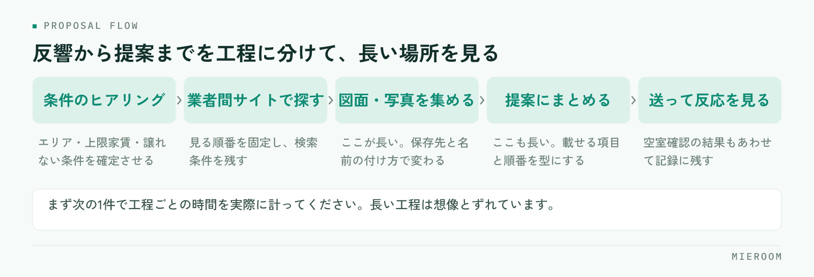

<!--META
{
  "title": "賃貸仲介の物件検索・提案を速くする方法｜業者間サイトを横断して探す手順",
  "date": "2026-09-10",
  "category": "業務効率化",
  "excerpt": "業者間サイトを1つずつ開いて探していると、提案までの時間が伸びます。探す前に条件を絞る手順、横断して探すときの型、図面と提案のまとめ方を整理しました。",
  "hook": "物件探しの時間は、探す前の準備で決まる",
  "tags": ["業者間サイト", "物件検索", "提案", "業務効率化", "賃貸仲介"]
}
META-->

反響が来てから提案を送るまでに時間がかかる。その原因を「探すのが遅いから」と考えているお店は多いのですが、実際に計ってみると、**時間が消えているのは探す工程そのものより、その前後**です。この記事では、業者間サイトを横断して探すときの手順と、提案までを短くする型を整理します。

<h4>この記事の結論</h4>
物件検索を速くする方法は、サイトを速く操作することではありません。<strong>探す前に条件を3つに絞り、集めた図面の置き場所と提案の型を先に決めておくこと</strong>で、1件あたりの時間は縮みます。

## 物件検索が遅いのは、探し方が毎回違うから

同じお店の中でも、スタッフによって物件の探し方が違うことがよくあります。ある人は業者間サイトを1つずつ開き、ある人は付き合いのある管理会社から当たり、ある人は自社の在庫から見る。どれも間違いではないのですが、順番が決まっていないと、探すたびに考える時間が発生します。

もう一つ起きているのが、**同じ物件を何度も探し直している**という状態です。先週別のお客様のために調べた物件を、今週また一から探す。図面を保存した場所が人によって違えば、社内に情報があっても再利用できません。

探す速さは、操作の速さではなく、探し方が決まっているかどうかで決まります。まずは自店の手順が言葉になっているかを確認してください。

## 時間が消えているのは「探す工程」だけではない

反響が来てから提案を送るまでを工程に分けると、どこが長いかが見えてきます。

<figure class="fig"><figcaption>長いのは検索そのものではなく、図面を集める工程と提案にまとめる工程です。</figcaption></figure>

✓まず1件だけ計る

感覚で議論すると「探すのが遅い」で終わってしまいます。次の1件で、工程ごとに何分かかったかを実際に書き留めてください。長い工程は、たいてい想像とずれています。

多くの場合、長いのは「図面・写真を集める」と「提案にまとめる」の2つです。物件を見つけること自体は数分でも、図面をダウンロードし、ファイル名を直し、必要な情報を書き写し、体裁を整える作業で時間が積み上がります。ここに手を入れないまま検索だけを速くしても、提案が届くまでの時間はほとんど変わりません。

## 探す前に条件を3つに絞る

検索が長引くいちばんの原因は、条件が多すぎることです。お客様から聞いた希望をすべて条件に入れると、該当が出ず、条件を緩めては検索し直すという往復が始まります。

先に絞るべき条件は次の3つです。

1. **エリア**：沿線・駅ではなく、通勤先や学校からの実際の移動時間で決めます
2. **上限の家賃**：管理費・共益費を含めた総額で確認します。ここがずれると後で全部やり直しになります
3. **絶対に譲れない条件を1つだけ**：ペット可、駐車場、1階不可など。2つ以上あるときは、どちらが優先かを先に聞きます

この3つ以外は「あれば嬉しい条件」として脇に置きます。**絞る条件と、比較材料にする条件を分ける**のがコツです。ヒアリングの段階でここまで決まっていれば、検索は一度で済みます。

!条件を聞ききらないまま探し始めない

「とりあえず何件か送ります」で始めると、送った後に条件が変わり、探し直しになります。急ぐべきは初回返信であって、物件の提案ではありません。まず返信し、条件を確定してから探すほうが、結果的に速く決まります。

## 業者間サイトを横断して探す手順

業者間サイトは複数を使い分けているお店がほとんどです。横断して探すときは、順番と記録の型を決めておきます。

- **見る順番を固定する**：自社在庫 → よく決まる管理会社 → 業者間サイトの順など。毎回同じ順で見ます
- **1回の検索条件を残す**：どの条件で探したかをメモしておくと、条件を緩めるときに何を変えたかが分かります
- **候補は一度に絞りきらない**：先に広めに拾ってから、比較材料の条件で落としていきます
- **他店が動いている物件を意識する**：業者間サイトに出ている物件は他店も見ています。確認の電話は早いほうが有利です
- **空室確認の結果を残す**：満室だった、条件が変わっていた、という情報も次に活きます

属人的な探し方と、型が決まっている探し方の違いを整理すると、次のようになります。

| | 探し方が人によって違う店 | 手順が決まっている店 |
|---|---|---|
| 探し始めるまで | 毎回どこから見るか考える | 見る順番が決まっている |
| 検索条件 | 記憶に残るだけ | 条件を残すので緩め方が分かる |
| 図面の置き場所 | 個人のPCやメール内 | 共通の場所に案件ごとで残る |
| 空振りの記録 | 残らず、次も同じ物件を当たる | 満室・条件変更が残り、再確認が減る |
| 引き継ぎ | 担当者が休むと止まる | 途中からでも引き継げる |

## 図面と写真の扱いで差がつく

集めた図面をどう扱うかで、2件目以降の速さが変わります。ダウンロードしたPDFを個人のパソコンに置いたままにすると、次に必要になったとき誰も見つけられません。

決めておくのは3つだけです。**どこに置くか、どういう名前を付けるか、どの案件に紐づけるか**。物件名と日付が入った名前で、案件ごとに紐づく場所に置く。これだけで、同じ物件を探し直す作業がなくなります。

間取り図の作り直しにも時間がかかります。もらった図面がそのまま提案に使えないとき、手描きで作り直しているなら、そこは仕組みで短くできる工程です。業務全体の見直し方は[賃貸仲介の業務改善ツール](./chintai-gyomu-kaizen-tool.html)で扱っています。

## 提案の型を先に決めておく

提案の速さは、書式が決まっているかどうかでほぼ決まります。毎回ゼロから体裁を整えていると、物件が見つかってからさらに時間がかかります。

型として決めておくのは、載せる項目と順番です。物件名、家賃と総額、間取りと面積、駅からの距離、譲れない条件を満たしているかどうか、そしておすすめの理由を1行。この並びを固定しておけば、埋めるだけになります。

送る本数も先に決めます。多く送れば選んでもらえるわけではなく、比較しきれずに返信が止まることがあります。**3件前後に絞り、それぞれ違う軸のものを入れる**ほうが、返信は返ってきやすくなります。反響のやりとりを記録として残す方法は[反響管理のやり方](./hankyo-kanri-hoho.html)にまとめています。

## よくある質問

業者間サイトは何社に登録しておくべきですか？

扱うエリアによって、掲載が集まるサイトが変わります。社数を増やすより、自店のエリアで実際に物件が出ているサイトを見極めて、そこを毎回確実に見るほうが効果があります。使っていないサイトが増えると、見る順番が決まらなくなります。

探すのが速いスタッフのやり方を、どう共有すればいいですか？

やり方を口頭で説明してもらうより、実際に1件探すところを横で見て、工程を書き出すのが早い方法です。見る順番、検索条件の入れ方、図面の保存先まで具体的に書き出すと、そのまま手順書になります。

物件情報を自社のシステムに取り込む必要はありますか？

同じ物件を繰り返し扱うお店ほど効果があります。一度取り込んで案件に紐づけておけば、次に条件の近いお客様が来たときに探し直しが要りません。取り込みに手間がかかるようでは続かないので、どれくらいの手数で入るかを確認してください。

## まとめ：探す前と、探した後を短くする

物件検索・提案を速くする方法は、検索画面の操作を速くすることではありません。**探す前に条件を3つに絞り、見る順番を固定し、集めた図面と提案の型を決めておく**。この3つで、1件あたりの時間は確実に縮みます。

今日から着手できるのは、次の1件で工程ごとの時間を計ることと、図面の置き場所と名前の付け方を決めることです。どちらも費用はかかりません。

[ミエルーム](../features.html)は、業者間サイトとの連携や物件コンバータで物件情報の取り込みに対応し、間取り作成も行えます。反響から接客・申込までを案件ごとに1か所で記録できるので、集めた図面や空室確認の結果が担当者の手元で止まりません。デモアカウントの発行と、最短即日でのスタートが可能です。既存のExcelデータのインポートと初期設定の代行にも対応していますので、まずはご相談ください。
