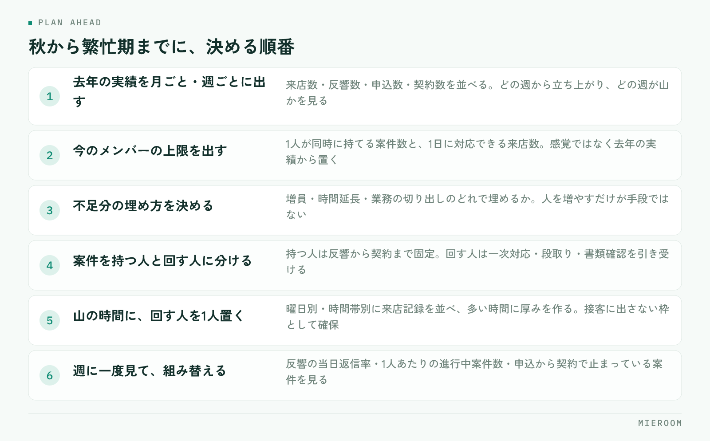

<!--META
{
  "title": "繁忙期のシフトと人員計画｜今から決めておく体制と役割分担",
  "date": "2026-10-01",
  "category": "組織・育成",
  "excerpt": "繁忙期のシフトと人員計画を、秋のうちに決めておくべき体制と役割分担から整理しました。人を増やす判断の時期、ピークへの寄せ方、途中で組み替えるための見方までまとめています。",
  "hook": "繁忙期の人繰りを秋のうちに決める",
  "tags": ["繁忙期", "シフト", "人員計画", "店舗運営", "組織づくり"]
}
META-->

繁忙期に入ってから人が足りないと気づいても、そこから採用しても間に合いません。毎年同じ苦しさを繰り返している店舗の多くは、人数が足りていないのではなく、**誰が何をやるかを決めないまま繁忙期に突入している**ことが原因です。決めるのは秋のうちです。

<h4>この記事の結論</h4>
繁忙期の人員計画は、人数を増やす前に<strong>役割を分けること</strong>から始めます。案件を持つ人と、店を回す人を分けておくと、同じ人数でも処理できる件数が変わります。<strong>人を入れるなら年内、遅くとも年明け前</strong>が判断の期限です。

## 人が足りなくなる原因は、人数ではなく配分

繁忙期に現場が詰まるとき、起きているのはたいてい次のことです。

- 全員が接客に出ていて、電話と反響への一次対応が誰も取れない
- 申込書類の不備確認が夜にまとめて発生し、担当者が深夜まで残る
- 経験の浅いスタッフが手待ちになっている一方、特定の人だけ手が回らない
- 誰がどの案件を持っているかが、その人に聞かないと分からない

共通しているのは、人数の不足ではなく**時間帯と役割の配分**です。来店が集中する時間に全員を接客に充てると、その裏で入ってくる反響が落ちます。取りこぼした反響は、件数としてどこにも残らないので、後から「忙しかった」という感覚しか残りません。

まず確認してほしいのは、去年の繁忙期に何件の反響が来て、そのうち何件に当日中に返せていたかです。ここが分からない店舗は、人員計画の前に記録の整備が先になります。反響の記録の残し方は[反響管理のやり方](./hankyo-kanri-hoho.html)で扱っています。

## 秋のうちに決めておくこと

年内にやっておくことは3つです。

<figure class="fig"><figcaption>増員するかどうかは3番目です。人数を決める前に、実績と上限を出しておくのが順番になります。</figcaption></figure>

1. **去年の実績を月ごと・週ごとに出す**。来店数、反響数、申込数、契約数を並べます。どの週から立ち上がり、どの週が山かが分かります
2. **今のメンバーで処理できる上限を出す**。1人が同時に持てる案件数と、1日に対応できる来店数を、感覚ではなく去年の実績から置きます
3. **不足分を、増員・時間延長・業務の切り出しのどれで埋めるか決める**。人を増やすだけが手段ではありません

3つ目が抜けると、とりあえず募集を出すという判断になりがちです。増員には教育の時間も要るため、年明け以降に入る人は、繁忙期を回す前提で数えないほうが安全です。

## 役割を「案件を持つ人」と「回す人」に分ける

配分を直す一番効く手は、役割を2つに分けることです。

**案件を持つ人**は、接客から申込・契約までを最後まで追います。担当が変わらないので、お客様への説明も途切れません。

**回す人**は、特定の案件を持ちません。電話と反響の一次対応、物件の空き確認、内見の段取り、書類の不備チェックといった、発生したそばから処理すべき仕事を引き受けます。

| | 案件を持つ人 | 回す人 |
|---|---|---|
| 担当の持ち方 | 反響から契約まで固定 | 案件を持たない |
| 主な仕事 | 接客・内見・申込・契約 | 一次対応・段取り・書類確認 |
| 評価の見方 | 成約件数と売上 | 一次対応の速さと取りこぼしの少なさ |
| 向く人 | 経験のあるスタッフ | 新人・パート・内勤 |

利点は2つあります。接客中に電話が鳴っても誰かが取れること。そして、経験の浅いスタッフに任せられる仕事がはっきりすることです。新人をいきなり担当に立てるより、回す側で件数に触れてもらうほうが早く慣れます。教える順番は[新人育成の順番](./shinjin-ikusei-junban.html)にまとめています。

## シフトはピークの曜日と時間に寄せる

繁忙期のシフトは、全員を均等に並べても機能しません。来店と反響が集中する時間帯に厚みを作ります。

やり方は単純です。去年の来店記録を曜日別・時間帯別に並べ、多い順に人を充てます。多くの店舗では土日と、平日の夕方以降に山ができますが、立地や客層で変わるので、自店の記録で確かめてください。

決めておくことは次のとおりです。

- **山の時間に、回す人を必ず1人置く**。接客に出さない枠として確保します
- **開店直後の枠を空けない**。前日夜に入った反響への返信が、ここで滞ります
- **休みを先に埋める**。繁忙期に入ってから調整すると、特定の人に偏ります
- **締めの担当を日ごとに決める**。翌日の段取りと未処理の申し送りをする人です

✓シフト表と一緒に貼っておくもの

その日の「回す人」が誰かを、シフト表に明記してください。役割を決めても、当日その場で分からなければ機能しません。朝礼で口頭確認するだけの店舗は、忙しくなると崩れます。

## 人を増やすかどうかの判断

増員を検討するなら、判断の期限は年内です。募集・面接・入社・教育の期間を考えると、年明けからでは繁忙期に間に合いません。

判断材料は、去年の実績と今のメンバーの上限の差です。差が接客の枠で出ているなら経験者、一次対応や事務の枠で出ているならパートや内勤で埋まることもあります。**どの枠が足りないかを特定せずに募集を出すと、入った人の使いどころが決まりません**。

増やさない選択も現実的です。反響の一次対応や追客の一部は仕組みで減らせますし、書類の不備チェックは様式を整えるだけで時間が変わります。人を増やす前に、繰り返し発生している手作業を洗い出してください。開業まもない店舗の人繰りは[開業直後の集客](./kaigyo-chokugo-shukyaku.html)でも触れています。

## 繁忙期の途中で組み替えるための見方

計画どおりに進むことはまずないので、途中で組み替える前提で作ります。週に一度、次の3つを見てください。

- **反響の当日返信率**。ここが落ちたら、回す人の枠が足りていません
- **1人あたりの進行中案件数**。特定の人に偏っていれば、担当を移します
- **申込から契約までで止まっている案件**。書類待ちが積み上がっているなら、事務側の手当てが必要です

見るのは週1回で十分です。毎日見ても打ち手は変わりません。スタッフごとの成績の見方は[スタッフ別の成績管理](./staff-seiseki-kanri.html)にまとめています。

繁忙期だけパートを入れるのは有効ですか？

一次対応や事務の枠なら有効です。接客から契約まで任せる前提だと、教育期間が足りず戦力になりません。入れるなら、回す側の役割を明確にしたうえで年内から慣れてもらう形が現実的です。

シフトは何か月前から組むべきですか？

枠の設計（どの時間に何人置くか）は秋のうちに、個人の割り当ては1か月前を目安にしてください。休みの希望だけは先に集めておくと、繁忙期に入ってからの調整が減ります。

去年の実績が記録に残っていない場合はどうすればいいですか？

今年分から残し始めてください。来店数・反響数・申込数を日ごとに記録するだけでも、来年の人員計画の土台になります。完璧な集計より、途切れずに残すことを優先してください。

## まとめ：決めるのは人数ではなく役割と時間帯

繁忙期の人員計画で決めるべきなのは、何人雇うかではありません。**どの時間帯に、誰が、何を引き受けるか**です。役割を分けて山の時間に厚みを作れば、同じ人数でも取りこぼしは減ります。そのうえで足りない枠がはっきりしたときに、初めて増員を検討します。

この判断はすべて記録が土台になります。反響が何件来て、何件返せて、何件が申込になったか。手元にあるかどうかで、計画の精度は変わります。

ミエルームは、反響から接客・申込・入金までを1つの画面で記録し、スタッフごとの接客成績や反響の状況を見られるようにした賃貸仲介向けの業務管理システムです。配分を組み替えるための数字を、集計の手間なく確認できます。詳しくは[ミエルームの製品ページ](../index.html)をご覧ください。デモアカウントの発行にも対応しています。
