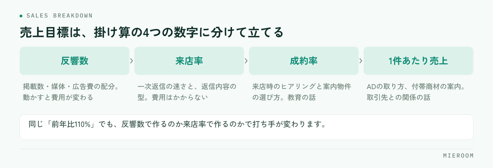

<!--META
{
  "title": "繁忙期の売上目標の立て方｜前年実績を店舗別・担当別に分解する",
  "date": "2026-09-27",
  "category": "売上管理",
  "excerpt": "繁忙期の売上目標の立て方を、前年実績の並べ方から店舗別・担当別への分解、週単位での追い方まで手順で整理しました。「前年比◯%」で止まらない、現場が動ける目標の作り方をまとめています。",
  "hook": "前年比だけの目標は、現場で動きに変わらない",
  "tags": ["売上管理", "繁忙期対策", "目標設定", "店舗運営", "賃貸仲介"]
}
META-->

年明けからの繁忙期に向けて、そろそろ売上目標を決める時期です。ただ、「前年比110%」とだけ決めた目標は、現場では動きに変わりません。**目標が効くのは、担当者が明日やることに翻訳できたときだけ**です。

<h4>この記事の結論</h4>
繁忙期の売上目標は、全店の金額を決めてから配るのではなく、<strong>前年実績を工程の数字まで分解してから積み上げる</strong>と現場が動けます。反響数・来店率・成約率・1件あたり売上の4つに分け、店舗別・担当別に落とし、週単位で追える形にします。

## 「前年比110%」だけでは、現場が動けない

金額だけの目標には、二つの問題があります。ひとつは、達成するために何をすればいいのかが分からないこと。もうひとつは、届かなかったときに原因を特定できないことです。

月末に「あと200万円足りない」と分かっても、反響が少なかったのか、来店までつながらなかったのか、成約率が落ちたのかが分からなければ、翌月も同じ結果になります。

目標は、**現場の行動に言い換えられる単位まで下ろして初めて機能します**。「今週は反響への一次返信を全件その日のうちに返す」まで具体化されていれば、担当者は動けます。金額はその結果として出てくるものです。

## 目標を作る前に、前年実績を同じ物差しで並べる

立て方の出発点は、前年の実績です。ただし、そのまま眺めても使えません。次の条件をそろえてから並べます。

- **売上の定義をそろえる**：契約日で計上するのか、入金日で計上するのか。後ADを含めるのかどうか
- **確定と見込みを分ける**：入金済みの確定売上と、まだ入っていない見込みを混ぜない
- **月をまたぐ案件を整理する**：1月申込・2月契約・4月後AD入金のような案件がどう計上されているか
- **店舗と担当をそろえる**：異動があった担当者の実績をどちらに寄せるか決めておく

ここが揃っていないと、店舗ごとの比較が成立しません。前年の集計に時間がかかっている場合は、[月末の売上集計を自動化する](./getsumatsu-uriage-shukei-jidoka.html)で、入力の設計から見直すことをおすすめします。

## 売上目標は、4つの数字に分解する

賃貸仲介の売上は、次の掛け算で成り立っています。

<figure class="fig"><figcaption>費用をかけずに動かせるのは、来店率と成約率です。広告の増額を考える前にここを見ます。</figcaption></figure>

**反響数 × 来店率 × 成約率 × 1件あたり売上 = 売上**

前年の実績をこの4つに分けると、どこを伸ばすかの議論ができるようになります。たとえば同じ「前年比110%」でも、反響数を増やして達成するのか、来店率を上げて達成するのかでは、打ち手がまったく違います。

- **反響数**を増やす：掲載数・掲載媒体・広告費の配分を見直す。費用が動く
- **来店率**を上げる：一次返信の速さ、返信内容の型を整える。費用はかからない
- **成約率**を上げる：来店時のヒアリング、案内物件の選び方。教育の話になる
- **1件あたり売上**を上げる：ADの取り方、付帯商材の案内。取引先との関係の話になる

費用をかけずに動かせるのは、真ん中の2つです。まずここを見てから、広告の増額を検討してください。

## 店舗別に配るときは、条件の差を先に見る

複数店舗を持っている場合、全店の目標を店舗数で割るのは避けてください。店舗によって前提が違います。

| 見るべき条件 | 高い店舗 | 低い店舗 |
|---|---|---|
| 商圏の反響量 | 反響数の目標を厚く持てる | 来店率・成約率で作る |
| 担当者の人数と経験 | 接客数を増やせる | 1人あたりの負荷を上げすぎない |
| 管理物件・専任物件の量 | 1件あたり売上を見込める | 客付け中心の構成になる |

条件をそろえて並べると、「反響は来ているのに来店につながっていない店舗」「反響が少ないぶん成約率で持っている店舗」のように、店舗ごとの課題が見えてきます。目標はその課題に対して立てます。

## 担当別に落とすときの考え方

担当別まで落とすとき、契約本数だけを配るとうまくいきません。経験の浅い担当者にとって、契約本数は自分でコントロールしにくい数字だからです。

工程の数字を混ぜて配ってください。

1. **接客数**：本人の行動で動かせる。新人にはここを厚く置く
2. **来店率**：反響への返信の速さと内容で変わる。チームで共通の目標にしやすい
3. **成約率**：経験が出る数字。単独で評価せず、接客数とセットで見る
4. **契約本数・売上**：結果の数字。ベテランにはここまで持ってもらう

配り方の詳細は、[担当者の成績管理](./staff-seiseki-kanri.html)で工程ごとの見方を整理しています。

## 月ではなく、週で追える形にする

繁忙期は3か月で終わります。月末に集計して振り返ると、修正できるのは実質1回だけです。**週単位で進捗が見える形**にしておいてください。

決めるのは3つです。

- **いつ見るか**：週の頭に前週分を確認する、と曜日を固定する
- **何を見るか**：反響数・来店数・申込数・確定売上。4つで足ります
- **誰が入力するか**：担当者が接客の直後に入れる。店長がまとめて入力する形にしない

✓目標より先に、入力のタイミングを決める

週次で見る仕組みは、入力が溜まった瞬間に止まります。繁忙期に入る前に「反響が来たらその場で1行」「申込が入ったらその日のうちに」と決めて、12月のうちに練習しておいてください。

## よくある失敗と、その直し方

!目標を上方修正だけする

好調な月に目標を上げ、届かない月はそのままにすると、数字への信頼がなくなります。修正するなら上下どちらも、理由とセットで。

そのほか、次の3つもよく起こります。

- **達成しても評価が変わらない**：目標と評価がつながっていないと、翌年から本気で取り組まれなくなります
- **見込みを売上に混ぜる**：入金前の案件を足して達成した気になり、月末に崩れます
- **前年データが人によって違う**：集計する人ごとに数字が変わる状態では、目標の議論が成立しません

開業したばかりで、前年の実績がありません

実績がない場合は、金額の目標を置かずに工程の数字だけで立ててください。「週に何件の反響に対応するか」「何件案内するか」を目標にし、3か月ぶんの実績が溜まってから金額の目標に切り替えます。最初の数字は精度より、記録が続くことを優先してください。

目標は店長が決めるべきですか、担当者と決めるべきですか

全店・店舗の目標は店長が決め、担当別の内訳は本人と話して決める形がおすすめです。工程の数字は本人が動かすものなので、納得感がないと週次の入力自体が続きません。決めた内容は口頭で終わらせず、記録に残してください。

Excelで管理していますが、分解までできますか

できます。ただし、反響・来店・申込・契約が別々のシートに分かれていると、掛け算の形に並べ直す作業が毎週発生します。1件の案件を1行で最後まで追える形にしておくと、分解が集計作業になりません。

## まとめ：目標は、金額ではなく工程で配る

繁忙期の売上目標の立て方は、前年実績を同じ定義でそろえ、反響数・来店率・成約率・1件あたり売上の4つに分解し、店舗の条件差を見て配り、担当別には工程の数字を混ぜて落とす。そして週単位で追う。この順番です。金額から始めると、現場が動ける形になりません。

分解して追う形を作るときに壁になるのは、目標の決め方より、数字が毎週そろうかどうかです。入力が溜まらず、店舗別・担当別に自動で分かれて出てくる状態になっていれば、目標は繁忙期のあいだ生きた数字として使えます。当社の[ミエルーム](../index.html)は、反響から申込・入金までを1件1行で記録し、確定売上と見込みを分けたまま店舗別・担当別に集計する形で作っています。繁忙期の前に体制を整えたい場合は、デモアカウントの発行からご相談ください。
