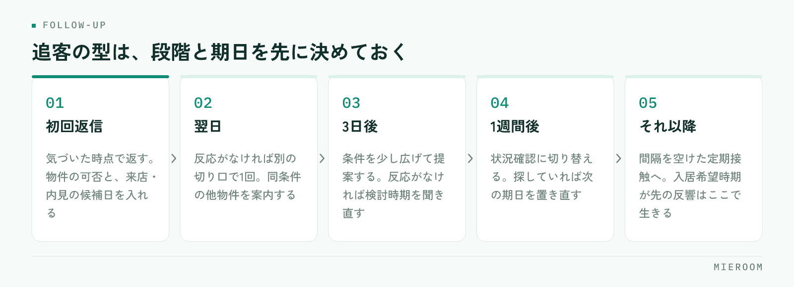

<!--META
{
  "title": "賃貸仲介の反響管理の方法｜取りこぼしをなくす記録と追客の型",
  "date": "2026-09-05",
  "category": "集客・広告",
  "excerpt": "賃貸仲介の反響管理は、入口をひとつにまとめ、次のアクションと期日を必ず記録する型を作ると対応漏れが減ります。漏れが起きる原因、反響管理表の項目設計、追客の段階の決め方、週次で見る数え方、明日から使えるチェック項目まで整理しました。",
  "hook": "取りこぼしは、注意力ではなく記録の型で防ぐ",
  "tags": ["反響管理", "賃貸仲介", "追客", "反響管理表", "対応漏れ"]
}
META-->

賃貸仲介の反響管理の方法は、**入口をひとつにまとめ、次のアクションと期日を必ず記録する**の2点に集約されます。取りこぼしは担当者の意欲ではなく、反響がどこに届き、誰が持ち、次にいつ動くかが決まっていないから起きます。原因、入口の統一、記録項目、追客の型、週次で見る数字を順に解説します。

## 反響の対応漏れは、この4つから起きる

取りこぼしは、忙しい日に偶然起きるものではありません。原因はほぼ次の4つで、どれも仕組みの側にあります。

1. 入口が分散している：ポータルのメール、自社サイトのフォーム、電話、LINE、紹介。届く場所がバラバラだと、全部を見に行ける人がいません。
2. 担当が決まっていない：「誰かが返すだろう」の反響は誰も返しません。営業時間外や休日の分で特に起きます。
3. 次の予定が記録されていない：初回返信までは動くのに、その後の予定を書いていない反響はそこで止まります。
4. ステータスが人によって違う：「追客中」「検討中」「保留」が混在すると、残っている反響を数えられません。

この4つは順番に効きます。入口を直さずに担当だけ決めても、気づけない反響が残るからです。**直す順番は、入口 → 担当 → 次のアクション → ステータス**。初動の速さが成約率に効く理由は[反響の初動5分](./lead-response-speed.html)で扱っているので、本記事は記録と追客の回し方に絞ります。

## 反響の入口をひとつにまとめる

最初にやるのは、反響が届く場所を1本にすることです。経路は増えていきますが、**見る場所は1つに揃える**のが原則です。

- ポータル・自社サイト：フォームやメールで届く分は自動で取り込むか、その場で1行足す。個人の受信トレイに残さない
- 電話：受けた人がその場で入力する。メモ用紙と口頭の伝言に頼らない。折り返すなら担当と期日まで書く
- LINE：問い合わせが来た時点で登録する。トーク画面だけで完結させると、他の人から状況が見えません
- 紹介・直来店：媒体欄を「紹介」「直来店」として同じ表に入れる。除外すると媒体ごとの成績が合わなくなります

集約とは「1つの受信箱に転送する」ことではなく、**全経路の反響が1行ずつ並んだ一覧が1つある**状態を作ることです。転送では、いま誰が持っている反響なのかが分かりません。

## 反響管理表に記録する項目を決める

反響管理表の列は、反響が進む順に左から並べます。増やしすぎると入力されないので、次の範囲に絞ります。

- 受付：受付日時（日付だけでなく時刻まで）／媒体／反響の種類（物件問い合わせ・来店予約・資料請求）
- 顧客：氏名／連絡がつく手段（電話・メール・LINE）／問い合わせ物件
- 希望条件：エリア／賃料の上限／間取り／入居希望時期／来店の可否
- 対応：対応状況（未対応・返信済・アポ設定・来店済・申込・見送り）／担当者
- 次：次のアクションの内容／その期日／最終接触日

欠けると最も痛いのは最後の2列です。**「次のアクション」と「期日」が空の反響は、その時点で止まっている反響**です。ここさえ埋まっていれば、対応状況が多少ずれても案件は前に進みます。

対応状況と媒体は必ず選択肢にします。文字入力では表記が割れ、数える段階で狂うからです。媒体ごとの費用対効果は[媒体別ROIをどう出すか](./media-roi.html)にまとめています。

## 追客の型：段階と期日をあらかじめ決める

追客は、思い出したときにやるものではなく、決めた段階に沿って回すものです。段階はこう決めます。

<figure class="fig"><figcaption>段階と期日を先に決めておくと、返信するかどうかを毎回考えずに済みます。</figcaption></figure>

1. 初回返信：気づいた時点で返す。物件の可否と、来店・内見の候補日を必ず入れる
2. 翌日：反応がなければ別の切り口で1回。同条件の他物件を案内する
3. 3日後：条件を少し広げた提案をする。反応がなければ検討時期を聞き直す
4. 1週間後：状況確認に切り替える。まだ探しているかを確かめ、探していれば次の期日を置き直す
5. それ以降：月に一度など間隔を空けた定期接触へ。入居希望時期が先の反響はここで生きます

この日数は運用例です。反響の量や商圏で変えて構いませんが、**段階の数と間隔を店舗として1つに決める**ことが肝心です。担当ごとに追い方が違うと引き継ぎができません。各段階を終えたら、次のアクションと期日を必ず入れ替えます。

## 週次で見るのは「その場で手を打てる件数」

店長が週に一度見る数字は、その場で指示を出せる数え方にします。反響数や返信済み率のような割合は、見ても次の行動が決まりません。

- 未返信の件数：受付から一度も返信していない反響。担当者名と一緒に出す
- 次のアクションが未設定の件数：対応中なのに次の予定が空の反響
- 期日を過ぎた次アクションの件数：その日のうちに消す対象
- 担当が空欄の件数：入ってきたのに誰も持っていない反響
- 来店予約が入っているのに、来店結果が未入力の件数

いずれも**「今週中にゼロにできる件数」で数える**のがポイントです。件数なら、その場で担当を割り振れます。割合では分母が増えたのか分子が減ったのかが分からず、指示に変わりません。見る時間も固定します。週の初めに前週の残りを片づけ、週末に翌週の期日を確認する。この2回で、止まっている反響はほぼ拾えます。

## 明日から使える、取りこぼし防止チェック

いまの運用に当てられる項目です。1つでも「いいえ」があれば、そこが取りこぼしの出口です。

- 反響の経路をすべて書き出し、全部が同じ表に1行ずつ入っているか
- 受付日時に時刻が入っているか（日付だけでは遅れが見えません）
- すべての行に担当者が入っているか。空欄が1つもないか
- すべての行に「次のアクション」と「期日」が入っているか
- 対応状況が選択肢になっていて、表記が割れていないか
- 営業時間外・休日の反響を、誰が翌朝に拾うか決まっているか
- 見送りになった理由を、選択肢で1つ残しているか
- 反響から来店、申込へ進んでも、同じ顧客として追い続けられるか
- 週に一度、未返信と期日超過の件数を数える時間が決まっているか

全部を一度に直す必要はありません。**まず「担当」と「次のアクションの期日」の空欄をゼロにする**だけで、止まっている反響が表に出てきます。申込より後ろの管理は[賃貸仲介の申込管理表の作り方](./moushikomi-kanrihyo-tsukurikata.html)にあります。

## まとめ：反響管理は「記録の型」で決まる

賃貸仲介の反響管理の方法は、特別なテクニックではありません。入口をひとつにまとめ、記録する項目を決め、追客の段階を統一し、週次で「未返信」と「次のアクション未設定」を数える。この4つで取りこぼしは減ります。**漏れは注意力ではなく、記録の型で防ぐ**ものです。

[ミエルーム](../features.html)は、この記録の型をそのまま画面にした賃貸仲介向けの業務管理SaaSです。フォームやメールから反響を自動で取り込んで一覧に並べ、担当と次のアクションを持たせたまま、接客・申込まで同じ顧客として追えます。LINE・SMSの自動追客や反響分析、Excelからのインポートにも対応します。いまの管理表を置き換えられるか確かめたい方は、デモアカウントをご用意しますのでお気軽にご相談ください。
