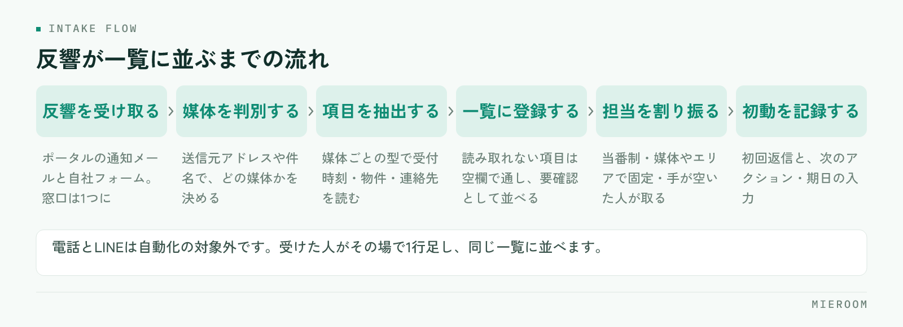

<!--META
{
  "title": "ポータルの反響メールを自動で取り込む仕組み｜転記ゼロで対応を速くする",
  "date": "2026-09-21",
  "category": "業務効率化",
  "excerpt": "ポータルからの反響メールを手で転記していると、初動が遅れ、入力の抜けも起きます。自動取込の仕組みと、取り込む項目の決め方、媒体ごとの形式の違いへの対処、導入前に確かめる点を整理しました。",
  "hook": "反響の転記をやめると、初動が速くなる",
  "tags": ["反響管理", "自動取込", "業務効率化", "賃貸仲介", "ポータル"]
}
META-->

ポータルからの反響メールを、管理表に手で打ち直している店舗は少なくありません。この転記は、時間を取られるだけでなく、**初動の遅れと入力の抜けを同時に生みます**。自動で取り込む仕組みを作れば、反響が届いた時点で一覧に並び、担当を割り振るところから始められます。

<h4>この記事の結論</h4>
反響メールの自動取込は、受信・判別・項目の抽出・一覧への登録・担当の割り振りという流れで動きます。導入時の要は<strong>取り込む項目を先に決めること</strong>で、ここが曖昧だと自動化しても手直しが残ります。

## 反響の転記が、遅れと漏れを生む理由

転記そのものは1件あたり数分の作業です。問題は、その数分がいつ発生するかを店舗側で選べないことにあります。

反響は来店対応中にも、内見の移動中にも届きます。手で入力する運用だと、「あとでまとめて入れる」が常態化し、そのあいだ反響は誰の目にも触れません。**一覧に載っていない反響は、店長からも他のスタッフからも見えない**ため、担当を割り振ることもできません。

抜けも起きます。急いで打ち込めば物件名や希望条件が省略され、あとから見た人が判断できない行が残ります。媒体欄が空のまま進めば、どの媒体からの反響だったかを後で数えられません。

- 転記までの空白時間に、他社が先に返信している
- 個人の受信トレイにだけ残り、休みの日に誰も気づかない
- 入力項目が人によって違い、表記が割れる
- 同じ反響を二人が入力して重複する

いずれも担当者の注意力の問題ではなく、**手作業を前提にした運用の構造**から生まれます。初動の速さが結果に効く理由は[反響の初動5分](./lead-response-speed.html)で扱っています。

## 自動取込の仕組みは、2つの入口で考える

反響の入口は、大きくメールとフォームの2つに分かれます。仕組みとしては別物なので、分けて設計します。

<figure class="fig"><figcaption>自動で進むのは登録までです。割り振りから先は、人の仕事として残ります。</figcaption></figure>

**メール経由**は、ポータルサイトから届く反響通知メールを受け取り、本文から必要な項目を読み取って一覧に登録する方式です。専用の受信アドレスを用意し、各ポータルの通知先をそこへ向けます。個人のアドレスに届けたままにせず、店舗として受ける窓口を1つ作るのが前提になります。

**フォーム経由**は、自社サイトの問い合わせフォームから送信された内容を、そのまま管理表へ渡す方式です。項目が最初から決まっているため、メールより確実に取り込めます。自社サイトを持っているなら、こちらから整えるほうが早く効果が出ます。

電話とLINEは自動化の対象外です。受けた人がその場で1行足す運用に統一し、**入口ごとの方式は違っても、並ぶ場所は同じ一覧にする**ことが重要です。

## 取り込む項目を先に決める

自動化の成否は、何を取り込むかを先に決められるかで決まります。後から足すと、それ以前の反響と比較できなくなるためです。最低限、次の項目を揃えます。

- **受付日時**：日付だけでなく時刻まで。初動の速さを後から測るために必要です
- **媒体**：どのポータル・どのフォームから来たか。選択肢にして表記を固定します
- **反響の種類**：物件問い合わせ・来店予約・資料請求などの区分
- **問い合わせ物件**：物件名と部屋番号。ここが空だと折り返しの一言目が作れません
- **顧客の連絡先**：氏名と、連絡がつく手段（電話・メール）
- **希望条件**：メール本文に含まれていれば、エリア・賃料・間取り・入居時期
- **担当者**：取り込み時点では空でも、割り振りの直後に必ず埋める
- **次のアクションと期日**：自動では埋まりません。初動の直後に人が入れます

最後の2つは自動では決まらない項目ですが、**列として用意しておかないと運用が止まります**。取り込みはあくまで入口で、そこから先の管理は人が回すという前提で設計してください。記録項目の全体像は[賃貸仲介の反響管理の方法](./hankyo-kanri-hoho.html)にまとめています。

## 媒体ごとに形式が違う問題への対処

自動取込でつまずきやすいのが、ポータルごとにメールの書式が違う点です。項目名の呼び方も、並び順も、含まれる情報の量も揃っていません。

対処は3段階で考えます。まず、**媒体ごとに読み取りの型を用意する**こと。送信元アドレスや件名で媒体を判別し、その媒体用の型で本文を読み取ります。1つの型ですべてを処理しようとすると、どこかで必ず崩れます。

次に、**取り込めなかった項目を空欄のまま通す**こと。読み取りに失敗した項目があるからといって、反響そのものを取りこぼしては本末転倒です。氏名と連絡先さえ入っていれば、残りは人が足せます。

最後に、**読み取りに失敗した反響を一覧の上に出す**こと。エラーとして別の場所に隠すのではなく、「要確認」として通常の一覧に並べます。別の画面に置くと、見に行く人がいなくなります。

ポータル側が通知メールの書式を変えることもあります。取り込みが急に崩れたときのために、**元のメールを残しておく**運用にしておくと、後から手で補えます。

## 取り込んだあと、初動までをつなぐ

自動取込は、反響が一覧に並ぶところまでを担います。そこから先の初動は、割り振りの決め方で速さが変わります。

割り振りの方式は、店舗の体制に合わせて選びます。どれを選んでも構いませんが、**決めていない状態だけは避けてください**。

| 割り振りの方式 | 向いている店舗 | 注意点 |
|--------------|--------------|--------|
| 当番制（時間帯で担当を固定） | スタッフが複数いる店舗 | 当番の引き継ぎ時刻を明確に決める |
| 媒体・エリアで固定 | 担当エリアが分かれている店舗 | 担当が不在の時間帯の代理を決めておく |
| 手が空いた人が取る | 少人数・一人運営 | 誰も取らない反響が出ないよう、残件を毎日見る |

割り振りと同時にやることは2つです。初回の返信と、次のアクション・期日の記録。この2つが済めば、その反響は止まりません。**取り込みが自動でも、この2つは人の仕事として残ります**。

自動追客の機能を併用する場合も、一次対応を機械に任せきりにはしないでください。定型の初回返信と、担当者の個別対応は役割が違います。

## 導入前に確かめておくこと

仕組みを入れる前に、店舗側で決めておくべきことがあります。ここが済んでいないと、導入後に運用が固まりません。

1. 反響の入口をすべて書き出す（ポータル、自社フォーム、電話、LINE、紹介、直来店）
2. 通知メールの届け先を、個人アドレスから店舗の窓口へ切り替えられるか確認する
3. 取り込む項目を決め、媒体と反響種別の選択肢を確定させる
4. 割り振りの方式と、営業時間外に届いた分を誰がいつ拾うかを決める
5. 重複した反響をどう扱うか決める（同じ人からの再問い合わせは1件にまとめるか、別件として持つか）
6. 過去の反響データを移すかどうかを決める
7. 取り込みが失敗したときに誰が気づくかを決める

!全部を自動で埋めようとしない

すべての項目を完璧に取り込もうとすると、導入が止まります。まずは受付日時・媒体・物件・顧客の連絡先の4つが自動で入る状態を作り、残りは運用しながら足すほうが早く回り始めます。

媒体ごとの成績を後から比べたい場合は、媒体欄の精度が要になります。数え方は[媒体別ROIをどう出すか](./media-roi.html)を参照してください。

ポータルのメール書式が変わったら、取り込みは止まりますか？

読み取りの型と合わなくなった項目は空欄になります。反響そのものが消えるわけではないので、「要確認」として一覧に残す設計にしておけば、対応は続けられます。元のメールを残しておくと、手で補うのも簡単です。

電話やLINEの反響も自動で取り込めますか？

メールやフォームと同じ形では取り込めません。受けた人がその場で1行入力する運用に統一してください。重要なのは入力方法を揃えることではなく、すべての反響が同じ一覧に並び、担当と次の期日が入っている状態にすることです。

いま使っているExcelの反響管理表は捨てることになりますか？

これまでの反響データは移せます。項目の対応付けを決めたうえで取り込む形になるため、過去の記録を残したまま切り替えられます。移す範囲を絞る判断も、どの期間まで比較に使うかで決めて構いません。

## まとめ：転記をやめると、反響管理が回り始める

ポータルの反響メールの自動取込は、受信・媒体の判別・項目の抽出・一覧への登録・担当の割り振りという流れで動きます。仕組みを入れる前に取り込む項目を決め、媒体ごとに読み取りの型を持ち、失敗した反響は隠さず一覧に出す。この3点を押さえれば、転記に使っていた時間はそのまま初動に回せます。**自動化の目的は入力の手間を減らすことではなく、反響が見える状態を切らさないこと**です。

[ミエルーム](../features.html)は、この流れをそのまま画面にした賃貸仲介向けの業務管理SaaSです。フォームとメールからの反響を自動で取り込んで一覧に並べ、担当と次のアクションを持たせたまま、接客・申込・売上まで同じ案件として追えます。反響分析やLINE・SMSの自動追客、Excelデータのインポートと初期設定の代行にも対応し、最短で即日から使い始められます。いまの管理表を置き換えられるか確かめたい方には、デモアカウントをご用意しますのでお気軽にご相談ください。
