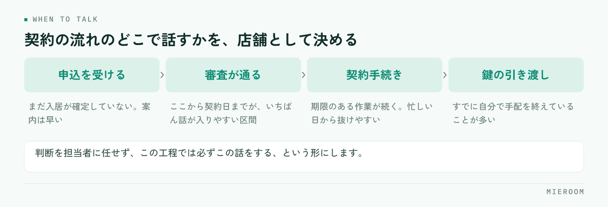

<!--META
{
  "title": "契約したお客様への引越し・ライフライン提案｜取りこぼしを仕組みで防ぐ",
  "date": "2026-09-11",
  "category": "売上管理",
  "excerpt": "契約後の引越し・ライフラインの提案は、担当者の意識ではなく手順で決まります。提案できるものの棚卸し、話すタイミングの固定、案内の型、提案したかどうかの記録まで、店舗で回る形に整理しました。",
  "hook": "付帯の提案は記憶ではなく手順で決まる",
  "tags": ["付帯収益", "売上管理", "賃貸仲介", "引越し", "契約後フォロー"]
}
META-->

契約後の引越しやライフラインの提案が取りこぼされるのは、担当者の意識が低いからではありません。**話すタイミングが業務の流れに埋まっていない**ため、忙しい日から順に抜けていくだけです。この記事では、提案できるものの棚卸しから、話す場所の固定、案内の型、記録の残し方までを順に整理します。

  <h4>この記事の結論</h4>
  
付帯の提案は、声かけの上手さではなく<strong>契約の流れのどこで話すかを決めて記録に残すこと</strong>で安定します。タイミングが固定されていれば、提案率は担当者ごとのばらつきに左右されにくくなります。

## 契約後の提案が抜け落ちる理由

申込から契約までは、期限のある作業が続きます。審査、書類、重要事項説明、鍵の引き渡し。どれも遅れると影響が出るため、自然と優先されます。一方で引越しやライフラインの案内は、抜けてもその場では何も起きません。だから最初に削られます。

理由は大きく3つです。ひとつ目は、**話すタイミングが決まっていない**こと。「余裕があるときに」と思っている限り、余裕がある日は来ません。

ふたつ目は、**何を案内できるのか担当者が把握していない**ことです。取引のある業者や、案内できる範囲が共有されていなければ、話そうにも話せません。

みっつ目は、**提案したかどうかが残らない**ことです。記録がなければ、抜けていても誰も気づけません。契約と売上が同じではない考え方は[「契約＝売上」ではない前提](./go-ad-management.html)でも扱っています。

## 案内できるものを棚卸しする

まず、自店で実際に案内できるものを一覧にします。「できたらいいもの」ではなく、**今日お客様に説明できるもの**だけを書き出してください。

- **引越し業者**：取引のある業者、繁忙期の押さえ方、見積もりの取り方
- **電気・ガス・水道の手続き**：案内する範囲（連絡先を渡すだけか、手続きまで支援するか）
- **インターネット回線**：物件ごとの設備状況と、申し込みから開通までの目安
- **家具・家電**：単身向けのセットや、レンタルという選択肢
- **クリーニング・不用品の処分**：退去側で必要になることが多い

一覧にすると、案内できるものと、話に出るのに用意がないものが分かれます。**後者が、次に取引先を探すべき領域**です。なお、保険の募集には資格や登録が必要になるため、自店で扱える範囲は必ず事前に確認してください。

## 話すタイミングを契約の流れに固定する

棚卸しが終わったら、それぞれを「いつ話すか」に割り当てます。ここが決まっていないと、いくら一覧を作っても使われません。

<figure class="fig"><figcaption>早すぎると入居が決まりきっておらず、遅すぎるとお客様が手配を終えています。</figcaption></figure>

契約の流れのどこで話すかを、店舗として1つに決めてしまいます。判断を担当者に任せず、**この工程では必ずこの話をする**という形にすると、忙しい日でも抜けにくくなります。

早すぎる案内は、お客様がまだ入居を決めきっていない段階になり、話が入りません。遅すぎると、お客様がすでに自分で手配を終えています。**申込が確定してから契約日までの間**が、多くの場合いちばん話が入りやすい区間です。

## 案内の型を1枚にまとめる

タイミングが決まったら、話す内容を型にします。担当者ごとに説明が変わると、お客様の反応もばらつき、うまくいった理由も分かりません。

1枚にまとめるのは、次の4つで足ります。

1. **切り出す一言**：手続きの案内として自然に始める文。売り込みの形にしない
2. **案内できるものの一覧**：お客様が選べるように並べる
3. **よく聞かれる質問と答え**：費用の目安、期限、自分で手配する場合との違い
4. **断られたときの引き方**：一度で終わらせ、必要になったら連絡できる形だけ残す

この4つ目が抜けている店舗は少なくありません。**断られた時点で終わりにせず、連絡先だけ残す**ことで、あとから相談が戻ってくることがあります。

## 提案したかどうかを記録に残す

提案の記録は、成約したものだけでは意味がありません。**提案した・しなかった・断られた**の3つが残って初めて、どこで落ちているのかが見えます。

案件ごとに、次の項目を持ちます。

- 案内した項目（引越し、回線、家具など）
- 案内した日
- 反応（申込／検討中／不要）
- 申込になった場合は、その後の進捗

記録が揃うと、原因の切り分けができます。そもそも案内していないのか、案内はしているが断られているのか。前者なら手順の問題、後者なら伝え方の問題です。**この2つは対策がまったく違う**ため、混ぜたまま「もっと提案しよう」と言っても改善しません。

| 記録から分かること | 実際に起きていること | 次に手を打つ場所 |
|---|---|---|
| 案内した記録がほとんどない | 話すタイミングが業務に埋まっていない | 契約の流れのどこで話すかを固定する |
| 案内はしているが不要が多い | 切り出し方や時期が合っていない | 案内の型と、話す区間を見直す |
| 検討中のまま止まっている | 追いかける担当と期日が決まっていない | 次に連絡する日を案件に持たせる |

## よくある失敗

いちばん多いのは、**目標だけを決めて手順を決めない**ことです。件数の目標を掲げても、話す場所が決まっていなければ結果は変わりません。決めるのは目標ではなく、業務のどこで話すかです。

次に多いのが、案内する項目を一度に増やしすぎることです。5つも6つも並べると、お客様は選べず、担当者も説明しきれません。**まず1つに絞って全案件で必ず案内する**ほうが、結果として定着します。

もう1つは、記録を担当者の判断に任せることです。「申込になったものだけ入力」という運用にすると、提案したのに断られた案件が消えます。断られた記録こそ、次の改善のもとになります。

## よくある質問

付帯の案内は、売り込みだと思われませんか？

入居に必要な手続きの案内として切り出せば、多くの場合は自然に受け取られます。電気・ガス・水道の開始手続きや回線の開通は、どのみちお客様が自分で調べることです。選択肢を示して、必要なら手伝えると伝える形にしてください。断られたときに引き下がる型を決めておくことも大切です。

担当者によって提案の数に差が出ます。どうすればよいですか？

差の原因が「案内していない」のか「案内しても断られている」のかを、記録で切り分けてください。前者であれば、話すタイミングが個人の判断に委ねられている可能性が高いので、契約の流れの中に固定します。後者であれば、うまくいっている担当者の切り出し方を型にして共有します。

記録はExcelでも回りますか？

始めるだけならExcelで十分です。案件ごとに1行で、案内した項目・日付・反応が追える形にしてください。難しくなるのは、契約管理のファイルと付帯の記録が別々になったときです。同じ案件を2か所で探すようになったら、まとめ方を見直す時期です。

## まとめ：タイミングが決まれば、提案は続く

契約後の引越し・ライフラインの提案は、担当者の熱心さではなく手順で決まります。**案内できるものを棚卸しし、契約の流れのどこで話すかを固定し、提案したかどうかを記録に残す**。この3つが揃えば、忙しい月でも提案は止まりにくくなります。

始めるときは、項目を1つに絞ってください。全案件で必ず案内する項目が1つできれば、そこから広げられます。記録は、断られたものも必ず残す。そこに次の改善のもとがあります。

[ミエルーム](../index.html)は、申込から契約・入金までを案件ごとに1行で追える形にしており、接客・反響の成績や確定売上と見込みの分離もあわせて見られます。Excelデータの取り込みと初期設定の代行、デモアカウントの発行、最短即日でのスタートに対応していますので、付帯の記録をどう持つかの段階からご相談ください。
