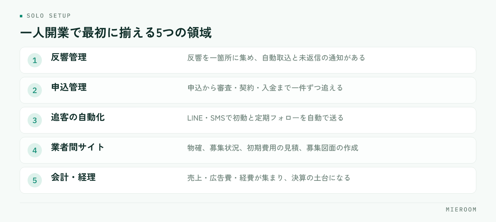

<!--META
{
  "title": "一人で始める不動産仲介の開業｜最初に揃えるツールと省力化の設計",
  "date": "2026-09-04",
  "category": "組織・育成",
  "excerpt": "一人で不動産仲介を開業するなら、反響対応・物件確認・書類・入金管理を最初から仕組みにしておくことが肝心です。揃えるツールの考え方、一日の動き方、人を増やす目安、よくある失敗を開業前に整理します。",
  "hook": "一人だからこそ、最初に仕組みをつくる",
  "tags": ["不動産開業", "一人開業", "独立準備", "省力化", "反響管理"]
}
META-->

一人で始める不動産仲介の開業では、接客以外の作業をどれだけ自分の手から離せるかで、使える時間が決まります。反響対応・物件確認・書類・入金管理の四つは、**開業前に仕組みにしておく領域**です。この記事では、一人開業で最初に揃えるツールの考え方と、省力化を前提にした一日の動き方、人を増やす目安までを整理します。

## 一人開業の不動産仲介で、時間を奪う4つの作業

一人で店を回すと、売上をつくる接客と物件提案の裏で、次の四つが静かに積み上がります。

- 反響対応。ポータルや自社サイトからの問い合わせは、接客中や内見中にも届く。返信が遅れるほど他社に流れる
- 物件確認。業者間サイトを往復して空室を確かめ、電話で物確をし、募集終了や条件変更を見落とさないよう追い続ける
- 書類。申込書の内容を契約書・重説に転記し、初期費用の見積を作り、送って、直して、また送る
- 入金管理。仲介手数料・AD・後AD・付帯の入金を案件ごとに追い、一部入金の残額を把握する

共通するのは、どれも**接客の裏で溜まり、夜にまとめて片づける仕事になる**ことです。スタッフがいれば分担できますが、一人開業ではそれができません。だから開業準備の段階で、この四つを「仕組みで回す」設計にしておく必要があります。

## 最初から仕組みにする領域と、手作業でよい領域

すべてを自動化する必要はありません。線引きの基準は三つです。「毎回同じ形で発生する」「漏れるとそのまま損失になる」「時間を選ばず発生する」。この三つに当てはまる作業は仕組みに、当てはまらない作業は手作業のままで構いません。

仕組みにする領域は、反響の受け口と記録、反響直後の初動と定期的な追客、申込から入金までの記録、書類への顧客情報の差し込みです。どれも形が決まっていて、漏れが機会損失や未回収に直結します。

手作業でよい領域は、接客そのもの、どの物件を提案するかの判断、内見、オーナーや管理会社との関係づくり、地域の生きた情報です。ここは**一人で開業する人の強みが出る部分**で、ツールに置き換えるものではありません。仕組みは強みを奪うためではなく、強みに時間を回すために入れます。

## 一人開業で揃えるツールの考え方：5つの領域

不動産の独立準備でツールを選ぶときは、領域を五つに分けて考えます。

<figure class="fig"><figcaption>この5つだけ先に決めておけば、増えた仕事に飲み込まれずに済みます。</figcaption></figure>

1. 反響管理。ポータル・自社サイト・LINEの反響を一箇所に集め、メールの自動取込と未返信の通知がある
2. 申込管理。申込から審査・契約・入金までを一件ずつ追え、後ADと一部入金を記録できる
3. 追客の自動化。LINE・SMSで、反響直後の初動と定期フォローを自動で送れる
4. 業者間サイト。物確、募集状況のウォッチ、初期費用の見積、募集図面（マイソク）の作成を、業者間サイトの情報から省力化できる
5. 会計・経理。売上・広告費・経費が集まり、確定申告や決算の土台になる

大切なのは、領域ごとに別のツールを寄せ集めないことです。反響→接客→申込→入金→売上が一本でつながっていれば、**入力は一回で済み、数字は勝手に集まります**。逆に領域ごとにサービスを分けると、一人の店舗ではツール同士をつなぐ作業が新しい仕事として増えます。選ぶときは、五つのうち何本が1つの画面でつながるかを数え、つながらない部分は自分の手作業として時間を見積もってください。店舗向けツールに必要な機能の考え方は [賃貸仲介の業務改善ツール完全ガイド。申込管理表から店舗DXまで。](./chintai-gyomu-kaizen-tool.html) にまとめています。

## 開業直後の一日の動き方を設計する

ツールを揃えたら、一日の流れを先に決めます。一人開業では、流れを決めておかないと反響対応が接客に割り込み、どちらも中途半端になります。

- 朝：前夜に届いた反響の確認と本返信、今日の内見・来店の準備、対象物件の物確
- 日中：接客・内見・案内に集中する。新しい反響は自動返信と自動追客で受け止め、隙間時間に本返信を入れる
- 夕方：申込・入金の記録、追客の配信状況の確認、翌日の内見予約と物件の確認
- 週に一度：反響数・来店数・申込数・売上・未入金を確認し、広告費の配分を見直す

決めておきたいのは、営業時間外に届いた反響の扱いです。**自動返信で受け止め、翌朝いちばんに本返信する**と決めておけば、夜に携帯を握りしめる必要がなくなります。初動の速さが成約を左右する理由は [反響の初動5分。返信スピードが成約率を左右する理由。](./lead-response-speed.html) を参考にしてください。

## 人を増やすタイミングの目安

人を雇うかどうかは、売上の額より「仕組みで吸収できない作業が溢れているか」で判断します。次のサインが続いたら検討の時期です。

- 反響への本返信が翌日にずれ込む日が続く
- 内見と来店が重なり、断る案内が出はじめる
- 申込書類の作成が毎回夜に回る
- 追客が止まり、再来店の連絡が途切れる
- 入金の確認が、月末にまとめて行う作業になっている

ただし、増やす前に一度立ち止まってください。**サインの原因が「仕組みで吸収できたはずの作業」なら、先に自動化の余地を埋める**ほうが安く済みます。それでも溢れるなら、事務やアシスタントから増やし、営業は最後です。判断を感覚ではなく数字でできるよう、反響数・来店数・申込数・成約数を開業初日から記録し続けることが、いちばんの準備になります。

## 一人開業でよくある失敗

- 反響の受け口がメール・LINE・電話でバラバラ。見落としが起き、どの媒体が効いているかも分からない
- 申込をExcelと手帳で管理する。後ADの入金予定や一部入金の残額が抜け、回収し損ねる
- 追客を気合いで続ける。忙しい週に止まり、そのまま再開しない
- 開業してからツールを選ぶ。設定と慣れが繁忙期に間に合わず、結局手作業になる
- 帳簿を後回しにする。決算や確定申告の前に、領収書の山と向き合う

どれも「開業前に決めておけば防げた」ことばかりです。免許や事務所、業者間サイトの申し込みと並べて、ツールの選定と初期設定を開業準備の項目に入れてください。準備全体の流れは [不動産の開業準備チェックリスト｜免許・事務所・業者間サイト・管理ツール](./fudosan-kaigyo-junbi-checklist.html) にまとめています。

## まとめ：ひとりだからこそ、仕組みが相棒になる

一人で始める不動産仲介の開業は、自由度が高いぶん、自分の時間の使い方がそのまま売上になります。反響対応・物件確認・書類・入金管理を仕組みに任せ、接客と提案に時間を残す。一日の流れを決め、数字を記録し、溢れたら人より先に仕組みを見直す。この順番を守れば、一人でも取りこぼしの少ない店舗が作れます。

この五つの領域をひとつにまとめた賃貸仲介向けの業務管理SaaSが [ミエルーム](../index.html) です。フォーム・メールの自動取込で反響の入力を減らし、LINE・SMSの自動追客で接点を切らさず、申込管理表では後ADや一部入金を案件ごとに追えます。業者間サイト連携や経理・勤怠・給与まで同じ場所にあるので、一人でも記録先が散らばりません。一人分の業務量にどこまで効くのかは、自分の案件を入れてみるといちばん早く分かります。開業日に合わせて最短即日で始められますので、時期の相談だけでも承ります。
