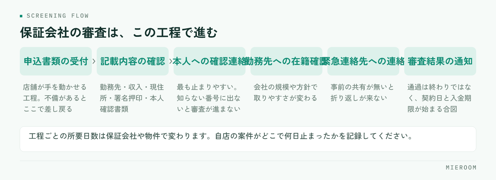

<!--META
{
  "title": "保証会社の審査の流れと店舗側の準備｜止まりやすい工程を先に潰す",
  "date": "2026-09-20",
  "category": "業務効率化",
  "excerpt": "保証会社の審査は、止まる場所がほぼ決まっています。申込から結果通知までの流れを工程に分け、それぞれで店舗側が先に準備できることと、進捗が読めなくなる原因を整理しました。",
  "hook": "審査が止まる場所は決まっています",
  "tags": ["入居審査", "保証会社", "申込管理", "賃貸仲介", "業務効率化"]
}
META-->

保証会社に申込を出したあと、「いまどこで止まっているのか分からない」という状態が続くと、お客様にも管理会社にも答えられません。ただ、審査が止まる場所は案件ごとにばらばらではなく、**ほぼ決まった工程に集中しています**。この記事では、審査の流れを工程に分けたうえで、店舗側が先に潰せる箇所を整理します。

<h4>この記事の結論</h4>
保証会社の審査で待ち時間が生まれるのは、審査そのものではなく<strong>本人確認の電話と、書類の追加依頼</strong>です。この2つはどちらも申込を出す前に手を打てます。流れを工程で把握し、止まりやすい箇所に先回りするのが、いちばん確実な短縮方法です。

## 審査の流れを、待ちが発生する単位で分ける

保証会社の審査は、書類を送って結果を待つだけの一本道に見えますが、実際には待ちが発生する工程がいくつも挟まっています。進捗を追うには、この単位で分けて考えるのが実務的です。

<figure class="fig"><figcaption>店舗が手を動かせるのは最初の2工程だけです。それ以降は店舗の外にいる人の対応待ちになります。</figcaption></figure>

大きくは、申込書類の受付、記載内容の確認、申込者本人への確認連絡、勤務先への在籍確認、緊急連絡先や連帯保証人への連絡、そして審査結果の通知という流れになります。管理会社を経由する場合は、その前後に管理会社側の確認が入ります。

重要なのは、**このうち店舗が手を動かせるのは最初の2工程だけ**という点です。それ以降は、申込者・勤務先・緊急連絡先という店舗の外にいる人の対応待ちになります。だからこそ、外の人が関わる工程ほど、事前の準備が効いてきます。

工程ごとの所要時間は、保証会社や物件、申込のタイミングによって変わります。目安を一律に決めるより、自店の直近の案件が実際にどこで何日止まったかを記録するほうが、はるかに使える情報になります。

## 受付と内容確認の工程で落ちないようにする

最初の2工程で差し戻されると、以降のすべてが後ろにずれます。逆に言えば、ここを通すだけで全体の遅れはかなり減ります。

確認すべき箇所は毎回同じです。

- 勤務先の正式名称・所在地・電話番号・勤続年数が埋まっているか
- 収入の記載と、提出する証明書類の内容が食い違っていないか
- 現住所と居住年数、住居の種別（賃貸・持家・社宅）
- 連帯保証人・緊急連絡先の氏名、続柄、住所、電話番号
- 署名・押印・日付、同意欄のチェック
- 本人確認書類の画像が四隅まで写り、有効期限内であること

これらは**お客様が目の前にいるうちに確認を終える**のが原則です。帰られたあとに気づくと、連絡がつくまでの時間がそのまま遅れになります。確認の順番や防ぎ方は[申込書の不備を減らす方法](./moushikomisho-fubi-herasu.html)で詳しく扱っています。

## 本人への確認連絡は、事前の一言で通る

審査が最も止まりやすいのが、保証会社から申込者本人への電話です。理由は単純で、**知らない番号に出ない方が多い**からです。

申込者が電話に出ないと、保証会社は時間を置いて掛け直します。その繰り返しで、審査が丸一日以上動かないことがあります。書類に不備が無くても起きるため、店舗側からは原因が見えにくい工程です。

防ぎ方は、申込書を受け取るときに一言添えるだけです。

- 保証会社から本人確認の電話が入ること
- 知らない番号からかかってくること
- つながらないと審査が止まること
- 出られる時間帯を、申込書の連絡希望欄に書いてもらうこと

連帯保証人や緊急連絡先を立てる場合は、**その方にも連絡が入る旨をお客様から先に伝えてもらいます**。本人以外への連絡は、事前の共有が無いと不審に思われて折り返しが来ません。ここは申込時に必ず口頭で確認しておく項目です。

## 在籍確認でつまずく条件を先に聞いておく

勤務先への在籍確認も、止まりやすい工程です。会社の規模や方針によって、確認の取りやすさがまったく違います。

申込前のヒアリングで、次の条件に当てはまらないかを聞いておくと、事前に手を打てます。

- 勤務先が個人事業主・小規模の事業所で、日中に電話が取られないことがある
- 派遣・請負で、就業先と雇用元が別になっている
- 入社直後で、社内の名簿にまだ載っていない
- 会社の方針で、第三者からの在籍確認に答えない
- シフト制で、本人が出勤していない日がある

該当する場合は、**在籍確認に代わる書類**（直近の給与明細や在籍証明書など）で対応できるかを、申込先に先に確認します。当てはまるかどうかを申込後に知ると、そこから書類を集め直すことになります。審査に通らない理由そのものについては[入居審査が通らない理由](./nyukyo-shinsa-toranai-riyu.html)にまとめています。

## 「いま止まっている場所」を案件ごとに残す

複数の申込が並行して動くと、どの案件がどこで止まっているかを記憶で追うのは無理があります。担当者が休んだ日に、状況を知らない人が確認から始めることにもなります。

案件ごとに残しておきたいのは、次の項目です。

- 申込日と、保証会社へ送った日
- いまどの工程にあるか（受付・内容確認・本人連絡・在籍確認・結果待ち）
- 最後に動きがあった日付
- 止まっている理由と、誰の対応を待っているか
- 次にこちらから確認する日

**特に効くのが「最後に動きがあった日付」**です。これがあると、何日も止まっている案件が一覧の上で目立ちます。止まっている理由が分かっていれば、お客様や管理会社への説明もその場でできます。

様式は既存の申込管理表に列を足す形で構いません。作り方は[申込管理表の作り方](./moushikomi-kanrihyo-tsukurikata.html)を参考にしてください。

## 結果が出たあとに止まらないようにする

審査が通ったあとも、契約や入金の手続きで止まることがあります。審査の進捗だけを追っていると、ここで気が緩みます。

結果の連絡を受けたら、その日のうちに次の3つを決めます。契約日の候補、初期費用の入金期限、そして必要書類の一覧と受け渡し方法です。**審査の通過は終わりではなく、次の期限が始まる合図**として扱います。

否決だった場合も、動き方は決まっています。まず理由が開示されるかを確認し、開示されない場合は無理に推測しません。そのうえで、別の保証会社や別の物件で進められるかを管理会社に相談します。お客様への連絡は、次の選択肢を用意してから行うほうが落ち着いて話せます。

✓記録は否決のときこそ残す

否決になった案件の条件と工程を残しておくと、次に似た条件の申込が来たときに、申込前の確認や物件の提案を変えられます。振り返れる形で残っていないと、同じ止まり方を繰り返します。

審査にかかる日数の目安は伝えてよいですか？

保証会社・物件・申込のタイミングで変わるため、一律の日数を断定して伝えるのは避けたほうが安全です。「本人確認の電話につながれば早く進む」「つながらないと止まる」という進み方の条件を伝えるほうが、お客様にも協力していただけます。自店の実績を記録しておけば、条件つきの目安として使えます。

審査を急いでほしいと言われたらどうしますか？

店舗から審査そのものを早めることはできません。できるのは、止まる要因を先に無くすことです。書類を完全な状態で出す、本人と緊急連絡先に電話が入ることを伝えておく、在籍確認が取りにくい条件を事前に共有する。この3つで、待ちの多くは避けられます。

申込者が電話に出られない時間帯が長い場合は？

連絡が取れる時間帯を申込書に明記し、申込先にも伝えておきます。あわせて、その時間帯を過ぎても連絡が来ない場合に店舗から確認する日を、あらかじめ自店の記録に入れておきます。待つ側が期限を決めておかないと、放置に気づけません。

## まとめ：流れを工程で持ち、止まる場所に先回りする

保証会社の審査は、申込書類の受付、内容確認、本人への確認連絡、在籍確認、結果通知という工程に分けられます。店舗が手を動かせるのは前半だけですが、**後半の待ちを短くする準備は、すべて申込前にできます**。書類をその場で完全にすること、本人と緊急連絡先に電話が入ると先に伝えること、在籍確認が取りにくい条件を聞いておくこと。この3つが効きます。

そして、案件ごとに「いまどの工程か」「最後に動いた日はいつか」を残しておけば、止まっている案件が一覧で見えるようになります。担当者の記憶に頼らずに済み、お客様や管理会社への説明もその場でできます。

ミエルームは、申込から入金までを案件ごとに記録し、いまどこで止まっているかを一覧で確認できる業務管理システムです。Excelで管理している内容はそのまま取り込めますし、初期設定の代行にも対応しています。まずは[ミエルームの製品ページ](../index.html)をご覧いただき、実際の画面で確認したい場合はデモアカウントの発行をご相談ください。
