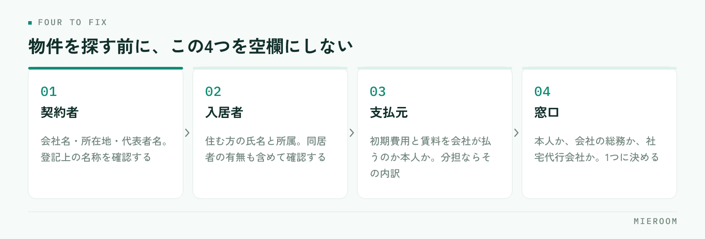

<!--META
{
  "title": "賃貸の法人契約・社宅対応の進め方｜個人契約との違いと必要書類",
  "date": "2026-10-05",
  "category": "業務効率化",
  "excerpt": "賃貸の法人契約と社宅対応について、個人契約との違い、受けた時点で確認する項目、審査と必要書類、請求と入金の段取りまで整理しました。社宅代行会社が窓口に入る場合の進め方もまとめています。",
  "hook": "法人契約の段取りに迷う方へ",
  "tags": ["法人契約", "社宅", "申込管理", "入金管理", "店舗運営"]
}
META-->

法人契約の問い合わせが入ったものの、個人契約と同じ段取りで進めてよいのか分からない。契約者と入居者が別で、支払いも請求書になる。**法人契約でつまずくのは手続きそのものより、受けた時点で確認すべき項目が個人契約と違うことに気づかないまま進めてしまう**ところです。

<h4>この記事の結論</h4>
法人契約は、<strong>契約者・入居者・支払元・窓口の4つが誰なのかを最初に確定させる</strong>ことで段取りが決まります。この4つが空欄のまま審査に進むと、書類の出し直しと入金の確認漏れが起きます。

## 法人契約は「契約する人」と「住む人」が別になる

法人契約は、会社が契約者となり、その会社の社員が入居する形の契約です。社宅、転勤者の住まい、単身赴任用の部屋などが該当します。

個人契約との最大の違いは、**契約者と入居者が別人である**ことです。ここから連鎖して違いが出てきます。

- 審査で見られるのは、入居者の収入ではなく契約者である会社の内容
- 初期費用や賃料の支払いは、会社からの振込や請求書払いになることが多い
- 契約期間中に入居者が変わる（異動・退職）可能性がある
- 連絡の窓口が、入居者本人ではなく会社の総務担当者になる

つまり、個人契約のつもりで入居者とだけやり取りを進めると、契約直前に「決裁がまだ下りていない」「書式が社内で通らない」といった形で止まります。**最初の問い合わせが入居者本人からだったとしても、法人契約の可能性があるなら決裁の相手を先に確認する**のが基本です。

✓問い合わせの時点では、法人契約かどうかが分からない

「会社の補助が出ます」「転勤で来ます」といった話が出た時点で、法人契約・社宅の可能性があります。契約者が本人になるのか会社になるのかで、進め方も必要書類も変わるため、ここを曖昧にしたまま物件を押さえると後から条件が合わなくなります。ヒアリングの項目に「契約者は本人か会社か」を入れておくと取りこぼしません。

## 受けた時点で確定させる4つ

法人契約の問い合わせを受けたら、物件を探す前にこの4つを埋めます。

<figure class="fig"><figcaption>支払元と窓口が空いたまま進むと、請求書の出し直しと認識違いが起きます。</figcaption></figure>

- **契約者**：会社名、所在地、代表者名。登記上の名称を確認します（屋号と登記名が違う場合があります）
- **入居者**：実際に住む方の氏名と勤務先での所属。同居者の有無も含めて確認します
- **支払元**：初期費用と毎月の賃料を、会社が払うのか本人が払うのか。会社と本人で分担する場合はその内訳
- **窓口**：やり取りする相手。本人なのか、会社の総務なのか、社宅代行会社なのか

このうち抜けやすいのが3つ目です。**初期費用は会社、毎月の賃料は本人の給与控除**という形は珍しくありません。これを確認せずに進めると、請求書の宛名を出し直すことになります。

4つ目も重要です。窓口が複数になると、伝えた内容が片方にしか届かず、契約日の直前に条件の認識違いが出ます。やり取りの相手を1つに決め、誰が決裁するのかを確認しておきます。

## 審査で見られるものと、必要になる書類

法人契約の審査は、契約者である会社に対して行われます。物件の所有者や管理会社の方針によって求められるものは変わりますが、一般に次のような書類を聞かれます。

- 会社の概要が分かる資料（会社案内、ホームページの写しなど）
- 登記事項証明書（履歴事項全部証明書）
- 直近の決算書類
- 入居者の身分証明書、在籍を示す書類
- 入居者の連絡先と、緊急連絡先

保証会社を使うかどうかは、物件や管理会社の方針によって異なります。会社の規模や内容によって不要となる場合もあれば、法人契約でも保証会社の利用が条件になっている物件もあります。**物件を提案する前に、その物件が法人契約を受けられるか、保証会社の扱いがどうなるかを確認する**のが安全です。保証会社の審査の流れ自体は[保証会社の審査の流れ](./hosho-gaisha-shinsa-nagare.html)にまとめています。

書類は会社側で用意するため、個人契約より時間がかかります。決算書類のように社内の承認が必要なものもあるため、依頼のタイミングを早めに取り、いつまでに必要かを明確に伝えてください。申込書の不備を減らす考え方は[申込書の不備を減らす](./moushikomisho-fubi-herasu.html)が共通して使えます。

## 個人契約・法人契約・社宅代行経由の違い

同じ「法人が関わる契約」でも、社宅代行会社が入るかどうかで進め方が変わります。

| 項目 | 個人契約 | 法人契約（直接） | 社宅代行会社経由 |
|---|---|---|---|
| 契約者 | 入居者本人 | 会社 | 会社（代行会社が窓口） |
| 窓口 | 本人 | 会社の担当者 | 代行会社の担当者 |
| 書式 | 自社や管理会社の様式 | 会社の様式を求められることがある | 代行会社の指定様式が基本 |
| 審査 | 本人の収入など | 会社の内容 | 代行会社を通じて進む |
| 請求先 | 本人 | 会社 | 代行会社 |
| 入金の時期 | 契約前が多い | 会社の支払い条件による | 代行会社の支払い条件による |

代行会社が入る場合、**書式と期限は代行会社の指定に合わせる**のが前提になります。自社の申込書で進めてしまうと、受け付けてもらえず作り直しになります。最初のやり取りで、所定の様式と提出期限、連絡の手段を確認してください。

一方で、代行会社経由は入居者募集の入口として安定しやすい面もあります。取引が始まれば、同じ様式で繰り返し案件が来るため、手順を固めやすくなります。

## 請求と入金は、個人契約と同じ扱いにできない

法人契約でつまずきが多いのは、契約の手続きより請求と入金です。理由は、会社には支払いの締め日と支払日があるためです。

- 請求書の宛名と送付先を確認する（本社の経理部門宛になることがあります）
- 支払いの締め日と支払日を確認する（月末締め翌月末払いなど、会社ごとに異なります）
- 請求書に必要な記載事項を確認する（登録番号、部署名、発注番号などを指定される場合があります）
- 入金予定日を案件の記録に残す

個人契約では契約前に初期費用が入ることが多いのに対し、**法人契約では入居後に入金されるケースがあります**。この違いを把握していないと、入金がないことに気づかないまま月をまたぎ、売上の集計が合わなくなります。

対策は単純で、案件ごとに「請求日・入金予定日・入金額」を記録し、予定日を過ぎた案件が一覧で見える状態にすることです。口頭やメールの履歴だけで追うと、担当者が不在のときに確認できません。月末の集計の進め方は[月末の売上集計を自動化する](./getsumatsu-uriage-shukei-jidoka.html)で扱っています。

!確定した売上と、見込みを混ぜない

法人契約は入金までの期間が長くなりやすいため、契約したタイミングで売上に計上してしまうと、実際に入ったお金と帳簿が合わなくなります。契約済みで入金待ちのものは見込みとして分けて数え、入金を確認した時点で確定に移す形にしてください。分けていないと、月の着地を読み間違えます。

## 契約後に起きることを、先に決めておく

法人契約は契約後の変更が発生しやすい契約です。契約の時点で次の点を確認しておくと、後からの問い合わせに慌てずに対応できます。

ひとつは**入居者の変更**です。異動や退職で住む人が変わる場合、契約者は会社のままで入居者だけが入れ替わることがあります。この取り扱いが可能かどうか、必要な手続きは何かを契約前に管理会社へ確認しておきます。

次に**重要事項説明と契約書の署名を誰が行うか**です。契約者は会社ですが、実際に住むのは社員です。説明の相手と署名の権限者、入居者を同席させるかどうかを事前に決め、日程の調整に組み込みます。遠方の本社が契約者になる場合は、書類の郵送にかかる日数も見込んでおきます。

最後に**解約の連絡経路**です。退去の連絡が入居者本人から来るのか、会社の担当者から来るのかを決めておきます。ここが曖昧だと、解約の意思表示の時期がはっきりせず、精算で揉める原因になります。

## 記録に残しておくと、次の案件が早くなる

法人契約は、同じ会社から繰り返し依頼が来ることがあります。一度やり取りした会社の情報を残しておくと、2件目以降の段取りが大きく短くなります。

残しておく項目は次のとおりです。

1. 会社名、登記上の名称、所在地、担当部署と担当者
2. 契約者・支払元の組み合わせ（初期費用と賃料をそれぞれ誰が払うか）
3. 指定の様式があるか、どの書類を提出したか
4. 支払いの締め日・支払日、請求書の宛名と送付先
5. 契約時に確認した取り扱い（入居者変更、解約の連絡経路）

これを担当者の手元のメモに置くと、担当が変わった時点で消えます。**案件の記録として残し、誰でも見られる状態にしておく**のが前提です。

社宅代行会社や地元企業からの依頼は、問い合わせの媒体としても分けて数えておく価値があります。どの経路から来た案件が契約まで進んでいるかが分かると、営業の時間をどこに使うかの判断材料になります。

法人契約だと仲介手数料の扱いは変わりますか？

請求先が会社になるため、見積書や請求書の形式を会社の指定に合わせる必要が出てきます。社宅代行会社が入る場合は、手数料の請求先と条件が代行会社との取り決めによって決まるため、案件を受ける前に確認してください。金額の考え方は物件や取引の条件によって変わるため、一律には決まりません。

会社名義での契約を断られる物件はありますか？

あります。物件の所有者や管理会社の方針によって、法人契約を受けていない物件、入居者の変更を認めていない物件があります。提案する前に確認しておかないと、申込の段階で白紙に戻ります。法人契約の問い合わせを受けた時点で、候補物件が法人契約に対応しているかを先に確かめる手順にしておくと、やり直しが減ります。

法人契約の問い合わせを増やすには何から始めればよいですか？

まずは過去に対応した会社の記録を見直し、再度依頼が来ていない会社がないかを確認するところからです。すでにやり取りの実績がある相手のほうが、新規に接点を作るより早く進みます。そのうえで、社宅代行会社との取引の有無や、地域で人の異動がある企業の所在を整理していきます。いずれにしても、過去の案件が記録として残っていることが前提になります。

## まとめ：4つを先に確定させれば、法人契約は難しくない

賃貸の法人契約と社宅対応は、契約者・入居者・支払元・窓口の4つを最初に確定させることで段取りが決まります。審査で見られるのは会社の内容で、必要書類は会社側で用意するため時間がかかる。社宅代行会社が入る場合は、様式と期限を代行会社に合わせる。この3点を押さえれば、個人契約と並行して回せます。

そして、個人契約といちばん違うのが請求と入金です。契約時点の計上と実際の入金にずれが出るため、請求日・入金予定日・入金額を案件ごとに記録し、確定した売上と見込みを分けて数えてください。契約後の入居者変更や解約の連絡経路も、契約時に決めておけば後の問い合わせに即答できます。

案件ごとの申込の進捗、請求と入金の予定、取引先ごとの履歴を1か所で追える形を探している場合は[ミエルーム](../index.html)が対応しています。デモアカウントの発行と、既存のExcelデータの取り込み・初期設定の代行にも対応していますので、いまの記録の残し方からお気軽にご相談ください。
