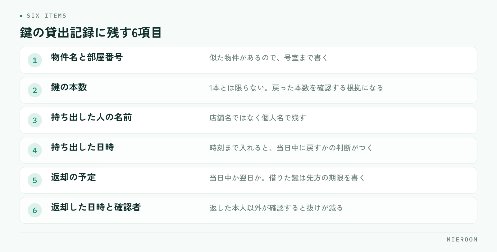

<!--META
{
  "title": "鍵の管理方法｜貸出の記録と、紛失・返却漏れを防ぐ運用",
  "date": "2026-09-22",
  "category": "業務効率化",
  "excerpt": "内見用の鍵が見つからない、返したはずの鍵が戻っていない。賃貸仲介の店舗で起きる鍵のトラブルを防ぐために、貸出の記録項目、1日の締め方、紛失時の初動を整理しました。",
  "hook": "鍵は記録が無いと、誰も責任を持てない",
  "tags": ["鍵管理", "業務効率化", "賃貸仲介", "店舗運営", "リスク管理"]
}
META-->

内見に出ようとしたら鍵が見つからない。管理会社から「返却がまだですが」と電話が来る。賃貸仲介の店舗で、鍵をめぐるこうした出来事は珍しくありません。原因のほとんどは不注意ではなく、**誰がいつ持ち出したかが記録に残っていないこと**にあります。

<h4>この記事の結論</h4>
鍵の紛失と返却漏れは、注意喚起では減りません。<strong>持ち出した瞬間に記録が残り、1日の終わりに戻っているかを必ず確認する仕組み</strong>を作ることで、探す時間と管理会社への謝罪が同時に減ります。

## 鍵が見つからなくなるのは、記録が残っていないから

鍵が行方不明になる場面を分解すると、ほとんどが同じ形をしています。急いでいる担当者が鍵を持ち出し、そのまま内見に向かう。戻ってきたときには次の接客が始まっていて、鍵は自分のカバンや机の引き出しに入ったまま。翌日、別のスタッフが同じ物件の鍵を探して見つからない、という流れです。

ここで問題なのは、なくしたことではなく、**誰が最後に触ったか分からないこと**です。記録があれば、その人に聞けば数分で解決します。記録が無ければ、店舗中を探し、心当たりのある全員に確認することになります。

「気をつけよう」と声をかけても、急いでいる場面では同じことが起きます。注意力に頼らず、持ち出すときに必ず記録が残る形にしてください。

## 店舗で扱う鍵を、3つに分けて考える

鍵をひとまとめに扱うと、管理の方法が決まりません。責任の所在と返す先が違うので、次の3つに分けます。

| 種類 | 保管場所 | 返す先 | 気をつける点 |
|---|---|---|---|
| 自社管理物件の鍵 | 自店のキーボックス・鍵棚 | 自店に戻す | 本数と所在を自店で把握する責任がある |
| 管理会社から借りた鍵 | 一時的に自店で預かる | 管理会社へ返却 | 返却期限がある。遅れると信用に直結する |
| 現地のキーボックス | 物件の玄関・メーターボックス | 元の位置に戻す | 暗証番号の共有範囲と、戻し忘れに注意 |

この3つは、なくしたときの影響も違います。現地キーボックスの戻し忘れは次の案内ができなくなり、**管理会社から借りた鍵の紛失は、鍵交換の費用負担と信用の問題に発展します**。分けて考えると、どこに手間をかけるべきかがはっきりします。

## 貸出の記録に残す項目

記録は、項目を絞るほど続きます。多すぎると書かれなくなり、少なすぎると後から追えません。次の項目があれば足ります。

<figure class="fig"><figcaption>「誰が」「いつまでに」が抜けると、記録があっても追えません。この6つは省略しないでください。</figcaption></figure>

1. **物件名と部屋番号**：似た物件があるので、号室まで書きます
2. **鍵の本数**：1本だけとは限りません。戻ってきた本数を確認する根拠になります
3. **持ち出した人の名前**：店舗名ではなく個人名で残します
4. **持ち出した日時**：時刻まで入れておくと、当日中に戻すかどうかの判断がつきます
5. **返却の予定**：当日中か、翌日か。管理会社から借りた鍵は先方の期限を書きます
6. **返却した日時と、確認した人**：返した本人以外が確認すると、抜けが減ります

✓記録は持ち出す場所で取る

鍵を置いている棚やキーボックスのすぐ横で記入できるようにしてください。事務所の奥にノートがあると、後で書こうとして忘れます。紙でもスマートフォンでも、鍵に手を伸ばす場所で完結する形にします。

## 返却漏れを防ぐのは、1日の締めの確認

記録を取り始めても、返却漏れはなくなりません。書いたまま誰も見返さなければ、記録はただの履歴になります。防ぐ方法は単純で、**1日の終わりに、出ているままの鍵が無いかを1回確認する**ことです。

確認するのは閉店前の数分です。記録を見て、持ち出しの記入があるのに返却の記入が無いものを拾い、その担当者に声をかける。翌日に持ち越すなら、持ち越すこと自体を記録に残します。

担当は日替わりでも固定でも構いませんが、**誰がやるかを決めておく**ことが必要です。「気づいた人が」にすると、誰もやりません。閉店作業の手順に1行足して、レジ締めや戸締まりと同じ並びに入れてください。

!週末明けが最も危ない

土日に持ち出した鍵は、月曜の朝まで確認されないことがあります。繁忙期の土日は特に出入りが多いので、土曜と日曜の閉店時にも同じ確認を行ってください。月曜にまとめて確認すると、管理会社からの連絡のほうが先に来ます。

## キーボックスと暗証番号の扱い

現地のキーボックスは便利ですが、扱いを決めておかないと別の問題が起きます。

暗証番号は、知っている範囲を把握できる形で共有します。口頭で伝えた番号は、誰に伝わっているか分からなくなります。案内が終わった物件の番号を変更するかどうか、管理会社の方針も確認しておいてください。

- **使ったら必ず元の位置に戻す**：ダイヤルは必ず回して閉じます。開いたまま戻すのは施錠していないのと同じです
- **番号は案件の記録に紐づける**：個人のメモ帳やメッセージ履歴に残さず、その物件の情報として残します
- **変更があったら共有する**：番号が変わった物件に古い番号で行くと、現地で立ち往生します
- **退去・成約後の扱いを決める**：もう案内しない物件の番号が共有されたままにならないようにします

物件情報や図面をどこにまとめるかは、鍵の扱いとも直結します。探す情報の置き場所を決める考え方は[物件検索・提案を速くする方法](./gyoshakan-site-bukken-kensaku.html)でも触れています。

## 紛失が起きたときの初動

どれだけ気をつけても、紛失はゼロにはなりません。起きたときに被害を小さくするのは、初動の速さです。

まず、探す前に**持ち出しの記録を確認**します。最後に触った人が分かれば、探す範囲が一気に狭まります。多くの場合、その人のカバンか車の中か、内見した部屋に置き忘れています。

30分ほど探して見つからないなら、隠さずに管理会社へ連絡してください。報告が遅れるほど話がこじれます。連絡するときは、どの物件のどの鍵が何本か、最後に確認できたのはいつかを伝えます。記録があれば、この情報はすぐ出てきます。

そして、見つかった場合も見つからなかった場合も、**どこで記録が途切れたかを確認する**ところまでやります。担当者を責めるためではなく、同じ抜け方を塞ぐためです。持ち出しの記入が無かったのか、返却の確認が飛んだのか。原因の場所が分かれば、対策は1つで済みます。

## よくある質問

紙のノートでの管理でも問題ありませんか？

記録が残り、毎日確認されているなら問題ありません。困るのは、ノートが事務所にあって現場から書けない場合と、過去の記録をさかのぼって探すのに時間がかかる場合です。複数店舗で鍵を融通している、記録を後から検索したい、という段階になったら別の方法を検討してください。

スタッフが記録を書いてくれません。どうすればいいですか？

多くの場合、書く場所か項目に原因があります。鍵を取る場所で書けるか、項目が多すぎないかを確認してください。それでも定着しない場合は、1日の締めの確認を必ず行い、記入が無い鍵について毎回本人に確認することです。確認される前提ができると、記入は自然に残るようになります。

鍵の管理は誰の担当にすべきですか？

持ち出しの記録は持ち出した本人、1日の締めの確認は当番、というように分けるのが現実的です。全体を一人に任せると、その人が休んだ日に止まります。締めの確認だけは必ず誰かが担当する形にしてください。

## まとめ：記録と締めの確認を、作業の中に組み込む

鍵の管理方法で押さえるのは3つです。**持ち出した瞬間に記録が残る場所を作ること、1日の終わりに出たままの鍵を確認すること、紛失したら記録から当たって早く報告すること**。注意喚起ではなく、作業の流れの中に組み込むことで初めて続きます。

今日からできるのは、鍵を置いている場所に記録の紙を1枚貼ることと、閉店作業の手順に確認の1行を足すことです。どちらも費用はかかりません。

[ミエルーム](../index.html)は、反響から接客・申込・契約までを案件ごとに1か所で記録できる賃貸仲介向けの業務管理システムです。案件に紐づけて情報を残せるので、内見の予定や担当者の動きと鍵のやりとりがばらばらの場所に散らばりません。デモアカウントの発行と、最短即日でのスタートが可能です。既存のExcelデータのインポートと初期設定の代行にも対応していますので、まずはご相談ください。
