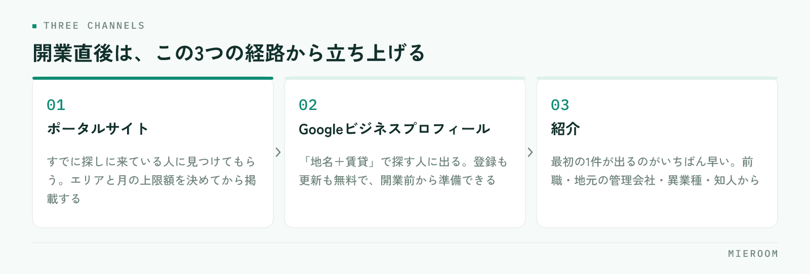

<!--META
{
  "title": "不動産仲介を開業した直後の集客｜最初の反響を作る3つの経路の設計",
  "date": "2026-09-09",
  "category": "集客・広告",
  "excerpt": "開業直後に反響が来ないのは、実力ではなく経路がまだ1本も通っていないからです。ポータルサイト・Googleビジネスプロフィール・紹介という3つの経路の作り方と、来はじめた反響を取りこぼさない記録の型を整理しました。",
  "hook": "開業直後の反響は、経路を3本つくるところから",
  "tags": ["開業", "集客", "反響", "ポータルサイト", "賃貸仲介"]
}
META-->

免許が下り、事務所が整い、業者間サイトにもつながった。それでも電話は鳴らない——開業直後にいちばん多い状態です。原因は営業力ではなく、**お客様がお店にたどり着く経路が、まだ1本も通っていないこと**にあります。この記事では、最初の反響を作るための3つの経路と、その順番を整理します。

  <h4>この記事の結論</h4>
  
開業直後の集客は、手を広げるより<strong>経路を3本だけ通し、来た反響を1件も落とさないこと</strong>が先です。ポータルサイト・Googleビジネスプロフィール・紹介の3つを、この順で立ち上げます。

## 反響が来ないのは、経路がまだ通っていないから

開業したばかりのお店には、実績も口コミも掲載履歴もありません。お客様の側から見ると、存在を知る手段がない状態です。物件を扱えることと、お客様に見つけてもらえることは別の話で、後者は意識して作らないと立ち上がりません。

このとき起きがちなのが、思いつく手段を一度に全部始めてしまうことです。ポータルに出し、SNSを開設し、チラシを撒き、看板を出す。手数は増えますが、どれも中途半端になり、しかも**どこから反響が来たのかが分からなくなります**。

開業直後に必要なのは、手数ではなく経路です。まず数を絞って通し、反応があった経路を太くする。この順番のほうが、結果的に早く回りはじめます。

## 最初に立ち上げる3つの経路

優先するのは次の3つです。それぞれ立ち上がるまでの時間が違うので、同時に着手して構いません。

<figure class="fig"><figcaption>3つとも開業前から準備を始められます。立ち上がる時間差があるので、同時に着手します。</figcaption></figure>

✓3つに絞る理由

SNSや自社サイトからの集客は、続ければ効いてきますが、成果が出るまでに時間がかかります。開業直後は、すでにお客様が探しに来ている場所（ポータル・地図検索）と、すでに人のつながりがある場所（紹介）から始めるのが現実的です。

3つとも、開業前から準備を始められます。特にGoogleビジネスプロフィールと紹介の準備は、免許の交付を待つ間にも進められます。

## ポータルサイト：出す前に決めておくこと

賃貸仲介の反響で最も大きいのはポータルサイトです。ただし、掲載を始める前に決めておかないと、費用だけが出ていきます。

- **どのエリア・どの価格帯で戦うか**：全域に薄く出すより、通える範囲を絞ったほうが問い合わせは濃くなります
- **掲載する物件の質を先に決める**：おとり掲載は論外として、すでに決まった物件を残さない運用ルールを最初に作ります
- **写真と間取りの用意に時間をかける**：同じ物件が並ぶ中で選ばれる理由は、ほぼ写真と情報量です
- **反響の受け口を決める**：電話かメールかフォームか。どこに届くかを決めてから掲載します
- **月いくらまで出すかを先に決める**：反響が出る前に上限を決めておかないと、判断が感情に寄ります

掲載は「出したら終わり」ではありません。反響が出はじめたら、媒体ごとに費用と成約を見比べる必要があります。その見方は[媒体別ROIの考え方](./media-roi.html)にまとめています。

## Googleビジネスプロフィール：開業直後こそ効く

見落とされがちですが、**「地名＋不動産」「地名＋賃貸」で探す人は必ずいます**。地図検索に出るかどうかは、開業直後の小さなお店でも整備すれば変わります。しかも登録も更新も無料です。

やることは多くありません。オーナー確認を済ませ、店舗名・住所・電話番号・営業時間を正確に登録し、外観と店内の写真を載せる。取り扱い（賃貸・売買・管理など）を登録し、営業時間の変更はその都度直す。これだけで、少なくとも「探されたときに見つかる」状態になります。

口コミは、開業直後はゼロから始まります。焦って集めようとせず、来店いただいた方に自然にお願いする形で構いません。返信は必ず全件に行います。

## 紹介：いちばん早く効く経路

3つのうち、最初の1件が出るのがいちばん早いのは紹介です。開業前から動けるのもここです。

- **前職からのつながり**：競業の取り決めを確認したうえで、可能な範囲で開業を知らせます
- **地元の管理会社・オーナー**：物件を預かる話と、お客様を紹介いただく話は別に進みます
- **異業種の事業者**：引越業者、リフォーム業者、保険代理店など、住まいの前後に関わる相手
- **既存の知人・家族**：住み替えの予定がある人は身近にいます

紹介は数が読めない代わりに、決まりやすく、費用がかかりません。**開業直後の資金繰りを支えるのは、たいてい紹介**です。ただし紹介だけに頼ると数が伸びないので、ポータルと地図検索を並行して立ち上げます。

## 来はじめた反響を、経路ごとに記録する

3つの経路が通りはじめたら、次にやるのは記録です。ここを最初からやるかどうかで、半年後の判断の精度が変わります。

| 記録する項目 | なぜ必要か |
|---|---|
| 反響が来た経路 | どこにお金と時間を足すかの判断材料になる |
| 受けた日時と初回返信の日時 | 初動の速さは成約率に直結する |
| 対応した担当者 | 人によるばらつきに早く気づける |
| 来店したか／内見したか | どの段階で止まっているかが分かる |
| 成約・不成約とその理由 | 掲載する物件と価格帯の見直しに使う |

開業直後は件数が少ないので、記録は苦になりません。**苦になってからでは、もう始められません**。件数が増えたときに「どの媒体が効いているか分からない」となるのは、この時期に記録を始めなかったお店です。

初回返信までの時間は、特に意識してください。反響は複数店舗に同時に送られていることが多く、先に返した店が話を進めます。詳しくは[反響の初動5分](./lead-response-speed.html)で扱っています。

!「まだ件数が少ないから後で」がいちばん危ない

記録の型は、件数が少ないうちに決めておくものです。あとから作ると、過去の反響を遡って入力し直すことになり、たいていやり切れません。最初の1件目から同じ形で残してください。

## よくある質問

開業してからどれくらいで反響が来はじめますか？

エリア、掲載する物件、時期によって大きく変わるため、期間を断言することはできません。ただし、紹介はすぐに動く可能性があり、ポータルは掲載を始めてから、地図検索は情報を整えてから、それぞれ時間差で立ち上がります。3つを同時に始めておくと、どれかが先に動きます。

ポータルサイトは何社に出すべきですか？

最初から複数に広げるより、1社に絞って掲載の質を上げ、反響と成約を見てから増やす順番をおすすめします。掲載社数を増やすと、物件情報の更新作業も社数分だけ増えます。手が回らずに古い情報が残るほうが、機会損失は大きくなります。

自社ホームページは開業時に必要ですか？

検索から集客する装置としては時間がかかりますが、ポータルや紹介で名前を知った人が確認しに来る場所としては、開業時から必要です。店舗の場所、営業時間、取扱内容、スタッフの顔が分かる程度でも、最初は十分に役目を果たします。

## まとめ：経路を3本通し、1件目から記録する

開業直後の集客でやることは、多くありません。**ポータル・Googleビジネスプロフィール・紹介の3本を通し、来た反響を1件も落とさない**。この2つだけです。手を広げるのは、どの経路が効いているかが見えてからで間に合います。

今日から着手できるのは、Googleビジネスプロフィールの登録と、紹介をお願いする相手の一覧づくりです。どちらも費用がかかりません。ポータルは、掲載エリアと上限額を決めてから動きます。

[ミエルーム](../index.html)は、反響の受付から追客・来店・成約までを1か所で記録し、経路ごとの反響数と成績を見られるようにしています。ポータルのメール反響や問い合わせフォームの自動取込、LINE・SMSでの自動追客にも対応しており、開業直後の少人数でも記録が続く形にできます。デモアカウントの発行と、最短即日でのスタートが可能です。開業準備の段階からご相談ください。
