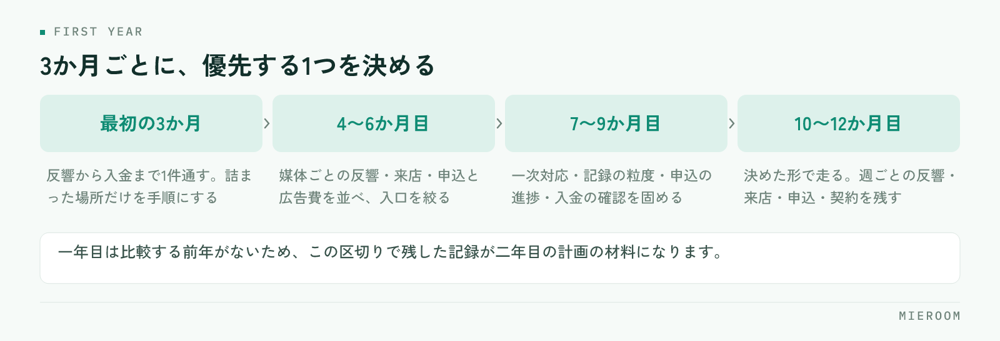

<!--META
{
  "title": "不動産仲介の開業一年目にやること｜月ごとの優先順位と数字の見方",
  "date": "2026-10-03",
  "category": "組織・育成",
  "excerpt": "不動産仲介の開業一年目にやることを、3か月ごとの優先順位で整理しました。最初に何を固めるか、繁忙期までに終わらせること、一年目に見るべき数字までまとめています。",
  "hook": "開業一年目、何から手をつけるか迷う方へ",
  "tags": ["開業", "店舗運営", "一年目", "計画", "数字の見方"]
}
META-->

開業の準備は終わったものの、日々の対応に追われて一年目の計画が立たないまま進んでしまう。これは一人で始めた店舗でも、数名で始めた店舗でも同じように起きます。原因は仕事量ではなく、**同じ時期に「売上を作ること」と「店の形を作ること」を同時にやろうとすること**にあります。

<h4>この記事の結論</h4>
開業一年目は、やることを並べるのではなく<strong>3か月ごとに優先する1つを決める</strong>ほうが進みます。最初の3か月は手順づくりより<strong>取引を最後まで1件通すこと</strong>に寄せ、記録の形を整えるのはそのあとです。

## 一年目に起きることと、一年の区切り方

やることを月単位で並べると、たいてい消化できません。3か月ごとに優先する1つを決め、残りはその期間にやらないと決めるほうが現実的です。

<figure class="fig"><figcaption>やることを月単位で並べると消化できません。その期間にやらないことを決めるのが前提です。</figcaption></figure>

一年目にいちばん効いてくるのは、反響が安定しないことです。広告を出し始めた直後は、どの媒体からどれだけ来るかの見当がつきません。来た反響に全力で対応するしかないため、計画を立てる時間が取れません。

同時に、決めていないことが毎日出てきます。問い合わせへの返し方、ヒアリングで聞く項目、申込書の保管場所、入金の確認方法。どれも一度決めれば済むことですが、案件が走っている最中に決めると、その場しのぎの形で固まってしまいます。

そしてもう一つ、**一年目は比較する前年がありません**。売上が多いのか少ないのか、反響の数が妥当なのかを判断する基準が手元にない状態で、投資の判断をしていくことになります。この3つが重なるのが一年目の実情です。

✓「やらないこと」を先に決める

一年目にありがちなのが、紹介された施策を全部試してしまうことです。媒体を増やし、SNSを始め、チラシも配る。同時に動かすと、どれが効いたのか分からないまま費用だけが積み上がります。この3か月は何をやらないかを、先に紙に書いてください。

## 最初の3か月：1件を最後まで通す

最初の3か月で優先するのは、取引を1件、反響から入金まで通すことです。通してみないと、自分の店で何が足りないかが分かりません。

この時期にやることは次の3つに絞ります。

1. 反響が入ったときの返し方を決める（誰が、いつまでに、何を返すか）
2. 来店時に聞く項目を紙に落とす
3. 申込から入金までに触る書類を、1件分すべて並べて確認する

手順書を先に作り込む必要はありません。**1件通したあとに、詰まった場所だけを手順にする**のが早道です。想像で作った手順は、実際の案件でほぼ使われません。

逆に、この時期に後回しにしていいのは、組織の体制づくり、評価制度、細かい経費の分類です。どれも案件の数が増えてからで間に合います。

## 4〜6か月目：反響の入口を絞る

3か月分の反響が溜まったら、媒体ごとの内訳を出します。見るのは反響数だけではありません。

- 媒体ごとの反響数
- そのうち来店につながった数
- そのうち申込・契約につながった数
- かけた広告費

反響が多い媒体が、契約につながる媒体とは限りません。問い合わせだけが多くて来店に至らない媒体に費用をかけ続けていると、忙しさだけが増えます。媒体ごとの判断のしかたは[媒体別のROIの見方](./media-roi.html)で詳しく扱っています。

この時期に絞り込むと、繁忙期に向けて費用を集中させる先が決まります。**判断の材料は、自分の店で取った記録しかありません**。だからこそ、最初の3か月で記録を残しておく意味があります。

## 7〜9か月目：繁忙期までに手順を固める

秋に入ったら、繁忙期までに終わらせることを逆算します。繁忙期に入ってから手順を変えるのは、ほぼ不可能だと考えてください。

この時期に固めるのは次のとおりです。

| 固めるもの | 判断の目安 |
|---|---|
| 反響への一次対応 | 担当が不在でも当日中に返せる形になっているか |
| 記録の粒度 | 引き継いだ人が、本人に聞かずに続きを進められるか |
| 申込の進捗 | 審査待ち・書類不足の案件が一覧で分かるか |
| 入金の確認 | 誰がいつ確認するかが決まっているか |

人を増やすかどうかの判断も、この時期です。増員は人件費が先に出るため、反響の見込みと1人が持てる案件数を並べて考えます。人を増やす以外に、一次対応だけを分担する、繁忙期だけ時間を延ばすといった選択もあります。

## 10〜12か月目：走りながら記録を残す

繁忙期は、新しいことを始める時期ではありません。決めた形で走り、翌年の判断材料を残すことに専念します。

残しておきたいのは、週ごとの反響数・来店数・申込数・契約数の4つです。週単位で残すと、翌年にどの週から立ち上がるかが分かります。月単位だと、山の位置が見えません。

繁忙期が終わったあとの振り返りは、記憶ではなく記録でやります。**忙しかったという感想は残りますが、どの週に何件詰まったかは1か月で忘れます**。走っている最中に数字を残しておくことが、二年目の計画の精度を決めます。

!繁忙期の売上だけで一年を判断しない

繁忙期に売上が立つと、その勢いで翌年の計画を立ててしまいがちです。ただ、閑散期の数字も含めて年間で見ないと、固定費に見合っているかの判断を誤ります。年間の売上を12で割った額と、毎月出ていく固定費を並べて見てください。

## 一年目に見る数字は4つだけ

管理できる数字を増やしても、見る時間がなければ意味がありません。一年目は次の4つに絞ります。

- **反響の当日返信率**：対応の速さは、一年目でも差がつく部分です
- **反響から来店への率**：媒体と物件の出し方が合っているかが出ます
- **来店から申込への率**：接客とヒアリングの精度が出ます
- **確定した売上と、見込みの売上**：この2つを混ぜると資金の判断を誤ります

最後の1つが、一年目はとくに大事になります。申込が入った段階の金額を売上として数えてしまうと、審査が通らなかったときに計画が崩れます。**入金が済んだ分と、まだ済んでいない分は分けて持つ**のが原則です。月末の集計で何を見るかは[月末の締め作業](./month-end-closing.html)に整理しています。

## よくあるつまずき

ひとつ目は、**記録が人の頭の中にあること**です。一人で始めた店舗で起きやすく、人を入れた瞬間に引き継げないことが分かります。最初から他人が読める形で残しておくほうが、後の手間が減ります。

ふたつ目は、**ツールを増やしすぎること**です。反響は反響の管理表、売上は別の表、入金はまた別。案件が増えると、同じ案件を何度も入力することになります。入口から売上までを1件でつなぐ形にしておくと、集計のし直しが要りません。

みっつ目は、**閑散期に何もしないこと**です。案件が少ない時期は、手順を直すのに最も向いています。繁忙期に詰まった場所をこの時期に直しておくと、翌年の繁忙期の負荷が変わります。

一人で開業した場合、どこまで自分でやるべきですか？

案件を進める仕事は自分でやり、集計と転記は仕組みに寄せるのが現実的です。一人のうちは何でも回りますが、転記の作業は案件数に比例して増えます。先に減らしておくと、人を入れるまでの期間を延ばせます。

一年目から業務管理のシステムを入れるべきでしょうか？

案件が少ないうちはExcelでも回ります。判断の目安は、同じ案件の情報を2か所以上に入力しているかどうかです。入力が二重になっているなら、案件が増えたときに崩れます。切り替えの考え方は[賃貸仲介の業務管理システム比較](../compare.html)で整理しています。

開業一年目の目標は、どう置けばよいですか？

売上の金額ではなく、工程の数で置くほうが機能します。反響数・来店数・申込数のうち、自分の努力で動かせるのは前の工程です。契約数は後ろの工程なので、目標に置いても日々の行動に結びつきません。前の工程に目標を置き、率を記録してください。

## まとめ：3か月ごとに、優先する1つを決める

開業一年目にやることは、3か月ごとに区切ると整理できます。最初は1件を最後まで通すこと。次に反響の入口を絞ること。秋に手順を固め、繁忙期は走りながら記録を残す。この順番であれば、日々の対応に追われていても前に進みます。

見る数字は4つに絞り、確定した売上と見込みは必ず分けて持つ。そして閑散期に、詰まった場所を直す。一年目にこの形ができていると、二年目の計画は記録から立てられるようになります。

反響から接客、申込、入金までを1件としてつなぎ、確定売上と見込みを分けて見られる状態にしておくと、一年目でも判断の材料が手元に残ります。その形を探している場合は[ミエルーム](../index.html)が対応しています。デモアカウントの発行と、既存のExcelデータの取り込み・初期設定の代行にも対応していますので、開業準備の段階からでもお気軽にご相談ください。
