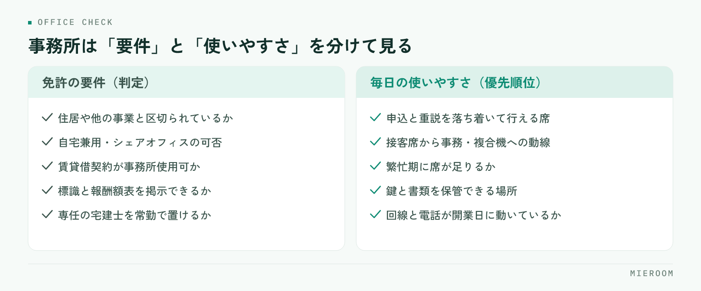

<!--META
{
  "title": "不動産仲介の開業に必要な事務所・設備・システムの準備｜後から困らない選び方",
  "date": "2026-09-17",
  "category": "組織・育成",
  "excerpt": "賃貸仲介の開業に向けて、事務所の要件確認、立地と物件の見方、店内レイアウト、回線と機器、そして開業日までに決めておくシステムまでを順番に整理しました。後から替えにくいものを先に決めるのが、無駄な投資を避ける近道です。",
  "hook": "開業投資は、後から替えにくい順に決める",
  "tags": ["不動産開業", "事務所準備", "賃貸仲介", "設備投資", "開業準備"]
}
META-->

不動産仲介の開業準備で事務所を探し始めると、家賃と広さばかりが判断材料になりがちです。しかし開業してから効いてくるのは、免許の要件を満たしているかと、毎日の接客と事務がその間取りで回るかの二点です。この記事では、事務所・設備・システムの準備を、**後から替えにくいものから順に決める**という考え方で整理します。

<h4>この記事の結論</h4>
開業時の投資は、金額の大きさではなく<strong>後から替えにくいかどうか</strong>で優先順位をつけます。事務所と回線と管理の仕組みは先に決め、机や什器は後からでも間に合います。

## 事務所の準備は「免許の要件」と「毎日の使いやすさ」を分けて考える

事務所探しでつまずく方の多くは、この二つを一度に考えようとしています。免許の要件は満たすか満たさないかの判定で、交渉の余地がありません。一方の使いやすさは程度の問題で、優先順位をつけて折り合う対象です。

<figure class="fig"><figcaption>要件は満たすか満たさないかの判定、使いやすさは優先順位をつけて折り合う対象です。</figcaption></figure>

先に判定すべきは要件のほうです。物件を気に入ってから要件を満たさないと分かると、探し直しになります。内見の前に、候補物件が要件を満たせる形かどうかを所管の窓口に確認する順番にしてください。使いやすさは、開業後の一日を頭の中で再現しながら見ます。朝に物件を確認し、来店を受け、内見に出て、戻って申込書を書き、夜に反響へ返信する。この流れが止まらずに回る間取りかどうかが判断の中心です。

## 事務所の要件で先に確認しておくこと

宅地建物取引業の免許には事務所に関する要件があり、要件の細かい運用は自治体によって異なります。金額や書式も改正で変わるため、必ず所管の窓口（都道府県の宅建業担当課など）や行政書士にご確認ください。そのうえで、確認の観点は次のとおりです。

- 独立性：住居や他の事業と明確に区切られ、継続して業務ができる形になっているか
- 自宅兼用の可否：玄関や動線が生活空間と分かれているかなど、認められる条件を事前に確認する
- シェアオフィス・レンタルオフィスの可否：区画の仕切りや専用性の条件を、契約前に窓口へ確認する
- 賃貸借契約の用途：事務所使用が可能な契約か。住居専用の契約では使えない
- 掲示と備え付け：標識（業者票）と報酬額表の掲示、帳簿・従業者名簿の備え付けを置ける場所があるか
- 専任の宅地建物取引士：常勤できる人員配置になっているか

**契約を結ぶ前に窓口へ確認する**。この一手間だけで、開業日がずれる事故のほとんどは防げます。開業全体の流れは[不動産の開業準備チェックリスト](./fudosan-kaigyo-junbi-checklist.html)にまとめています。

## 立地と物件を見るときの基準

賃貸仲介の立地は、来店型で進めるか、反響からの直行型で進めるかによって重みが変わります。来店を主にするなら人の流れ、反響を主にするなら家賃を抑えて広告費に回す判断もあり得ます。

- 客層の通り道：駅・大学・大きな職場など、狙う入居者層が日常的に通る場所か
- 一階と視認性：路面か空中階か。空中階なら看板と入口の分かりやすさをどう補うか
- 看板の可否：物件の規約で出せる看板の大きさと位置が決まっている場合がある
- 駐車場：内見の送迎に使う車を置けるか。来客用が必要か
- 繁忙期の耐久力：一月から三月に来店が重なったとき、席が足りるか
- 原状回復と契約期間：内装に手を入れる場合の条件と、退去時の負担

見落とされやすいのが繁忙期の席数です。平常時にちょうど良い広さは、繁忙期には足りません。**一番混む時期を基準に見て、普段は広く使う**ほうが、後の増床より安く済みます。

## 店内レイアウト：接客席とバックヤードの取り方

間取りは、接客・事務・保管の三つの役割で考えると決めやすくなります。

接客席は、申込や重要事項説明を落ち着いて行える場所が要ります。隣の席の会話が筒抜けだと、収入や勤務先といった話をしづらくなります。パーテーションや席の間隔で、最低限のプライバシーを確保してください。

事務のスペースは、接客席から見える位置にあると動きやすくなります。接客中に空室を確認する、図面を印刷する、といった往復が発生するためです。**接客席と複合機の距離**は、内見の前に実際に歩いて確かめておく価値があります。

保管は、鍵と書類の二つです。鍵は施錠できる場所に、どの物件の鍵かが分かる形で。書類は契約関係を年度ごとに保管できる棚を見込んでおきます。

## 設備と回線：開業日までに動く状態にするもの

設備は「開業日に動いていないと営業できないもの」から手配します。工事が必要なものほど、申し込みから開通までに時間がかかります。

- インターネット回線：業者間サイトも管理ツールも回線がなければ使えない。物件が決まったら最初に申し込む
- 固定電話：番号を広告やGoogleビジネスプロフィールに載せるため、開業前に番号が確定している必要がある
- パソコン：業者間サイトと図面作成を同時に開くため、画面の大きさと台数を接客席の数に合わせる
- 複合機：募集図面や契約書を印刷する。リースか購入か、保守の条件も含めて比べる
- 鍵の保管設備：施錠できるキーボックスや金庫
- 什器：接客テーブル、椅子、書類棚。中古でも支障がないものが多い

このうち、回線と電話番号は日程が読みにくい項目です。什器は後からでも足せますが、**回線が開通していない事務所では、営業初日から何もできません**。開業日から逆算して、余裕をもって申し込んでください。

## システムは「後から替えにくいもの」から決める

設備と同じ発想で、システムも後から替えにくいものを先に決めます。判断を助けるために、開業時の投資を二つに分けて並べます。

| | 先に決めるもの | 後からでも間に合うもの |
|---|---|---|
| 事務所 | 物件の要件と契約条件 | 什器の買い替え、レイアウトの微調整 |
| 設備 | 回線、固定電話の番号 | パソコンの増設、複合機の入れ替え |
| 記録 | 反響・申込・売上・入金を残す場所と項目 | 集計の見せ方、レポートの整え方 |
| 集客 | 媒体ごとに反響を記録する型 | 出稿する媒体の組み合わせ |

記録の仕組みが「先に決めるもの」に入るのは、後から替えると過去のデータの持ち出しと突き合わせが発生するからです。開業初月の反響がどの媒体から来て、いくらの売上になったか。これを後から再現するのは、当初から記録しておくのに比べてはるかに手間がかかります。

開業直後は案件が少ないため、紙とエクセルで足りているように見えます。ただし**案件が少ない時期こそ、記録の型を作るのに最も適した時期**です。反響の受付日と媒体、申込の審査状況、契約後の入金と後ADの予定日。この四つが同じ案件に紐づく形を、開業日までに決めておいてください。ツール選定の観点は[賃貸仲介の業務改善ツール完全ガイド](./chintai-gyomu-kaizen-tool.html)で扱っています。

## 揃える順番と、後回しにしてよいもの

順番をまとめると、次のようになります。

1. 事務所の要件を窓口に確認し、候補物件が満たせる形かを判定する
2. 物件を決め、契約と同時にインターネット回線と固定電話を申し込む
3. 接客席・事務・保管の配置を決め、必要な什器の数を確定する
4. パソコンと複合機を手配し、業者間サイトの利用申請を進める
5. 反響・申込・売上・入金を記録する仕組みを決め、開業日から使える状態にする
6. 看板、内装の仕上げ、備品を揃える

後回しにしてよいのは、6番の見た目に関わる部分と什器の質です。これらは営業しながら改善できます。よくある失敗は、什器と内装に予算を使い切り、記録の仕組みが「落ち着いてから考える」になることです。落ち着く時期は来ないまま繁忙期に入り、媒体別の費用対効果が分からないまま二年目の広告費を決めることになります。

自宅を事務所にして開業できますか？

認められる場合がありますが、条件は自治体によって運用が異なります。生活空間と業務空間が明確に区切られているか、玄関や動線が分かれているかなどが見られます。契約や工事の前に、必ず所管の窓口へご確認ください。

開業時のパソコンは何台あればよいですか？

台数は接客席の数と、同時に物件確認を行う人数で決まります。一人で開業する場合でも、業者間サイト・図面作成・管理ツールを同時に開くため、画面の大きさや外部モニターの有無が作業効率に影響します。

管理の仕組みは開業してから決めてはいけませんか？

後から決めること自体は可能ですが、それまでの記録を移す作業が発生します。特に媒体別の反響と成約の対応づけは、後から遡って再現するのが難しい情報です。開業日から同じ形で残しておくことをおすすめします。

## まとめ：事務所選びは、開業後の毎日から逆算する

不動産仲介の開業における事務所・設備・システムの準備は、免許の要件を満たすことと、開業後の毎日が回ることの両方を満たす必要があります。要件は窓口で判定してもらい、使いやすさは開業後の一日を再現しながら確かめる。そして投資の順番は、金額ではなく後から替えにくいかどうかで決める。この三点を押さえておけば、開業時の出費が無駄になりにくくなります。

記録の仕組みを開業日から整えたい方は、賃貸仲介向けの業務管理SaaS [ミエルーム](../index.html) もご検討ください。反響管理・接客管理・申込管理表・売上管理を1つの画面にまとめ、後ADの案件ごとの記録、一部入金や分割入金、確定売上と見込みの分離まで扱えます。業者間サイト連携やフォーム・メールの自動取込もあり、1店舗の開業時から使えて最短即日で始められます。すでにエクセルで準備を進めている場合はデータのインポートと初期設定の代行にも対応していますので、画面を確かめたい方はデモアカウントの発行からお声がけください。
