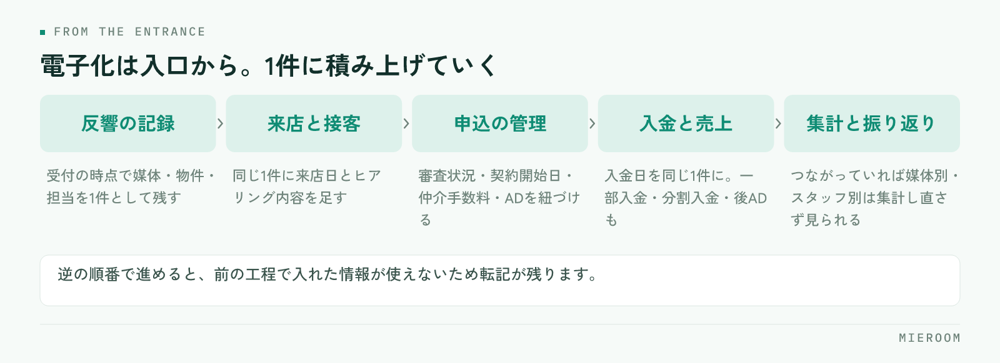

<!--META
{
  "title": "紙とExcelが混在する店舗の移行手順｜何から電子化するかの順番",
  "date": "2026-10-02",
  "category": "DX",
  "excerpt": "紙とExcelが混在した賃貸仲介の店舗が、何から電子化すべきかの順番を整理しました。最初に手をつける業務の見分け方、反響から売上までの移行の順序、紙のまま残していい業務、並行運用の進め方までまとめています。",
  "hook": "電子化は、何から手をつけるかで決まる",
  "tags": ["電子化", "ペーパーレス", "Excel管理", "DX", "賃貸仲介"]
}
META-->

反響はメールと電話のメモ、来店はノート、申込は紙の申込書、売上はExcel。賃貸仲介の店舗では、この混在がごく普通の状態です。全部をいっぺんに変えようとすると現場が止まるので、**順番を決めて1つずつ移す**のが現実的な進め方になります。どこから手をつけるかで、移行が続くかどうかが決まります。

<h4>この記事の結論</h4>
電子化の順番は、<strong>同じ情報を2回書いている場所から</strong>決めます。紙かExcelかという媒体ではなく、転記が起きている場所が最初の対象です。<strong>紙をやめることが目的ではない</strong>ので、現場で手書きのほうが速い業務は紙のまま残して構いません。

## 紙とExcelの混在が止まらない理由

混在が続くのは、現場がだらしないからではありません。紙とExcelにはそれぞれ得意な場面があり、それを使い分けた結果として今の形になっています。

- 来店中のヒアリングは、パソコンを開くより手元のメモが速い
- 申込書は様式が決まっていて、お客様に直接書いてもらう必要がある
- 売上の集計は、Excelなら自分の見たい形に作れる
- 反響のメモは、鳴った電話のそばに紙があるから紙に書く

問題は混在そのものではなく、**混在の境目で転記が発生していること**です。紙のメモからExcelに打ち直す、申込書の内容を管理表に入れる、Excelの数字を別のシートにまとめる。この打ち直しの回数が、そのまま入力ミスと残業の量になります。

もうひとつの問題は、店長が全体を見られないことです。反響が何件来て、何件が来店につながり、何件が申込になったか。情報が3か所に分かれていると、聞いて回らないと分かりません。

## 最初に電子化するのは「転記が起きている場所」

対象を選ぶときの基準は1つだけです。**同じ情報を2回以上書いている業務から手をつける**。これに尽きます。

確かめ方は簡単です。1週間、スタッフに「今、どこかに書いたことをもう一度書いている」と感じた作業をメモしてもらいます。多く挙がるのは、たいていこのあたりです。

- 反響のメールを見て、管理表に案件として打ち込む
- 来店時に書いたヒアリング内容を、あとでパソコンに入れ直す
- 紙の申込書から、申込管理表に転記する
- 入金を通帳で確認して、売上のExcelに入れる

逆に、手をつけないほうがよい業務もあります。1人しか使わない情報、月に数回しか発生しない作業、紙に書いてそのまま完結する業務です。ここを先に電子化すると、手間だけ増えて効果が見えません。移行が途中で止まる店舗は、効果の見えにくい業務から始めてしまっているケースが多いです。

✓判断の目安

その業務の情報を、2人以上が見るかどうかで分けてください。自分しか見ない情報は紙でもExcelでも困りません。複数の人が見る情報、あとから探す情報が、電子化して効く対象です。

## 電子化する順番：反響から売上まで

順番は、業務の流れと同じにします。入口から順に移すと、前の工程で入れた情報を次の工程で使えるため、転記が自然に減っていきます。

<figure class="fig"><figcaption>売上のExcelだけを先に移しても、入口が紙のままなら入力する人は手で打ち込みます。</figcaption></figure>

1. **反響の記録**。問い合わせを受けた時点で、媒体・物件・担当を1件として残します。ここが入口なので最初です
2. **来店と接客の記録**。反響の1件に、来店日とヒアリング内容を足していきます。新しく作り直さず、同じ1件に積む形にします
3. **申込の管理**。審査の状況、契約開始日、仲介手数料、ADを1件に紐づけます
4. **入金と売上**。入金日を申込の1件に記録します。一部入金や分割入金、後ADも同じ1件で追えるようにします
5. **集計と振り返り**。ここまでが1件でつながっていれば、媒体別の反響数やスタッフ別の成績は集計し直さずに見られます

逆の順番でやると苦しくなります。売上のExcelだけを先にシステムへ移しても、入口の反響が紙のままなら、入力する人は結局手で打ち込みます。反響の記録の残し方は[反響管理のやり方](./hankyo-kanri-hoho.html)で詳しく扱っています。

## 紙のまま残していい業務

電子化の目的は、紙を全部なくすことではありません。残したほうがよい業務もあります。

- **お客様に書いてもらう書類**。様式が決まっているもの、署名や押印が必要なものは紙が前提の場面が残ります
- **来店中の手元のメモ**。接客しながら画面に向かうと、お客様との会話が切れます。メモは紙で取り、終わってから1件に入れる形で十分です
- **現場で使うチェックリスト**。鍵の受け渡しや内見時の確認は、紙に印刷したほうが速いことがあります

判断は、媒体ごとの得意不得意で分けます。

| | 紙が向く | Excelが向く | システムが向く |
|---|---|---|---|
| 向く場面 | 書いてもらう・現場で持ち歩く | 一時的な試算・自分用の整理 | 複数人が見る・あとから探す |
| 使う人 | 1人、その場だけ | 1人 | 店舗全員 |
| 弱いところ | 探せない・集計できない | 同時に編集できない | 入力の形が決まっている |
| 残すか | 場面を限って残す | 一時利用に限る | 蓄積する情報はここ |

残すと決めた業務は、割り切って残してください。中途半端に電子化すると、紙とシステムの両方を見ないと分からない状態になり、かえって手間が増えます。

## 移行の進め方：棚卸しから並行運用まで

順番が決まったら、進め方は次のとおりです。

**1. 棚卸し**。今ある紙とExcelを全部出します。管理表の名前、誰が更新しているか、どこから情報が来ているかを書き出します。使われていないファイルが見つかることも多く、その整理だけでも効果があります。

**2. 項目をそろえる**。同じ情報が違う名前で呼ばれていることがあります。「媒体」「流入元」「反響元」が同じ意味なら、1つの呼び方に決めます。ここを先にやらないと、移したあとで集計が合いません。

**3. 過去データを決める**。全部移す必要はありません。進行中の案件と、当期の売上だけを移し、それより前は元のファイルを保管するという線引きで足ります。

**4. 並行運用を1か月**。新しい入力先と、今までのExcelを両方動かします。二度手間ですが、ここを飛ばすと切替の日に現場が止まります。期間を区切り、終わりの日を先に決めておくことが大切です。

**5. 切替**。並行期間で不足が出なければ、旧ファイルは更新をやめて閲覧用にします。消さずに残しておけば、現場の不安が減ります。

乗り換えの判断基準や比較の観点は[不動産の業務ツール見直しチェックリスト](./fudosan-gyomu-tool-minaoshi.html)、Excelからの移行の考え方は[ExcelからSaaSへの移行](./excel-to-saas.html)にまとめています。

## 移行でよくある失敗

**全業務を同時に移す**。現場の負担が一度に増え、「前のほうがよかった」という話になります。入口から1つずつが原則です。

**過去データを全部移そうとする**。移行作業そのものが大きくなり、本題が進みません。進行中の案件と当期の売上に絞ります。

**並行運用の終わりを決めない**。期限がないと、両方を永遠に続ける店舗になります。開始時に終了日を決めてください。

**入力する人を決めていない**。誰がいつ入れるかを決めないと、記録が歯抜けになります。反響は受けた人が受けた時点で、申込は申込書を受け取った人が当日中に、という形で担当と締めを決めます。

!注意

切替の日程は、繁忙期の直前に置かないでください。入力に慣れるまでの期間が必要になるため、落ち着いている時期に並行運用を済ませ、繁忙期には慣れた状態で入るのが安全です。

スタッフがパソコンに慣れていない場合はどう進めればいいですか？

入力する項目を最小限から始めてください。反響なら、受付日・媒体・物件・担当の4つだけで十分です。項目を増やすのは、入力が習慣になってからにします。最初から細かく作ると、埋まらない欄が増えて記録そのものが止まります。

Excelの管理表はそのまま使い続けられませんか？

1人で使っている分には問題ありません。複数人が同時に触る、月をまたぐ案件を追う、スタッフ別に集計するという使い方になると、ファイルの取り合いや数式の崩れが起きます。その段階が移行を検討する入口です。

移行にはどのくらいの期間を見ておくべきですか？

業務の数と過去データの量で変わるため一律には言えませんが、棚卸しと項目の整理、並行運用の期間を分けて考えてください。並行運用は期間を区切って実施し、その前後に準備と切替の時間を置く形で計画すると見通しが立ちます。

## まとめ：紙をなくすのではなく、転記をなくす

紙とExcelが混在している状態は、それ自体が問題なのではありません。問題は、境目で同じことを2回書いていることと、店長が全体を見られないことです。だから、手をつける順番は**転記が起きている場所から**になります。

進め方は、入口の反響から順に移し、現場で紙のほうが速い業務は残す。並行運用は期間を区切る。過去データは絞る。この4つを守れば、現場を止めずに進められます。

ミエルームは、反響の受付から接客、申込、入金、売上の集計までを1件のまま追える賃貸仲介向けの業務管理システムです。問い合わせフォームやメールからの自動取込に対応しているため、入口の転記そのものを減らせます。手元のExcelデータのインポートと初期設定の代行にも対応しており、最短即日からの利用が可能です。詳しくは[ミエルームの製品ページ](../index.html)をご覧ください。デモアカウントの発行も承っています。
