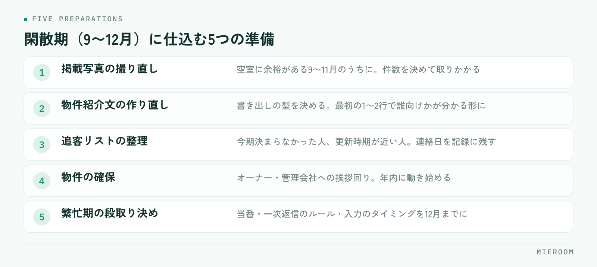

<!--META
{
  "title": "賃貸仲介の閑散期にやること｜繁忙期前の9〜12月に仕込む5つの準備",
  "date": "2026-09-26",
  "category": "集客・広告",
  "excerpt": "賃貸仲介の閑散期にやることを、繁忙期前の9〜12月という時期に絞って整理しました。今期の振り返り、写真と紹介文の作り直し、追客リストの整理、物件の確保、繁忙期の段取り決めまで、順番つきでまとめています。",
  "hook": "繁忙期の結果は、閑散期の仕込みで決まる",
  "tags": ["閑散期", "繁忙期対策", "賃貸仲介", "集客", "店舗運営"]
}
META-->

問い合わせが落ち着く時期になると、やることが急に減ったように感じます。ですが、**繁忙期の結果は、閑散期にどれだけ仕込めたかでほとんど決まります**。9月から12月は、繁忙期に入ると手をつけられなくなる作業を片づけられる、一年で唯一の時期です。

<h4>この記事の結論</h4>
閑散期にやることは、新しい集客を足すことではなく、<strong>繁忙期に判断で止まらない状態を先に作ること</strong>です。今期の振り返り → 写真と紹介文の作り直し → 追客リストの整理 → 物件の確保 → 段取り決め、の順に進めます。

## 閑散期は「休む時期」ではなく「仕込む時期」

繁忙期の忙しさは、作業そのものより「その場で判断しなければならないこと」の多さから来ます。どの物件を先に出すか、誰がどの反響を追うか、写真は足りているか。これらを繁忙期の最中に考えると、接客の時間が削られます。

閑散期にやるべきことは、**繁忙期に考えなくて済むように、先に決めておくこと**です。時期ごとに、できる作業が違います。

| | 閑散期（9〜12月） | 繁忙期（1〜3月） |
|---|---|---|
| 向いている作業 | 見直し・作り直し・決めごと | 反響対応・案内・契約 |
| 写真の撮り直し | できる（空室に余裕がある） | ほぼできない |
| 運用ルールの変更 | できる | 混乱するので避ける |
| 新しい仕組みの導入 | 試す時間がある | 入れた瞬間に止まる |
| 数字の振り返り | じっくり見られる | 見る時間がない |

新しいツールや運用を試すなら、この時期しかありません。繁忙期に入ってから何かを変えると、慣れない操作が接客の妨げになります。

## まず、今期の反響と契約を振り返る

仕込みの前に、今期の数字を見ます。見るのは3つだけで構いません。

ひとつ目は、**どの媒体から反響が来て、どこから契約になったか**です。反響の数が多い媒体と、契約につながった媒体は一致しないことがあります。ここを分けて見ないと、来期の掲載先を決められません。媒体ごとの判断のしかたは[広告費のROIを見る](./media-roi.html)にまとめています。

ふたつ目は、**反響から来店、来店から契約に、どこで人が減ったか**です。反響は取れているのに来店が少ないなら、初動の返信か物件の見せ方。来店はあるのに契約が少ないなら、ヒアリングか提案の内容に原因があります。

みっつ目は、**決まらなかった理由**です。条件が合わなかったのか、他社で決まったのか、連絡が途絶えたのか。ここが記録に残っていないと、来期も同じ取りこぼし方をします。

✓振り返りは1〜2時間で切る

細かく分析しようとすると終わりません。上の3つを、メモ書き程度で構わないので紙に書き出してください。大事なのは正確さではなく、来期に変える点を1つか2つ決めることです。

## 閑散期に仕込む5つの準備

振り返りで見えた課題を、次の5つに落とし込みます。上から順に進めてください。

<figure class="fig"><figcaption>上から順に進めます。写真と段取りは、繁忙期に入るとできなくなる作業です。</figcaption></figure>

1. **掲載写真の撮り直し**（空室に余裕があるうちに）
2. **物件紹介文の作り直し**（テンプレートを整える）
3. **追客リストの整理**（今期決まらなかった人、更新時期が近い人）
4. **物件の確保**（オーナー・管理会社への挨拶回り）
5. **繁忙期の段取り決め**（当番・返信のルール・入力のタイミング）

この順番には理由があります。写真と紹介文は掲載の土台なので、追客や集客の前に整える必要があります。物件の確保は相手のある話なので、年内に動き始めないと間に合いません。

## 写真と紹介文は、閑散期にしか直せない

繁忙期に入ると、空室はすぐ埋まり、撮り直しに行く時間もなくなります。**写真の撮り直しは、9〜11月のうちにしかできません**。

優先するのは、来期に主力として出す物件と、今期に反響が少なかった物件です。全部をやり直そうとすると終わらないので、10件なら10件と決めて取りかかってください。撮る順番と準備は[物件写真の撮り方](./bukken-shashin-torikata.html)に手順をまとめています。

紹介文は、物件ごとに書き直すのではなく、**書き出しの型を決める**のが現実的です。最初の1〜2行で誰に向いた部屋かが分かる形になっていれば、繁忙期の入力が速くなります。書き方は[物件紹介文の書き方](./bukken-shokaibun-kakikata.html)が参考になります。

## 追客リストの整理と、物件の確保

今期に決まらなかった見込み客は、条件が変われば動きます。転勤・進学・更新の時期が近い人を抜き出し、**いつ連絡するかを決めて記録に残してください**。「そのうち連絡する」は、繁忙期に入ると必ず後回しになります。

!連絡先が個人のスマホに散っている状態は直しておく

担当者ごとのメールやSMSの履歴にしか残っていないと、繁忙期に人手を分けたときに引き継げません。閑散期のうちに、誰が誰を追っているかを一覧で見られる形にしておいてください。反響の残し方は<a href="./hankyo-kanri-hoho.html">反響の管理方法</a>にまとめています。

物件の確保は、オーナーや管理会社との接点づくりです。繁忙期の直前は各社が一斉に動くため、**印象に残るのは、それより前に顔を出した会社**です。今期にどの物件で決めたか、どんな入居者が決まったかを持って行くと、話が具体的になります。

## 繁忙期の段取りを、12月までに決めておく

最後に、繁忙期の動き方を決めます。決めるのは次の5つです。

- 反響への**一次返信は誰が、何分以内に**返すか
- 土日の**来店対応の当番**をどう組むか
- 反響と来店の**記録をいつ入力する**か（その場か、閉店前か）
- 申込が入ったときの**書類確認の担当**は誰か
- 週に一度、**何の数字を見て**打ち合わせるか

どれも当たり前のことですが、決めずに繁忙期へ入ると、その場の判断で毎回止まります。特に入力のタイミングは、決めておかないと後からまとめて入れることになり、記録が実態とずれていきます。

新しい仕組みを試すなら、**12月までに使い始めて、1月には慣れている状態**にしてください。繁忙期に入ってからの導入は、ほぼうまくいきません。開業直後の集客と立ち上げについては[開業直後の集客](./kaigyo-chokugo-shukyaku.html)も合わせて読んでみてください。

閑散期に広告費を止めてもいいですか？

全部を止めるより、今期の振り返りで契約につながっていた媒体を残し、反響だけ多くて決まらなかった媒体を絞る形をおすすめします。完全に止めると、繁忙期前に掲載を戻したときの反応が読めなくなります。掲載の枚数や写真を見直すだけでも、費用対効果は変わります。

スタッフが少なく、通常業務だけで手一杯です。何から手をつければいいですか？

5つのうち「写真の撮り直し」と「段取り決め」の2つに絞ってください。この2つは繁忙期に入ると物理的にできなくなるためです。追客リストの整理と物件の確保は、繁忙期に入ってからでも部分的に進められます。

繁忙期はいつから準備を始めるのが適切ですか？

写真の撮り直しは9〜11月、物件の確保は10〜12月、段取り決めと新しい仕組みの導入は12月までが目安です。1月に入ってから始めると、準備そのものが業務を圧迫します。年内に形をつけて、1月は運用に集中できる状態を作ってください。

## まとめ：閑散期の仕込みが、繁忙期の余裕になる

賃貸仲介の閑散期にやることは、新しい集客を足すことではありません。今期を振り返り、写真と紹介文を作り直し、追客リストを整理し、物件を確保し、繁忙期の段取りを決める。この5つを年内に終わらせておくと、1月からは接客に集中できます。

逆に、仕込みをしないまま繁忙期へ入ると、判断のたびに手が止まります。忙しさの正体は、作業量ではなく決めごとの積み残しです。

反響・来店・申込の記録を一か所にまとめ、繁忙期でも入力が続く形にしておきたい場合は、[ミエルーム](../index.html)が対応しています。デモアカウントの発行と初期設定の代行にも対応していますので、繁忙期に入る前に試しておきたい場合はお気軽にご相談ください。
