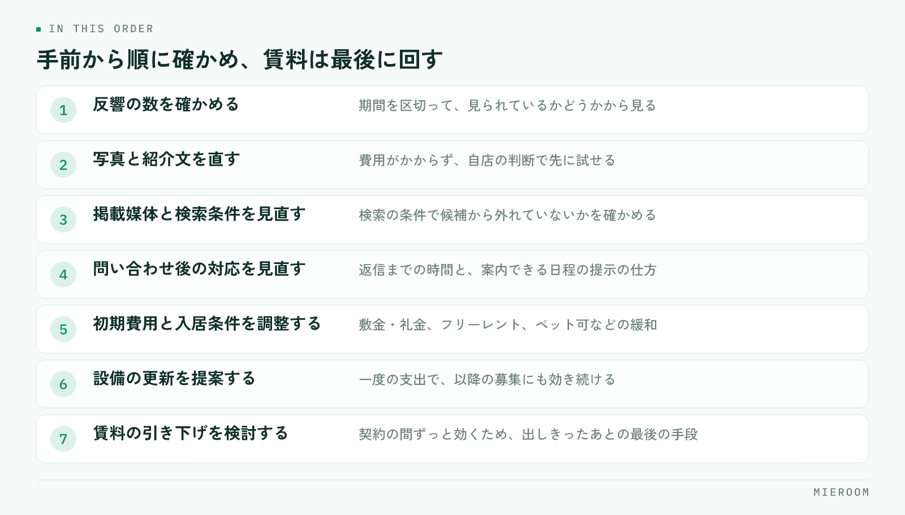

<!--META
{
  "title": "空室が動かないときの募集条件の見直し｜オーナーへの提案の組み立て方",
  "date": "2026-10-08",
  "category": "集客・広告",
  "excerpt": "空室が長期化したときの募集条件の見直しを、確認の順番とオーナーへの提案の組み立て方の両面から整理しました。賃料を下げる前に動かせる条件、提案資料に載せる項目、長期化した部屋の扱いの決め方までまとめています。",
  "hook": "値下げの前に、見直す順番を決めておく",
  "tags": ["空室対策", "募集条件", "オーナー提案", "賃貸仲介", "集客"]
}
META-->

空室が動かないとき、相談はたいてい「賃料をいくら下げるか」から始まります。けれども先に決めるべきなのは金額ではなく、**どこで止まっているかを確かめる順番**です。見られていないのか、見られているが問い合わせがないのか、内見まで進むのに決まらないのか。止まっている場所が違えば、打つ手も変わります。

<h4>この記事の結論</h4>
募集条件の見直しは、反響の数・内見の数・申込の数のどこで落ちているかを見てから決めます。落ちている場所が手前であれば、条件より先に<strong>情報の出し方を直すほうが効きます</strong>。賃料の引き下げは、動かせる条件を出しきったあとの最後の手段として残してください。

## 空室が動かない原因は、3つの段階のどこで止まるかで分かれる

空室の相談を受けたとき、最初に見るのは3つの数字です。掲載してからの反響の数、内見に進んだ数、申込に至った数。この3つを並べると、原因の当たりがつきます。

**反響がほとんどない**なら、物件が見られていないか、見られても候補から外されています。原因は掲載の内容や写真、検索の条件にかかる設定であることが多く、賃料を下げても反響の増え方は限られます。

**反響はあるが内見に進まない**なら、問い合わせ後のやり取りに原因があります。返信までの時間、案内できる日程の提示、他の候補の出し方です。

**内見しても決まらない**なら、はじめて部屋そのものと条件の話になります。ここまで来てから条件を動かすのが本来の順番です。3つの数字を物件ごとに追う考え方は、[反響の管理方法](./hankyo-kanri-hoho.html)でも整理しています。

## 値下げを最後に回すための、見直しの順番

部屋ごとに、次の順番で確かめていきます。手前の項目ほど、オーナーの承諾なしに自店で動かせます。

<figure class="fig"><figcaption>手前の項目ほど費用がかからず、オーナーの承諾なしに自店で動かせます。</figcaption></figure>

この順番で進める理由は2つあります。1つは、手前の項目は費用がかからないこと。もう1つは、賃料を一度下げると元に戻しにくく、同じ建物の他の部屋や更新時の交渉にも影響が残ることです。

## 募集条件のうち、どこを動かせるか

条件の見直しは「賃料」の一語でまとめず、動かせる部分を分けて考えます。オーナーの負担の形が違うため、提案の受け入れられやすさも変わります。

| 動かす場所 | 具体例 | オーナーへの説明の軸 |
|---|---|---|
| 初期費用 | 敷金・礼金の調整、フリーレント | 賃料の額面を維持したまま入居のハードルを下げられる |
| 入居条件 | 二人入居可、ペット可、事務所利用可、保証人の条件 | 対象になる入居者の層が広がる |
| 設備・原状回復 | エアコンの交換、照明、インターネット、室内の補修 | 一度の支出で、以降の募集にも効く |
| 募集の見せ方 | 写真の撮り直し、紹介文、間取り図、掲載媒体の追加 | 費用がかからず、先に試せる |
| 賃料 | 月額の引き下げ | 長期の収入に効き続けるため、最後に検討する |

この表のうち、**4行目は提案の前に自店で先に試せます**。写真と紹介文を直して2週間様子を見てから相談に行くと、「できることはやったうえでの提案」になり、話が通りやすくなります。紹介文の書き方は[物件紹介文の書き方](./bukken-shokaibun-kakikata.html)にまとめています。

✓フリーレントと賃料引き下げは、効き方が違う

どちらも入居者の負担を下げますが、フリーレントは一度きりの調整で、賃料の額面は残ります。賃料を下げると、その部屋の収入が契約の間ずっと下がり、同じ建物の他の部屋の募集にも基準として影響します。オーナーにとっての重さが違うため、提案では必ず分けて示してください。

## オーナーへの提案は、事実の並べ方で決まる

提案が通らないときの原因は、提案の内容よりも、判断材料が揃っていないことにあります。オーナーからすれば、下げる根拠が見えないまま「下げましょう」と言われている状態です。

並べる事実は3種類です。

1. **その部屋で起きたこと**：掲載からの日数、反響の数、内見の数、内見したお客様が選ばなかった理由
2. **近隣の募集状況**：同じ沿線・同じ間取りで現在募集されている部屋の条件
3. **このまま続けた場合の見通し**：空室が続く期間と、条件を動かした場合の比較

このうち1番目がもっとも強い材料になります。**自分の部屋を見たお客様が何を理由に選ばなかったかは、他の誰も持っていない情報です**。内見の際に「決めなかった理由」を一言だけ記録しておくと、提案の場でそのまま使えます。

逆に、避けたほうがよい伝え方もあります。「相場が下がっています」という一般論だけで数字を出さない説明、複数の案を示さず引き下げ一択で持っていく進め方、根拠の日付が古い資料です。

## 提案資料に載せる項目

資料は1枚で足ります。多くの項目を並べるより、判断に必要なものだけを載せてください。

- 物件名と部屋番号、現在の募集条件
- 募集を開始した日と、経過した日数
- 反響の数、内見の数（期間を区切って）
- 内見したお客様が選ばなかった理由の要約
- 近隣で募集中の類似物件の条件（確認した日付を入れる）
- 提案（2〜3案。初期費用の調整、設備、賃料の順に重い案を後ろへ）
- それぞれの案で想定される入居時期の違い

数字は自店で記録しているものだけを使ってください。推計や「◯割の方が」といった表現を入れると、根拠を聞かれたときに答えられなくなります。手元にある事実だけで十分に説明は成り立ちます。

!近隣の条件は、確認した日付を必ず書く

募集中の部屋の条件は週単位で変わります。日付のない比較表は、オーナーから見て信頼できる材料になりません。確認した日と、どの媒体で見た情報かを資料の端に入れておいてください。

## 長期化した部屋の扱いを、店として決めておく

個別の判断に任せると、長期化した部屋は担当者の視界から静かに外れていきます。店として扱いを決めてください。決めることは3つです。

**見直しの時期**。掲載から何日で一度目の見直しをするか。繁忙期と閑散期で変えるなら、それも決めます。時期の考え方は[閑散期にやること](./kansanki-yarukoto.html)で触れた季節ごとの動きと合わせて組むと無理がありません。

**担当の所在**。長期化した部屋を、元の担当者が持ち続けるのか、店長が引き取るのか。持ち続ける前提だと、他の案件に追われて後回しになりがちです。

**止める判断**。募集を一度取り下げて、設備の入れ替えや原状回復をやり直す選択もあります。動かない部屋を出し続けると、掲載に反応しない状態が続き、見る側の印象にも残りません。

この3つを決めておくと、月に一度の確認で済みます。長期化そのものを防ぐのは難しくても、放置される部屋をなくすことはできます。

オーナーが賃料の引き下げに応じない場合、どう進めればよいですか？

引き下げ以外の案を並べて示してください。初期費用の調整、入居条件の緩和、設備の更新は、賃料の額面を維持したまま入居のハードルを下げられます。応じない理由が「根拠が見えない」ことにある場合も多いため、その部屋で起きた反響と内見の記録を添えて、判断材料そのものを増やすほうが前に進みます。

見直しは掲載からどのくらいの期間で行うべきですか？

一律の日数はありません。地域や時期、間取りによって動きが違うためです。自店の過去の成約までの期間を間取り別に並べて、その中央あたりを超えた部屋から見直す、という決め方が現実的です。記録が揃っていないうちは、繁忙期なら短く、閑散期なら長めに置くところから始めてください。

内見で選ばれなかった理由は、どこまで聞いてよいですか？

一言で足ります。「広さ」「日当たり」「駅からの距離」「水回り」「金額」のどれに近いか程度で十分です。詳しく聞き出そうとするとお客様の負担になりますし、判断の材料としては種類が分かれば使えます。大切なのは深さではなく、すべての内見で同じ形で残っていることです。

## まとめ：順番を決めれば、提案は通りやすくなる

空室が動かないときの募集条件の見直しは、反響・内見・申込のどこで止まっているかを見るところから始めます。手前で止まっているなら情報の出し方を直し、内見まで進んでいるなら条件を動かす。賃料の引き下げは、動かせる条件を出しきったあとに残しておく。

オーナーへの提案で効くのは、その部屋で実際に起きたことです。**反響の数と、内見したお客様が選ばなかった理由が記録に残っていれば、提案の材料はそれだけで揃います**。逆にこの記録がないと、どれだけ資料を整えても一般論の説明にしかなりません。

反響と内見の記録を担当者の手元ではなく店舗で共有する形にしたい場合は、[ミエルーム](../index.html)の反響管理・接客管理の画面もあわせてご覧ください。デモアカウントの発行もできますので、いまの運用に合うかどうかから確認いただけます。
