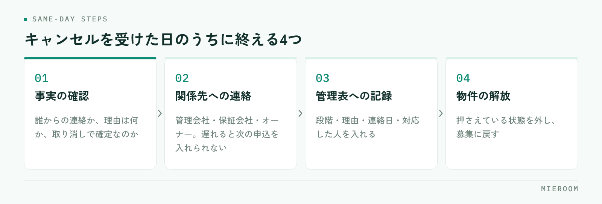

<!--META
{
  "title": "申込キャンセルが出たときの処理｜売上の戻し方と記録の残し方",
  "date": "2026-10-10",
  "category": "売上管理",
  "excerpt": "賃貸仲介で申込キャンセルが出たときの処理を、発生する段階ごとの扱い方から、売上の戻し方、スタッフ成績への反映、月次での数え方までまとめました。行を消さずに記録を残す形に重点を置いています。",
  "hook": "キャンセルは消さずに、理由まで残して数える",
  "tags": ["申込キャンセル", "売上管理", "申込管理", "賃貸仲介", "店舗運営"]
}
META-->

申込が入った翌週にキャンセルの連絡が来る。賃貸仲介では珍しいことではありません。それでも毎回ばたつくのは、対応の手順ではなく**キャンセルが出たときに数字をどう戻すかが決まっていないこと**が理由です。管理表の行を消すのか、残して印を付けるのか。ここが人によって違うと、月末の数字が合わなくなります。

<h4>この記事の結論</h4>
キャンセルは、<strong>行を消さずに残し、段階と理由を記録して数える</strong>のが基本です。売上は見込みと確定を分けて戻し、スタッフの成績に反映するかどうかは案件ごとに判断せず、先にルールを決めておきます。

## キャンセルで本当に困るのは、数字の戻し方

キャンセルそのものへの対応は、たいてい現場で片付きます。お客様への連絡、保証会社や管理会社への取り消しの連絡、押さえていた物件の解放。ここは担当者が動けば進みます。

困るのはその後です。申込管理表に入れた1行をどうするか、今月の売上に乗せていた金額を下げるか、担当者の契約本数から引くか。この判断が担当者任せになっていると、同じようなキャンセルが別々の扱いになります。

**いちばん多い失敗は、管理表の行を消してしまうこと**です。行を消すと帳尻は合いますが、その案件が存在したこと自体が消えます。あとから「先月はキャンセルが何件あったか」を聞かれても答えられません。反響から申込まで進んだのに失注した案件は、集客と接客の両方の材料になるものなので、消すのはもっとも損な処理です。

## キャンセルは、起きる段階で3つに分かれる

同じ「キャンセル」でも、どこまで進んでいたかで戻す範囲が変わります。先に3つに分けておくと、毎回の判断が速くなります。

| 段階 | 状況 | 戻す範囲 |
|---|---|---|
| 審査前のキャンセル | 申込書は受けたが審査に出していない | 物件の解放と、申込のステータス変更だけ。売上は見込みにも入っていない段階が多い |
| 審査中・承認後のキャンセル | 保証会社や管理会社の審査に出した、または通った | 審査の取り消し連絡が必要。見込み売上として計上していれば、そこから下げる |
| 契約後のキャンセル | 契約書を交わした、または初期費用の入金があった | 返金の範囲、仲介手数料とADの扱いを、契約内容に沿って個別に確認 |

**分け方の目的は、連絡先と戻す金額の範囲を決めること**です。審査前なら社内の処理で終わりますが、承認後は外部への連絡が発生し、契約後は金銭のやり取りが絡みます。段階を記録しておけば、同じ段階のキャンセルが来たときに前回と同じ手順が使えます。

契約後のキャンセルは、契約書の取り決めと管理会社の判断によって扱いが変わります。店舗で一律のルールにはできないため、**「個別に確認する」ことをルールにして、確認した結果を案件の記録に残す**形が現実的です。

## 受けた日のうちにやる4つのこと

キャンセルの連絡を受けたら、その日のうちに次の4つを終えます。順番にも意味があります。

<figure class="fig"><figcaption>3番目の記録を翌日に回すと、段階と理由があやふやになります。</figcaption></figure>

1. **事実の確認**：誰からの連絡か、理由は何か、本当に取り消しで確定なのか。「少し考えたい」は保留で、キャンセルではありません
2. **関係先への連絡**：管理会社、保証会社、オーナー。遅れると次の申込を入れられず、取引先にも迷惑がかかります
3. **管理表への記録**：ステータスをキャンセルに変え、段階・理由・連絡日・対応した人を入れます
4. **物件の解放**：押さえている状態を外し、募集に戻します

このうち3番目を飛ばす店舗が多くあります。目の前の連絡が済むと、記録は後回しになるからです。しかし**記録を当日に入れないと、段階と理由があやふやになります**。「なぜキャンセルになったか」は、その日が最も正確に分かります。

申込管理表に何を持たせておくかは[申込管理表の作り方](./moushikomi-kanrihyo-tsukurikata.html)に整理しています。キャンセルを記録する欄は、あとから足すより最初から作っておくほうが運用に乗ります。

✓ステータスは「キャンセル」で止めず、段階まで残す

ステータスをキャンセルの一択にすると、月次で数えたときに中身が分かりません。「審査前キャンセル」「審査後キャンセル」「契約後キャンセル」の3つに分けておくと、同じ件数でも意味が違うことが見えます。審査後が増えているなら審査の見立ての問題、審査前が増えているなら接客での条件確認の問題です。

## 売上は、見込みと確定を分けて戻す

キャンセルで数字が合わなくなる原因は、ほとんどが**見込みと確定を同じ欄で管理していること**です。申込が入った時点の金額と、入金が済んだ金額を1つの列に入れていると、キャンセルのときにどちらを直すのか分からなくなります。

分けるのは次の形です。

- **見込み**：申込・審査中・契約前の案件。キャンセルが出たら、ここから下げます。実績には影響しません
- **確定**：入金が済んだ案件。キャンセルが出た場合は返金処理を伴うので、金額を書き換えるのではなく、戻した記録を別に残します

**確定した売上を上書きで修正しないでください**。入金があった事実と返金した事実は別の出来事なので、片方を消すと通帳と突き合わせられなくなります。当初の計上を残したまま、取り消しの行を立てる形にします。一部入金や分割入金が入っている案件では、どこまで受け取ってどこまで返したかが特に分かりにくくなるため、ここは記録を増やすほうが安全です。

月末の集計で売上を見込みと確定に分ける考え方は[月末の売上集計を自動化する](./getsumatsu-uriage-shukei-jidoka.html)で詳しく扱っています。キャンセルの処理は、この分け方ができていれば自然に収まります。

ADについても同じです。後ADは入金が先々になるため、キャンセルが出た時点で入金予定から外す必要があります。予定日だけを頼りに追っていると、来ない入金を待ち続けることになります。後ADの追い方は[後AD・入金管理表](./go-ad-nyukin-kanrihyo.html)にまとめています。

## スタッフの成績への反映は、先にルールを決める

キャンセルが出たとき、担当者の契約本数から引くかどうか。ここを案件ごとに判断すると、必ず不公平が出ます。**ルールを先に決めて、全員に同じ基準を当てる**のが前提です。

決めるのは2つだけです。

**1つめは、何を成績の単位にするか**。契約本数を単位にしているなら、キャンセルは引くのが筋です。一方で接客数や申込件数を見ているなら、申込を取った事実は残ります。工程を分けて見ていれば、キャンセルで全部が消える形にはなりません。

**2つめは、理由による扱いの差を付けるか**。付けないほうが運用は簡単です。お客様の都合、審査の否決、他物件への流出。理由を評価に織り込もうとすると、毎回の線引きで揉めます。理由は記録して分析に使い、成績の計算には使わない。この割り切りが続きます。

成績を工程で見る考え方は[スタッフの成績管理](./staff-seiseki-kanri.html)に整理しています。キャンセルを引くかどうかより、**引いたときに本人へ何を伝えるか**のほうが育成には効きます。審査前のキャンセルが続いているなら、ヒアリングで条件を詰め切れていない可能性があります。

!キャンセルを減らす目的で、報告を遅らせる動きが出る

成績から機械的に引く運用にすると、キャンセルの連絡が入っても報告を遅らせたり、保留のまま置いたりする動きが出ます。物件が押さえられたままになり、次の申込を入れられません。ルールを決めるときは、報告が早いほうが本人にとって不利にならない形かどうかを確かめてください。

## 月に1回、理由で分類して数える

キャンセルの記録は、残すだけでは意味がありません。月に1回、件数と理由を並べて見ます。見るのは次の3つです。

- **件数と段階の内訳**：審査前・審査後・契約後がそれぞれ何件か
- **理由の内訳**：お客様の都合、審査の否決、条件の相違、他社・他物件への流出、物件側の都合
- **媒体別**：どの反響経路からの申込がキャンセルになりやすいか

ここで初めて、記録が判断の材料になります。たとえば審査の否決が多いなら、申込を受ける前の確認項目が足りていないことになります。入居審査の見立ては[入居審査が通らない理由](./nyukyo-shinsa-toranai-riyu.html)で扱っています。他物件への流出が多いなら、提案の幅や内見の組み方に原因がある可能性があります。

**件数をゼロにする目標は立てないでください**。賃貸仲介では、お客様の事情や審査の結果でキャンセルは必ず出ます。見るべきは件数の増減ではなく、**同じ理由が繰り返し出ていないか**です。繰り返しているものだけが、手を打てるキャンセルです。

キャンセルになった案件は、管理表から消したほうが見やすくなりませんか？

表示を切り替えるのと、データを消すのは別です。普段の一覧ではキャンセルを非表示にして構いませんが、データ自体は残してください。消してしまうと月次で数えられず、キャンセルの理由を分析する材料も失われます。ステータスで絞り込めるようにしておけば、見やすさと記録の両方が成り立ちます。

申込を「保留」のまま置いている案件が増えてしまいます。

保留に期限を決めていないことが原因です。「連絡がないまま何日経ったら、こちらから確認する」「確認しても連絡が取れない場合は、どう扱う」を先に決めてください。保留のまま物件を押さえ続けると、次の申込を受けられず、取引先からの信頼にも関わります。期限を過ぎた案件が一覧で分かる形にしておくと、放置が減ります。

契約後のキャンセルで、仲介手数料はどう扱えばよいですか？

契約内容と管理会社の取り決めによって変わるため、店舗で一律には決められません。案件ごとに確認し、確認した結果と、誰とどう決めたかを記録に残してください。記録がないと、次に同じことが起きたときにまた一から確認することになります。判断そのものより、判断の履歴を残すことが効きます。

## まとめ：キャンセルは消さずに、段階と理由を残す

申込キャンセルの処理は、段階を3つに分け、受けた日のうちに事実の確認・関係先への連絡・管理表への記録・物件の解放を終える流れになります。売上は見込みと確定を分けて戻し、確定した金額は上書きせず取り消しの記録を立てる。スタッフの成績への反映は、案件ごとに判断せず先にルールを決めておく。

そして月に1回、件数と理由を並べて見る。**キャンセルは減らす対象ではなく、数える対象です**。同じ理由が繰り返し出ているものだけが、手を打てるキャンセルになります。

申込から入金・後ADまでを1行で追い、キャンセルも段階と理由を残したまま集計したい場合は、[ミエルーム](../index.html)の申込管理・売上管理の画面をご覧ください。いまお使いのExcelデータのインポートと初期設定の代行にも対応しており、デモアカウントを発行して運用に合うかどうかから確認いただけます。
