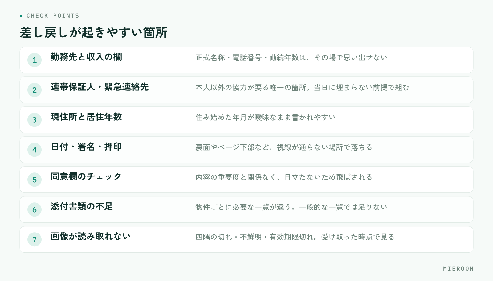

<!--META
{
  "title": "申込書の不備を減らす方法｜差し戻しが起きる箇所と、その場で防ぐ手順",
  "date": "2026-09-19",
  "category": "業務効率化",
  "excerpt": "申込書の不備は、書類の問題ではなく手順の問題です。差し戻しが起きる箇所は決まっているため、受け取る前に確認する順番を決めるだけで大きく減らせます。その場で防ぐ手順をまとめました。",
  "hook": "差し戻しは、その場で防ぐのが最短です",
  "tags": ["申込管理", "業務効率化", "賃貸仲介", "入居審査", "書類管理"]
}
META-->

申込書の不備が多いと、審査が止まり、お客様に連絡し直し、管理会社にも謝ることになります。担当者の注意力の問題に見えますが、実際には**どこで何を確認するかが決まっていない**だけであることがほとんどです。この記事では、差し戻しが起きやすい箇所と、その場で防ぐ手順を整理します。

<h4>この記事の結論</h4>
申込書の不備は、受け取ったあとに点検するのをやめ、<strong>お客様が目の前にいるうちに確認を終える</strong>形に変えると大きく減ります。確認する箇所は決まっているので、必要なのは新しい様式ではなく、確認の順番です。

## 不備の本当のコストは、書き直しの時間ではない

不備が出たときに失われるのは、記入し直す数分ではありません。**止まっている時間そのもの**です。

申込書が差し戻されると、まずお客様に連絡がつくまで待ちます。次に、記入や書類の再送を待ちます。そのあとにようやく審査が動き出します。連絡がつくのが翌日になれば、審査の開始が丸一日遅れます。人気物件では、この間に他の申込が先に通ることもあります。

もう一つの影響は、お客様の不安です。何度も連絡が来ると、手続きが滞っている印象を与えます。契約までの信頼に関わるため、**不備は「直せばよいもの」ではなく、起こさない前提で組む**必要があります。

社内では、誰が差し戻しに対応するかも曖昧になりがちです。申込を受けた担当者が休みだと、状況を知らない人が確認から始めることになります。案件ごとの記録の残し方は[申込管理表の作り方](./moushikomi-kanrihyo-tsukurikata.html)で扱っています。

## 差し戻しが起きる箇所は決まっている

不備は毎回違う場所で起きているように見えますが、実際には数か所に集中します。自店で発生した差し戻しを数回分並べれば、同じ箇所が繰り返し出てくるはずです。

<figure class="fig"><figcaption>落ちやすいのは、その場で答えられない情報と、書き忘れても気づきにくい欄の2種類です。</figcaption></figure>

多いのは、勤務先と収入に関する欄、連帯保証人・緊急連絡先の情報、現住所と居住年数、押印と署名の欠け、そして添付書類の不足です。いずれも**お客様がその場で答えられない情報**か、**書き忘れても気づきにくい欄**のどちらかに当てはまります。

逆に言えば、この2種類に印をつけておけば、確認すべき箇所はその場で絞れます。全項目を等しく見直すより、落ちやすい欄だけを毎回同じ順で見るほうが速く、漏れも減ります。

## 答えられない情報は、来店前に伝えておく

勤務先の正式名称、部署、電話番号、勤続年数、年収。連帯保証人の住所、電話番号、勤務先。これらは、その場で思い出せないことが普通です。

対策は単純で、**申込の意思が見えた時点で、必要な情報を先に伝えておく**ことです。来店前の連絡でも、内見の帰り道でも構いません。伝えるのは次の内容です。

- 勤務先の正式名称・所在地・電話番号・勤続年数
- 収入のおおよその額（源泉徴収票や給与明細で確認できる範囲）
- 連帯保証人の氏名・続柄・住所・電話番号・勤務先
- 緊急連絡先（保証人と別の方）
- 現住所と、そこに住み始めた年月

✓「調べておいてください」で終わらせない

項目名だけを伝えると、何のために必要かが伝わらず、後回しになります。「保証会社の審査で必要になるため」と理由を添えると、準備してもらいやすくなります。連帯保証人にあらかじめ話を通しておいてもらうことも、同じタイミングで依頼します。

連帯保証人の欄は、本人以外の協力が要る唯一の箇所です。ここだけは当日に埋まらない前提で、締め切りと渡し方を先に決めておいてください。

## 書き忘れやすい欄は、受け取る前に見る

記入漏れが起きやすいのは、見た目が目立たない欄です。日付、押印、ページ下部の同意欄、裏面、チェックボックス、訂正印。どれも内容の重要度とは関係なく、単に視線が通らない場所にあります。

防ぎ方は一つで、**お客様が席を立つ前に、決めた順で目を通す**ことです。書き終えた申込書を受け取ったら、その場で次の順に見ます。

- ページをすべてめくり、空欄が残っていないか
- 日付・署名・押印がそろっているか（裏面も含む）
- 同意欄のチェックが入っているか
- 金額と物件名が、案内した内容と一致しているか
- 訂正箇所に訂正印があるか

この確認は1〜2分で終わります。**お客様が帰ってから点検すると、同じ確認が連絡・待機・再訪という工程に化けます**。目の前で終えるのが、いちばん安い方法です。

!「あとで確認します」を禁止する

繁忙期ほど、申込書を受け取ってそのまま次の接客に移りがちです。しかし後回しにした申込書は、その日のうちに見られないまま翌日に回ります。確認を接客の一部として組み込み、終わるまでは次に進まない形にしてください。

## 添付書類は、渡し方と受け取り方を決める

記入欄が埋まっていても、添付書類が足りなければ審査は始まりません。ここは案内の仕方で結果が変わります。

必要になるのは、本人確認書類、収入を確認できる書類、住民票などです。何が必要かは保証会社や管理会社によって変わるため、**物件が決まった時点で、その物件に必要な一覧を伝える**のが基本になります。一般的な一覧を渡すと、不要なものまで集めさせることになり、かえって時間がかかります。

受け取り方も決めておきます。撮影して送ってもらう場合は、文字が読める状態か、四隅が切れていないか、有効期限内かを、受け取った時点で確認します。後日の差し戻しで最も多いのが、画像が不鮮明で読み取れないという理由です。

| 渡し方 | 向いている場面 | 注意する点 |
|---|---|---|
| 来店時にその場でコピー | 書類を持参している | 不足分の期限をその場で決める |
| 写真を送ってもらう | 来店後に用意する | 受け取った時点で読めるか確認する |
| 郵送・持参 | 原本が必要な書類 | 到着予定日を記録に残す |

不足がある場合は、「いつまでに」「どの方法で」を必ずその場で決めてください。期限が決まっていない依頼は、優先度が下がります。

## 様式の違いは、店側で吸収する

保証会社や管理会社ごとに申込書の様式が違うため、担当者が毎回どこを埋めるか考えることになります。ここが不備の温床です。

現実的な対策は、**よく使う様式ごとに、落ちやすい欄へ印をつけた見本を1部ずつ用意しておく**ことです。新しい様式に当たったときは、最初の1件を通したあとに見本を作って残します。属人的な慣れに頼らず、様式ごとの違いを店の資産にする形にしてください。

記入した内容を社内の管理表に転記している場合は、二重入力そのものが誤りの原因になります。申込書と管理表で数字が違うと、どちらが正しいのか追う作業が発生します。書類と記録を同じ場所にそろえる考え方は[契約書と重説の時間短縮](./chintai-keiyakusho-jusetsu-jitan.html)でも触れています。

## 再発を止めるには、差し戻しの理由を残す

不備を減らす取り組みが続かない最大の理由は、**何が原因だったかが記録に残らない**ことです。その場で直してしまえば、記憶からも消えます。

残すのは一言で十分です。差し戻しが起きたら、案件の記録に「勤務先電話番号の記入漏れ」「本人確認書類の画像が不鮮明」のように理由だけを書き足してください。数週間分がたまれば、自店でどこが落ちやすいかが見えてきます。

そのうえで、上位2〜3件だけを対策の対象にします。全部を一度に直そうとすると確認項目が増えすぎ、かえって守られません。**確認の手順は、増やすより絞るほうが機能します**。

## よくある質問

確認項目を増やすと、接客の時間が長くなりませんか？

その場での確認は1〜2分程度で、差し戻し1件にかかる連絡と待機の時間より短く収まります。むしろ項目を増やしすぎると守られなくなるため、自店で実際に多い箇所に絞ってください。

オンラインでの申込にすれば、不備はなくなりますか？

必須項目の空欄はシステム側で防げますが、内容の誤りや添付画像の不鮮明さは残ります。入力の形式が変わっても、受け取った時点で内容を確認する工程は必要です。

連帯保証人の欄が当日に埋まらない場合、どうしていますか？

埋まらない前提で、いつまでに・どの方法で提出するかをその場で決めておく形が現実的です。あわせて、保証人の方に事前に連絡しておいてもらうよう依頼すると、後日の確認が短く済みます。

## まとめ：点検する場所を変えるだけで、差し戻しは減る

申込書の不備を減らすために必要なのは、新しい様式でも注意喚起でもありません。答えられない情報は来店前に伝え、書き忘れやすい欄はお客様が席を立つ前に決めた順で見て、添付書類は期限と方法をその場で決める。そして差し戻しが起きたら理由を一言残す。この4つだけで、繰り返し起きていた不備はかなり減らせます。

今日からできるのは、直近の差し戻しを数件並べて、多い箇所を2つ選ぶことです。その2つを確認リストの先頭に置くところから始めてください。

[ミエルーム](../index.html)は、反響から接客・申込・入金までを案件ごとに1か所で管理し、社内の契約フォーマットの自動取込や、申込・入金の記録までを同じ画面で扱えます。Excelデータの取り込みと初期設定の代行、デモアカウントの発行、最短即日でのスタートに対応しています。今の様式を変えずに、記録の場所だけ整えたいという段階からご相談ください。
