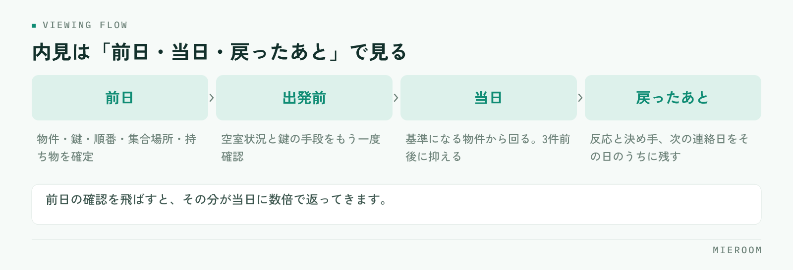

<!--META
{
  "title": "内見の準備と当日の進め方｜段取りで差がつく持ち物・順番・鍵の手配",
  "date": "2026-09-16",
  "category": "業務効率化",
  "excerpt": "内見に時間がかかるのは当日の案内ではなく、前日までの準備が固まっていないからです。確定させておく項目、鍵の手配の方式別の段取り、回る順番の決め方までを整理しました。",
  "hook": "内見にかかる時間は、前日の段取りで決まる",
  "tags": ["内見", "接客", "段取り", "賃貸仲介", "業務効率化"]
}
META-->

内見の準備に時間がかかると感じているとき、実際に時間を使っているのは当日の案内ではありません。**前日までに決まっていない項目が、当日に持ち越されている**のが原因です。この記事では、内見前に確定させておくこと、鍵の手配の段取り、回る順番の決め方を順に整理します。

<h4>この記事の結論</h4>
内見の所要時間を決めているのは案内の上手さではなく、<strong>前日までに何が確定しているか</strong>です。物件・鍵・順番・持ち物の4つを前日に固定できれば、当日は移動と接客だけに集中できます。

## 内見で時間が消えるのは、当日ではなく前日

当日に慌てる店舗には、共通する場面があります。現地に着いてから鍵が別の場所にあると分かる。物件の空室状況が変わっていて、着いてから案内できないと判明する。お客様を待たせたまま、担当者が電話で確認を始める。

<figure class="fig"><figcaption>当日の10分は、前日の2分で消せます。短くできる場所は当日の外にあります。</figcaption></figure>

これらはすべて、**前日までに確認していれば当日に起きなかったこと**です。当日の10分は、前日の2分で消せます。逆に前日の確認を飛ばすと、その分が当日に数倍で返ってきます。

もう一つ、見落とされやすい時間があります。案内から戻ったあとの入力です。誰をどの物件に案内し、どんな反応だったかを記録する作業が後回しになると、翌日以降の追客の判断材料が残りません。内見は「準備」「当日」「戻ったあと」の3つで見ると、短くできる場所が分かります。

## 内見前日までに確定させる6項目

前日にこの6つを潰しておけば、当日の確認事項はほぼ無くなります。

✓前日に確定させること

物件の空室状況・鍵の所在と受け取り方法・回る順番と所要時間・集合場所と時間・持ち物・お客様の優先条件。このうち1つでも「明日確認する」が残っていると、当日その分だけ止まります。

**空室状況**は、案内直前に業者間サイトで再確認します。前日に埋まることは珍しくありません。**鍵の所在**は次のセクションで扱いますが、方式によって動き方が変わるため、前日の時点で受け取り手段まで決めておきます。

**回る順番と所要時間**は、移動時間を含めて逆算します。**集合場所**は、現地集合か来店かで当日の動きがまったく変わるため、前日までに文面で伝えて確認を取ってください。口頭だけの合意は行き違いの元になります。

**お客様の優先条件**は、案内の途中で何を優先して比較するかの軸です。ここが曖昧なまま3件回ると、感想がすべて「悪くない」で終わり、次に進みません。

## 鍵の手配は、方式ごとに段取りが変わる

鍵は当日いちばん止まりやすい部分です。方式によって前日にやることが違います。

| 鍵の方式 | 前日にやること | 止まりやすい点 |
|----------|----------------|----------------|
| キーボックス設置 | 暗証番号を確認する | 番号が変更されていて現地で開かない |
| 管理会社で受け取り | 営業時間と担当者不在時の可否を確認 | 土日に閉まっていて受け取れない |
| 現地で立ち会い | 時間の再確認と連絡先の控え | 到着時刻がずれたときに連絡が取れない |
| 自社で保管 | 持ち出しの記録を残す | 前の担当者が持ったままで見つからない |

!鍵の確認は「前日」と「出発前」の2回

前日に確認していても、当日の朝に変更が入ることがあります。出発前にもう一度、物件ごとの鍵の手段を口に出して確認してください。ここだけは重複して構いません。

複数物件を回る場合、鍵の方式が混在します。物件ごとに手段が違う前提で一覧にしておくと、移動中に迷いません。物件情報を横断して探す段取りは[業者間サイトでの物件検索](./gyoshakan-site-bukken-kensaku.html)にまとめています。

## 当日の持ち物を固定する

毎回考えると抜けます。店舗で1つのセットを決めて、出発前にそろっているかだけを見る形にしてください。

- 物件資料（間取り図・募集条件・初期費用の概算）を物件ごとに1部ずつ
- スリッパ、メジャー、懐中電灯、軍手
- 記録用の端末またはメモ。写真を撮る前提で充電を確認する
- 申込に必要な書類の案内（何をいつまでに用意するか書いたもの）
- 名刺と、次回連絡の手段を書いたもの

**初期費用の概算は、内見の前に渡しておくほうが後戻りが少なくなります**。現地で気に入ったあとに金額で止まると、そこまでの時間がそのまま失われます。

メジャーと懐中電灯は地味ですが効きます。冷蔵庫や洗濯機が入るかをその場で測れると、その場で判断が進みます。電気が止まっている部屋では、日中でも収納や水回りが見えません。

## 回る順番の決め方

順番は移動効率だけで決めないでください。判断の材料がそろう順に組みます。

✓基本の並べ方

条件を満たす標準的な物件を1件目に置き、比較の基準を作る。2件目に本命を置く。3件目は条件の振れ幅を見せる物件にする。3件を超えると印象が混ざるため、増やすほど決まりにくくなります。

1件目に本命を置くと、そのあとの物件がすべて見劣りして、比較そのものが成立しません。逆に1件目を極端に条件の悪い物件にすると、店舗への信頼が下がります。**基準になる物件を最初に見せる**のが無難です。

件数は3件前後に抑えます。時間を取って多く見せるほど満足度が上がるように思えますが、実際には判断が止まります。多く回すよりも、**次に何を確認すれば決まるかがはっきりした状態で終える**ほうが、申込までが早くなります。

## 内見後に、その日のうちに残すこと

案内が終わった時点で、次の判断に必要な情報はすべて担当者の頭の中にあります。これを当日中に形にしておくかどうかで、翌日以降の動きが変わります。

残すのは、案内した物件、それぞれの反応、決め手になりそうな条件、次の連絡日の4つです。とくに**気に入らなかった理由**は、次の提案を組む材料になります。「駅から遠い」で終わらせず、何分までなら許容できるのかまで踏み込んでおくと、次の物件選びが一度で済みます。

反応を記録していない店舗では、追客の文面を毎回ゼロから考えることになります。当日中の記録が残っていれば、翌日の連絡は短く具体的になります。反響から来店までの初動の考え方は[反響への返信スピード](./lead-response-speed.html)にまとめています。

## よくある質問

内見は何件くらい案内するのが適切ですか？

3件前後を目安にしてください。件数が増えるほど物件の印象が混ざり、比較の軸が曖昧になります。多く見せるより、条件の違いがはっきり分かる組み合わせを選ぶほうが、次に進みやすくなります。

現地集合と来店集合、どちらがよいですか？

お客様の移動手段と件数で決めてください。複数物件を回るなら来店集合のほうが確実で、移動中に条件のすり合わせもできます。現地集合にする場合は、集合場所の目印と連絡先を前日までに文面で送っておくと、当日の待ち時間が減ります。

準備に時間をかけると、案内できる件数が減りませんか？

前日の準備は1組あたり数分で済む内容がほとんどです。当日に鍵や空室の確認で止まる時間のほうが長くなるため、合計では短くなります。準備を省いて件数を増やすと、当日の中断が増えて結局回りきれなくなります。

## まとめ：当日の速さは、前日に作る

内見の段取りで差が出るのは、案内の話し方ではありません。物件・鍵・順番・持ち物を前日に固定し、当日は移動と接客だけに集中する。戻ったその日のうちに反応を記録する。この3つで、1件あたりにかかる時間ははっきり変わります。

今日からできるのは、持ち物のセットを1つ決めて出発前の確認項目にすることと、鍵の手段を物件ごとに一覧で持つことです。どちらも紙1枚で始められます。

[ミエルーム](../index.html)は、反響から接客・申込・入金までを案件ごとに1か所で管理し、案内の記録や反響の分析、LINE・SMSでの追客までを同じ画面で扱えます。Excelデータの取り込みと初期設定の代行、デモアカウントの発行、最短即日でのスタートに対応しています。今の進め方のまま整えたい段階からご相談ください。
