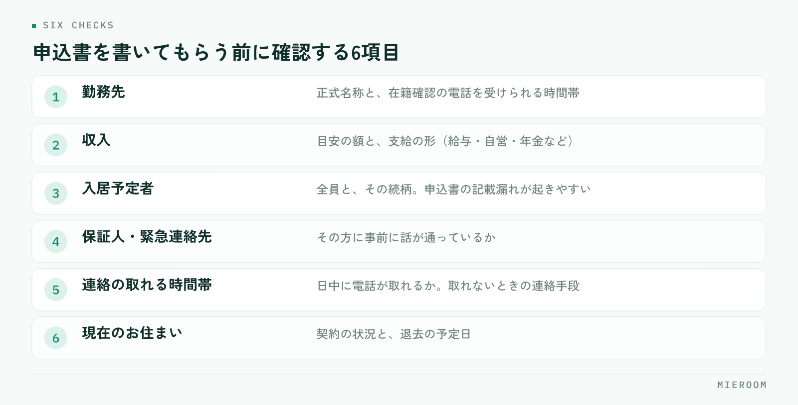

<!--META
{
  "title": "入居審査が通らない理由と、申込前に店舗側でできる確認",
  "date": "2026-09-14",
  "excerpt": "入居審査に落ちる案件の多くは、申込を出したあとではなく、申込前のヒアリングで防げます。審査で見られている項目、保証会社による違い、申込前に店舗側で確認しておくこと、落ちたあとの動き方を整理しました。",
  "category": "業務効率化",
  "hook": "審査落ちの多くは申込の前に確認できる",
  "tags": ["入居審査", "申込管理", "賃貸仲介", "店舗運営", "業務効率化"]
}
META-->

申込を出したのに審査が通らない。契約が流れるだけでなく、お客様への説明と物件の押さえ直しに時間を取られます。ただ、落ちた案件を振り返ると、**申込前のヒアリングで気づけたはずの項目**が含まれていることが少なくありません。この記事では、審査で見られている点と、申込前に店舗側で確認できることを整理します。

  <h4>この記事の結論</h4>
  
入居審査は、通す・通さないを店舗が決められるものではありません。店舗にできるのは<strong>申込前に確認し、伝えるべき事情を先に添えること</strong>です。この2つで、避けられたはずの審査落ちは減らせます。

## 入居審査で見られている項目

審査の主体は、保証会社・貸主・管理会社です。それぞれ見る点は違いますが、共通しているのは「家賃を継続して払えるか」と「連絡が取れるか」の2点に集約されます。

具体的には、次のような項目が確認されます。

- 収入と家賃の釣り合い（月収に対して家賃が高すぎないか）
- 勤務先と勤続年数、雇用の形態
- 過去の家賃滞納の記録
- 申込内容と提出書類の整合
- 申込者本人・連帯保証人・緊急連絡先に連絡が取れるか

見落とされがちなのが最後の項目です。**本人や緊急連絡先に電話がつながらないことを理由に、審査が止まる**ケースは珍しくありません。内容そのものに問題がなくても、確認が取れなければ先へ進みません。

## 保証会社の種類によって見られる点が変わる

同じ申込者でも、どの保証会社を使うかで結果が変わることがあります。審査の重心が違うためです。

| 保証会社の系統 | 審査で重く見られる点 |
|---|---|
| 信販系 | クレジットカードやローンの支払い履歴 |
| 独立系 | 収入と家賃の釣り合い、本人との連絡 |
| 協会系 | 業界内で共有される家賃の支払い履歴 |

物件ごとに使える保証会社は決まっているため、店舗側で自由に選べるわけではありません。ただし複数から選べる物件であれば、申込者の状況に合う方を先に案内できます。**どの系統を使う物件なのかを、募集図面の段階で控えておく**と、後の判断が早くなります。

## 申込前のヒアリングで確認しておくこと

申込書を書いてもらう前の会話で、次の点を確認します。詰問にならないよう、「審査をスムーズに進めるための確認です」と前置きすると伝わりやすくなります。

<figure class="fig"><figcaption>「審査をスムーズに進めるための確認です」と前置きすると伝わりやすくなります。</figcaption></figure>

1. 勤務先の正式名称と、在籍確認の電話を受けられる時間帯
2. 収入の目安と、支給の形（給与・自営・年金など）
3. 入居予定者の全員と続柄
4. 連帯保証人・緊急連絡先の方に、事前に話が通っているか
5. 日中に電話が取れる時間帯と、取れないときの連絡手段
6. 現在のお住まいの契約状況と、退去予定日

3番目と4番目は、後から食い違いが出やすい箇所です。同居人が申込書に書かれていなかったり、緊急連絡先の方が話を聞いていなかったりすると、確認のやり取りで日数がかかります。ヒアリングの内容をその場で残す方法は[反響管理のやり方](./hankyo-kanri-hoho.html)でも扱っています。

  
✓時間帯の確認は必ず入れる

  
在籍確認や本人確認の電話は日中にかかります。「平日の昼は出られない」と分かっていれば、申込時に伝達事項として添えられます。この一行があるだけで、審査が止まる時間が変わります。

## 申込書の書き方で止まるケース

内容ではなく、書き方が原因で差し戻される申込があります。店舗側で防げる部分です。

- 勤務先が略称で書かれていて、在籍確認ができない
- 年収が手取りと額面のどちらか分からない
- 電話番号の桁が足りない、旧番号のまま
- 押印や署名の漏れ、記入日の空欄
- 本人確認書類の住所が現住所と違う

差し戻しは、審査そのものより時間を奪います。**申込書を預かった時点で、その場で読み返す**手順を店舗のルールにしておくと、この種の止まり方は大きく減らせます。担当者が変わっても同じ確認ができるよう、項目を管理表の側に持たせておくと確実です。

## 事情がある場合は、先に添えて出す

収入や勤務の形に事情がある申込は、隠さずに補足資料を添えて出すのが結果的に早道です。後から確認で出てくれば、そのぶん日数がかかります。

添えられるものとして、たとえば次のようなものがあります。

- 転職直後であれば、内定通知書や雇用契約書
- 自営業であれば、確定申告書の控え
- 年金収入があれば、その内容が分かる書類
- 貯蓄で支払う前提であれば、その旨の説明

どの書類を添えれば見てもらえるかは、保証会社や管理会社によって異なります。判断に迷うときは、申込を出す前に管理会社へ一本確認を入れるのが確実です。**申込前の電話1本が、数日の往復を省きます。**

## 落ちたあとの動き方

審査が通らなかった場合、理由は原則として開示されません。店舗側から申込者へ理由を推測して伝えるのは避けてください。伝えるべきは結果と、次にできることです。

次の一手は、おおむね3つに分かれます。ひとつは、別の保証会社が使える物件へ切り替えること。ふたつめは、条件を見直して家賃帯を下げること。みっつめは、連帯保証人を立てられる物件を探すことです。

大切なのは、**結果が出た当日のうちに次の物件を提示する**ことです。時間が空くほど、お客様の来店意欲は下がります。そのためには、申込時点で第2候補まで押さえておく動き方が有効です。

## 審査の結果を店舗の記録として残す

審査落ちを減らす一番の材料は、自店舗の記録です。案件ごとに、どの保証会社で、どういう条件で、結果がどうだったかを残しておくと、扱う物件と客層に合った傾向が見えてきます。

残す項目は多くなくて構いません。物件名、保証会社、申込日、結果、結果が出るまでの日数、差し戻しがあればその内容。この6つがあれば、どこで時間がかかっているかは読み取れます。申込の情報をどう持たせるかは[申込管理表の作り方](./moushikomi-kanrihyo-tsukurikata.html)にまとめています。

記録が溜まると、ヒアリングの段階で「この条件なら確認を丁寧にしておこう」という判断が、担当者の経験に頼らずできるようになります。

審査に落ちた理由を保証会社に聞くことはできますか

原則として開示されません。店舗側から理由を推測して申込者へ伝えることも避けてください。結果をそのまま伝え、次の選択肢を示すことに切り替えるのが適切な対応です。

同じ物件に条件を変えて再申込できますか

管理会社や保証会社の方針によります。再申込を受け付けない場合もあるため、出す前に管理会社へ確認してください。確認せずに出すと、申込者に二度目の期待をさせてしまいます。

申込者に事情を尋ねるとき、気をつけることはありますか

審査に必要な範囲にとどめ、目的を先に伝えることです。「審査で確認される項目なので、先に伺っています」と言い添えるだけで受け取られ方が変わります。必要のない立ち入った事柄までは尋ねません。

## まとめ

入居審査の結果を店舗が動かすことはできません。それでも、申込前のヒアリング、申込書の読み返し、事情の先出し、結果の記録という4つの手順を持っておけば、避けられたはずの審査落ちと差し戻しは確実に減ります。どれも道具がなくても今日から始められますが、担当者ごとにばらつくと効果は続きません。

ミエルームは、申込から入金までを案件ごとに記録し、店舗の誰が見ても同じ状態が分かる形で管理できる、賃貸仲介向けの業務管理システムです。申込管理表・反響管理・接客管理を一つにまとめており、デモアカウントの発行と最短即日でのスタートに対応しています。詳しくは[ミエルームの製品ページ](../index.html)をご覧ください。
