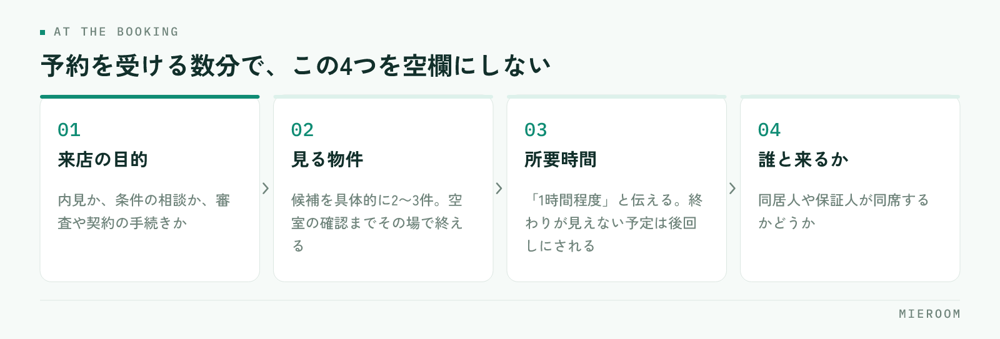

<!--META
{
  "title": "来店予約のキャンセルを減らす方法｜予約から当日までの連絡の組み方",
  "date": "2026-10-04",
  "category": "集客・広告",
  "excerpt": "来店予約のキャンセルや無断キャンセルを減らすために、予約を受けた時点でそろえる情報と、当日までの連絡の組み方を整理しました。キャンセルの理由を記録して次に活かす手順までまとめています。",
  "hook": "予約は入るのに来店につながらない方へ",
  "tags": ["来店予約", "キャンセル対策", "反響対応", "集客", "店舗運営"]
}
META-->

反響も予約も入っているのに、当日になると半分くらいしか来ない。予約表は埋まっているのにスタッフの手が空く、という状態は多くの店舗で起きています。原因は接客の良し悪しではなく、**予約を受けた時点で来店の理由があいまいなまま、当日までの連絡が空いていること**にあります。

<h4>この記事の結論</h4>
キャンセルを減らす打ち手は当日の電話ではなく、<strong>予約を受けたその場で「何のために来るのか」を決めること</strong>です。来店の目的・見る物件・所要時間がその場で固まっていれば、当日までの連絡は確認の一言で足ります。

## キャンセルは「当日」ではなく「予約した瞬間」に決まっている

当日の無断キャンセルを減らそうとして、前日の電話を増やす店舗は多いです。ただ、電話をかけても出ない相手は、たいてい予約した時点で来店の優先度が低いままになっています。

理由は、お客様側の状況を考えると分かります。部屋を探している人は同じ日に複数の会社へ問い合わせ、そのうち何社かと予約が入ります。このとき残るのは、**その店に行く理由が具体的になっている予約**です。

- 「お部屋をご案内します」とだけ伝えた予約 → 他社と区別がつかない
- 「ご希望の2件は押さえました。当日はその2件を見て、30分ほどで終わります」と伝えた予約 → 行かないと進まない

同じ30分の電話でも、後者は予定表に残ります。つまりキャンセル対策の中心は、予約を受ける数分間の中身を変えることにあります。反響が入ってからの最初の対応の速さについては[反響のレスポンス速度](./lead-response-speed.html)で扱っていますが、速く返したあと何を決めるかが、来店率に直結します。

✓キャンセルを「お客様の都合」で終わらせない

キャンセルの連絡が入ると、理由はほぼ「予定が入った」「他で決まった」になります。これを記録して終わりにすると、何も変わりません。見るべきは、予約を受けたときに目的と物件が決まっていたかどうかです。そこが空いていた予約は、他社に優先度を譲った可能性が高くなります。

## 予約を受けるときに、その場でそろえる4つ

電話やLINEで予約を受ける数分で、次の4つを決めます。メモの欄を作っておき、空欄のまま通話を終えないようにします。

<figure class="fig"><figcaption>当日の電話を増やすより、予約を受ける数分の中身を変えるほうが効きます。</figcaption></figure>

1. **来店の目的**：内見か、条件の相談か、審査や契約の手続きか
2. **見る物件**：候補を具体的に2〜3件。空室の確認までその場で終える
3. **所要時間**：「1時間程度」と伝える。終わりが見えない予定は後回しにされます
4. **誰と来るか**：同居人や保証人が同席するかどうか

このうち効くのは2つ目です。**物件が決まっていない来店予約は、お客様から見ると「とりあえず行く約束」**になります。候補が挙がっていないまま予約を取ってしまった場合は、当日までに2件だけでも提示して、見る物件を決めてしまうほうが確実です。

所要時間を伝えるのも忘れやすい部分です。何時間かかるか分からない予定は、休日に入れにくくなります。1時間と伝えて1時間で終われば、次回の予約も入りやすくなります。

## 当日までの連絡は、回数より中身

予約日が3日以上先になる場合は、間の連絡を1回入れます。入れる内容は確認ではなく、情報の追加にします。

- 良い例：「ご希望に近い物件がもう1件出ました。当日あわせてご覧になれます」
- 良い例：「当日ご案内する2件の内装写真をお送りします」
- 避けたい例：「◯日◯時のご予約、お間違いないでしょうか」だけの確認

確認だけの連絡は、相手に「行くか行かないか」を考えさせる機会になります。情報を足す連絡なら来店の価値が上がるため、予定として残りやすくなります。

連絡の手段は、予約を取った手段にそろえます。LINEで問い合わせてきた方に電話をかけると、出ない確率が上がります。記録が残る形にしておけば、担当が不在でも他のスタッフが続きを進められます。

前日の確認は入れて構いませんが、そこに**持ち物と集合場所を書き添える**のがコツです。身分証、印鑑、現地集合の場合は目印になる建物。当日の段取りが具体的になるほど、直前の離脱は減ります。内見当日の準備については[内見の準備と案内](./naiken-junbi-annai.html)にまとめています。

## 予約枠の作り方で、来店率は変わる

予約が埋まっているのに来店が少ないとき、枠の取り方を見直すと改善することがあります。

| 枠の取り方 | 起きやすいこと |
|---|---|
| 「いつでも大丈夫です」と伝える | 予約の時間が決まらず、約束の重みが下がる |
| 希望日だけ聞いて時間は当日調整 | 当日の連絡が必要になり、そこで流れる |
| 2つの時間を提示して選んでもらう | その場で時間が確定し、予定に入りやすい |
| 1週間以上先の枠だけを案内する | 他社に先に行かれ、決まってしまう |

おすすめは3つ目です。「土曜の11時か、14時はいかがですか」と2択で聞くと、選ぶだけで予約が確定します。希望を聞く形より、決まるのが早くなります。

そして、**できるだけ早い日に枠を出す**ことです。問い合わせの熱が高いのは最初の数日で、1週間後の枠を案内すると、その間に他社で決まる可能性が上がります。繁忙期で枠が埋まっている場合は、短い時間の相談枠を別に用意して、先に接点を作る方法もあります。

## キャンセルが出たときに記録すること

キャンセルをゼロにはできません。大事なのは、出たときに次に使える形で残すことです。残す項目は4つに絞ります。

- 反響の媒体（どこから来た問い合わせか）
- 予約を受けたときに、目的と物件が決まっていたか
- 当日までの連絡を何回入れたか
- キャンセルの連絡があったか、無断だったか

案件の記録に残しておくと、月末に並べたときに傾向が見えます。特定の媒体からの予約だけキャンセルが多い場合は、物件の出し方や広告の文面が実態と合っていない可能性があります。媒体ごとの判断は[媒体別のROIの見方](./media-roi.html)が参考になります。

無断キャンセルと連絡ありのキャンセルは、分けて数えます。連絡が入るのは関係が切れていない状態なので、日程を変えて再提案できます。**キャンセルの連絡が来た電話は、次の予約を取る機会**として扱ってください。その場で候補日を2つ出せれば、そのまま予約が入ることもあります。

!キャンセル率をスタッフの成績にしない

キャンセルの数を個人の成績として扱うと、確度の低いお客様の予約を取らなくなります。結果として来店率は上がりますが、反響の総数に対する申込数は下がります。見るのは個人ではなく、媒体別・曜日別・予約から来店までの日数別の傾向です。

## 来店率は反響の記録とつないで見る

キャンセル対策の効果は、来店率だけを見ても分かりません。反響の数・予約の数・来店の数・申込の数を、同じ1件としてつないで見る必要があります。

つないでいないと、見間違いが起きます。来店率が上がったので効いたと判断したものの、実際は予約を取る基準を厳しくしただけで申込は変わっていない。逆に、来店率は下がったが予約の数が増えて申込は増えている、という場合もあります。見る順番は決まっています。

1. 反響から予約になった数
2. 予約から来店になった数
3. 来店から申込になった数

このうちどこが落ちているかで、直す場所が変わります。1が低ければ最初の対応、2が低ければ本記事の内容、3が低ければ接客とヒアリングです。**途中の数字を飛ばして申込数だけを見ていると、どこを直せばよいかが分かりません**。記録の残し方は[反響管理の方法](./hankyo-kanri-hoho.html)に整理しています。

当日の無断キャンセルに、追いかけの連絡は入れるべきですか？

予約時間から30分ほど過ぎた時点で1回だけ連絡を入れ、その後は追いかけないのが現実的です。来られなかった事情がある場合もあるため、責める言い方は避け、日程の再調整ができる一言を添えておきます。返信がなければ記録を残して終わりにし、同じ方から再度問い合わせが来たときに前回の記録が見える状態にしておくほうが役に立ちます。

キャンセル料を取れば減りますか？

来店や内見の段階でキャンセル料を取る運用は、一般的ではありません。設定したとしても、問い合わせの段階で他社を選ばれる要因になりやすく、反響の総数が減ります。減らしたいのであれば、料金ではなく予約時に目的と物件を決めることと、当日までに情報を足す連絡のほうが効きます。

繁忙期は予約が重なって対応しきれません。どう優先順位をつけますか？

入居希望日が近い方と、見る物件が決まっている方を優先します。逆に、入居時期が数か月先で物件も未定の方は、短い相談枠に回す形が現実的です。優先順位を担当者の感覚で決めず、予約を受けるときの項目として入居希望日を必ず聞いておくと、枠の調整がしやすくなります。

## まとめ：予約の数分を変えると、当日が変わる

来店予約のキャンセルを減らす打ち手は、当日や前日ではなく予約を受ける数分の中にあります。来店の目的、見る物件、所要時間、同席者。この4つをその場でそろえると、他社の予約と並んだときに残る予約になります。

当日までの連絡は、回数を増やすより中身を変える。確認だけで終わらせず、物件や写真を1つ足す。キャンセルが出たら、媒体・予約時の状態・連絡の回数・無断かどうかを記録し、月末に並べて見る。この繰り返しで直す場所がはっきりしてきます。

反響・予約・来店・申込を1件としてつなぎ、媒体別や担当別に来店率を見られる状態にしておくと、対策の効果が記録から判断できます。その形を探している場合は[ミエルーム](../index.html)が対応しています。デモアカウントの発行と、既存のExcelデータの取り込み・初期設定の代行にも対応していますので、まずは現状の記録の残し方からお気軽にご相談ください。
