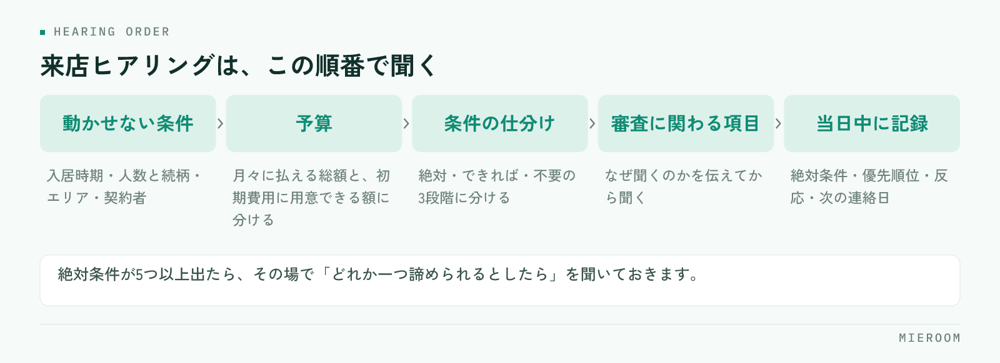

<!--META
{
  "title": "来店時のヒアリングで聞く項目｜提案がずれない条件整理の順番",
  "date": "2026-09-18",
  "category": "業務効率化",
  "excerpt": "来店時のヒアリングが人によってばらつくと、提案する物件もばらつきます。聞く項目を固定し、条件を絶対・できれば・不要の3段階に整理する順番を、店舗でそのまま使える形でまとめました。",
  "hook": "聞く順番を固定すると、提案がずれない",
  "tags": ["ヒアリング", "接客", "賃貸仲介", "条件整理", "業務効率化"]
}
META-->

来店時のヒアリングで聞く項目が担当者ごとに違うと、そのあとの提案も担当者ごとに変わります。接客の上手さの問題に見えますが、実際には**何を、どの順番で聞くかが決まっていない**だけであることがほとんどです。この記事では、聞く項目と順番、条件の整理の仕方を、店舗でそのまま使える形にまとめます。

<h4>この記事の結論</h4>
ヒアリングのばらつきは、項目を紙1枚に固定するだけで大きく減ります。鍵になるのは、条件を並べて聞くのではなく<strong>絶対・できれば・不要の3段階に分けて聞く</strong>ことです。優先度がないまま集めた条件は、提案の材料になりません。

## ヒアリングがばらつくと、提案は「数打ち」になる

条件を聞き切れていないまま物件を探すと、提案の件数だけが増えます。5件見せて全部違う、という状態は、お客様の希望が曖昧なのではなく、**優先順位を聞いていない**ことが原因です。

ばらつきが起きるのは、ベテランほど自分の型で聞き、新人は聞くこと自体を思い出しながら進めるからです。結果として、同じ来店でも引き出せる情報の量が変わります。ここが揃っていないと、担当者ごとの成績の差が接客の質なのか情報量の差なのかも分かりません。工程ごとに数字を分けて見る考え方は[スタッフの成績管理](./staff-seiseki-kanri.html)で整理しています。

もう一つの影響は、引き継ぎです。担当者が休んだときに別の人が対応できるかどうかは、聞いた内容が記録に残っているかで決まります。頭の中にある条件は、引き継げません。

## 聞く順番は、後戻りが起きない順に決める

項目を並べただけの表を渡しても、順番が決まっていないと結局ばらつきます。先に決めるのは順番で、原則は**後戻りが起きない順に並べる**ことです。入居時期が決まらないまま物件を探すと、募集が始まっていない物件や、逆に入居が先すぎる物件を提案してしまいます。予算を聞かずに条件だけ広げると、後から全部やり直しになります。聞きにくい話題ほど後ろに置くのも順番の役割です。

<figure class="fig"><figcaption>先に決まる条件から順に聞きます。聞きにくい項目ほど後ろに置くのも、順番の役割です。</figcaption></figure>

そのうえで、いちばん最初に確定させるのは、後から変えられない項目です。

- **入居時期**：いつまでに住み始める必要があるか。退去予告を出しているか
- **入居人数と続柄**：単身か、同居人がいるか、将来増える予定があるか
- **エリア**：勤務先や学校の場所と、通勤通学の手段
- **契約者**：本人か、親族か。法人契約になるか

この4つは、お客様側の事情で決まっていて、提案では動かせません。**ここが曖昧なまま進めると、あとで全部の条件が変わります**。とくに入居時期は、急ぎなのか半年先なのかで提案する物件がまったく変わるため、最初に確認してください。

退去予告をすでに出している場合は、期限が明確な締め切りになります。この場合は、決まらないまま時間が過ぎるリスクを共有しておくほうが、そのあとの動きが速くなります。

## 予算は「家賃」ではなく初期費用と月々で聞く

予算を家賃の上限だけで聞くと、あとで金額の話で止まります。分けて聞いてください。

| 聞く内容 | 確認するポイント |
|---|---|
| 月々に払える総額 | 家賃だけでなく、共益費・駐車場・町内会費を含めた額 |
| 初期費用に用意できる額 | 手元にいくらあるか。時期によって変わるか |
| 現在の住居費 | 今いくら払っているか。上げたいのか下げたいのか |
| 譲れる範囲 | 条件が合えば、いくらまでなら上げられるか |

**初期費用の目安は、物件を見る前に伝えておくほうが後戻りが少なくなります**。内見で気に入ったあとに金額で止まると、そこまでの時間がそのまま失われます。初期費用の内訳をどう説明するかは[初期費用の内訳の説明](./shokihiyo-uchiwake-setsumei.html)にまとめています。

「今より安く」だけで聞くと、実際の上限が見えません。今の住居費を基準にして、上下どちらに動かしたいのかまで確認すると、提案できる幅がはっきりします。

## 条件は「絶対・できれば・不要」の3段階に分ける

ここがヒアリングの中心です。条件を一覧で聞くのではなく、**3段階に仕分けながら聞きます**。

絶対条件は、満たさなければ申し込まない項目です。ペット可、駐車場2台、1階不可など、数は多くありません。多くても3つか4つに収まります。できれば条件は、あれば嬉しいが無くても決められる項目です。不要は、一般に人気があるが本人は要らない項目で、ここを聞いておくと提案の幅が広がります。

仕分けるときのコツは、**具体的な数字まで踏み込む**ことです。「駅から近い」では判断できません。徒歩何分までなら許容できるのか、バス便は検討対象に入るのかまで確認します。「広いほうがいい」も同じで、何を置きたいのかを聞けば必要な広さが決まります。

絶対条件が5つ以上出てきた場合は、そのまま探しても該当がほとんど出ません。その場で「この中で、どれか一つ諦められるとしたらどれですか」と聞いておくと、物件が少なかったときの提案が用意できます。

✓3段階で聞くと、代替案が作れる

絶対条件だけを集めると、該当が無かったときに提案が止まります。できれば条件と不要な条件まで聞いておけば、条件を一つずらした代替案をその場で出せます。

## 聞きにくい項目は、必要な理由とセットで聞く

審査に関わる項目は、避けて通ると申込の直前で止まります。ただし、聞き方と順番で受け止められ方が変わります。

確認するのは、勤務先と勤続年数、収入のおおよその区分、連帯保証人を立てられるか、過去の滞納や保証会社の利用状況です。いずれも、**なぜ聞くのかを先に伝えてから聞く**と、答えてもらいやすくなります。「保証会社の審査で必要になるため」と前置きするだけで印象が変わります。

順番としては、条件が固まり、案内する物件が見えてきた段階に置きます。来店直後に聞くと、審査目的の面談のように受け取られます。審査で止まりやすい要因は[入居審査が通らない理由](./nyukyo-shinsa-toranai-riyu.html)にまとめているので、事前の確認項目の参考にしてください。

!聞いたまま記録しない項目に注意

審査に関わる内容は、聞いた担当者の記憶だけに残りがちです。申込の段階で別の人が対応すると、同じことをもう一度聞くことになります。確認済みかどうかだけでも、案件の記録に残してください。

## 聞いた内容を、その日のうちに記録に残す

ヒアリングの質を上げても、記録に残らなければ次に使えません。来店の当日中に残す項目を決めておきます。

残すのは、絶対条件と優先順位、予算の2つの数字、入居時期、案内した物件と反応、次の連絡日です。とくに**気に入らなかった理由**は、次の提案を組む材料になります。ここが残っていれば、翌日の連絡は短く具体的になります。

記録が個人のメモ帳に散っていると、引き継ぎのたびに聞き直しが発生します。反響の段階からの記録の持ち方は[反響管理の方法](./hankyo-kanri-hoho.html)で扱っています。ヒアリングの内容も同じ場所に続けて残すと、反響から来店、申込までが1本の線でつながります。

## よくある質問

ヒアリングシートは紙とデータ、どちらがよいですか？

聞きながら書くなら紙が速く、そのあとの活用を考えるならデータです。現実的なのは、接客中は紙で聞き、当日中にデータへ移す形です。重要なのは媒体より、その日のうちに全員が同じ場所に残すという運用が守られることです。

項目を増やすと接客が長くなりませんか？

項目数より順番の影響が大きくなります。順番が決まっていないと、聞き漏らしに気づくたびに話が戻り、結果的に長くなります。動かせない条件から順に聞く形にすれば、項目が増えても所要時間はそれほど変わりません。

電話やLINEでの問い合わせでも同じ項目を聞きますか？

全部は聞きません。来店前は、入居時期・エリア・人数・おおよその予算までで十分です。詳しい条件は来店時に確認する前提にしておくと、問い合わせの段階で長くなりすぎず、来店につながりやすくなります。

## まとめ：聞く項目より、聞く順番を固定する

来店時のヒアリングで差が出るのは、項目の多さではありません。動かせない条件から順に聞き、予算を初期費用と月々に分け、条件を絶対・できれば・不要の3段階に仕分ける。この順番を紙1枚に固定するだけで、担当者による提案のばらつきは目に見えて減ります。

今日からできるのは、店舗のヒアリングシートを1枚に決めることと、絶対条件の欄に「どれか一つ諦めるとしたら」の記入欄を足すことです。どちらも既存の様式に書き足すだけで始められます。

[ミエルーム](../index.html)は、反響から接客・申込・入金までを案件ごとに1か所で管理し、接客の記録や反響の分析、LINE・SMSでの追客までを同じ画面で扱えます。Excelデータの取り込みと初期設定の代行、デモアカウントの発行、最短即日でのスタートに対応しています。今の進め方を変えずに記録の場所だけ整えたい、という段階からご相談ください。
