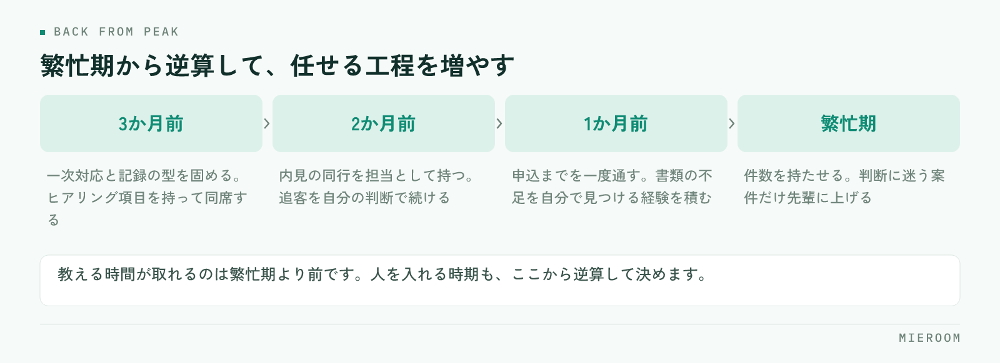

<!--META
{
  "title": "賃貸仲介の新人育成｜繁忙期までに戦力にする教育の順番",
  "date": "2026-09-30",
  "category": "組織・育成",
  "excerpt": "賃貸仲介の新人育成を、繁忙期までに戦力にするための順番で整理しました。最初に覚えさせること、後回しにしていいこと、独り立ちの判断基準までまとめています。",
  "hook": "新人が育つ前に繁忙期が来る店舗へ",
  "tags": ["新人育成", "教育", "組織づくり", "繁忙期", "店舗運営"]
}
META-->

秋に入った新人を、年明けの繁忙期に戦力として数えられるか。ここが読めないまま人員計画を立てている店舗は少なくありません。うまくいかない原因は本人の素質ではなく、**教える順番が現場の忙しさに合わせて前後してしまうこと**にあります。

<h4>この記事の結論</h4>
新人育成は「覚えることを増やす」のではなく<strong>覚える順番を決める</strong>ことで速くなります。先に物件知識を詰め込むより、<strong>反響への一次対応と記録の残し方</strong>を固めるほうが、繁忙期に効きます。

## 新人が育たない店舗で起きていること

新人の教育が進まない店舗では、たいてい次のどれかが起きています。

- 教える人が日によって変わり、言われることが違う
- 最初に覚えることが「物件知識」になっていて、範囲に終わりがない
- 見て覚えてくださいと言われるが、先輩の接客に同席する機会が週に数回しかない
- できているかどうかの判断が、上司の感覚に委ねられている

共通しているのは、**教える内容が決まっていないこと**ではなく、教える順番と到達点が決まっていないことです。何をどこまでできれば次に進むのかが本人に見えていないため、自分が伸びているのかどうかも分かりません。

繁忙期に間に合わない原因もここにあります。忙しくなると教える時間が消えるので、それまでに何を終わらせるかを決めておかないと、教育は自然に止まります。

## 最初の2週間で固めること

最初に固めるのは、知識ではなく**型**です。具体的には次の3つに絞ります。

1. 反響が入ったときの一次対応（誰が、どの順番で、いつまでに返すか）
2. お客様から聞く項目と、その聞く順番
3. 聞いた内容をどこに、どの粒度で記録するか

物件知識や契約の流れは、この段階では後回しにして構いません。理由は単純で、**一次対応と記録は毎日発生するのに、契約の実務は新人に回ってくるまで日数がかかる**からです。発生頻度の高い作業から固めるほうが、反復の回数を稼げます。

来店時のヒアリングは、項目を紙に落として持たせるのが早道です。何を聞くかの整理は[来店時のヒアリング項目](./raiten-hearing-koumoku.html)にまとめています。

✓記録の書き方は最初に教える

後から直すのがいちばん大変なのが、記録の粒度です。「電話済み」だけ書く人と、聞いた条件まで書く人が混在すると、引き継いだ側が本人に聞き直すことになります。最初の1週間で書き方の見本を1件見せ、その形をなぞらせてください。

## 教える順番を、発生頻度で決める

順番に迷ったときの基準は「その作業が月に何回発生するか」です。頻度の高いものから教えます。

- 毎日発生：反響への一次対応、追客の連絡、記録の入力
- 週に数回：内見の同行、物件の案内、現地での確認
- 月に数回：申込書の作成、審査への提出、契約書の説明
- 数か月に1回：更新、解約、トラブル対応

この並びで教えると、覚えたことがすぐ使える状態になります。逆に、契約や審査から教え始めると、覚えた翌日には使わないので忘れます。実務で使うまでに間が空くものは、その場面が来たときに先輩が横について一緒にやるほうが早く定着します。

内見の準備や案内の進め方は手順として整理しておくと、同行の前に読ませることができます。[内見の準備と案内](./naiken-junbi-annai.html)が目安になります。

## 独り立ちの判断は、件数ではなく工程で見る

「何件やったら独り立ち」という基準は、実は判断に使いにくいものです。難しい案件を3件こなした人と、決まりやすい案件を10件こなした人では、経験の中身が違います。

見るのは工程です。次の4つを、指示なしで最後まで通せるかどうかで判断します。

- 反響を受けて、その日のうちに一次対応を終えられる
- 聞いた条件から、案内する物件を自分で組める
- 内見後の追客を、決めた間隔で続けられる
- 申込のあと、必要な書類の不足に自分で気づける

この4つは、どれも**止まったときに店舗の誰かが代わりに動かないと進まない**工程です。ここを任せられるかどうかが、繁忙期に人員として数えられるかの分かれ目になります。

判断を感覚に委ねないためには、工程ごとの数字を見られる状態にしておくことが前提になります。何を見るかの整理は[スタッフの成績管理](./staff-seiseki-kanri.html)、数字を開いたときに現場で何が変わるかは[成績の見える化](./staff-visualization.html)で扱っています。

## 教える側の負担を減らす

新人育成が続かない理由の多くは、教える側の時間が足りないことです。負担を減らす手立ては3つあります。

ひとつ目は、**教える人を1人に決める**ことです。複数人で分担すると、言われることが変わって新人が迷います。日々の指導役は1人にし、その人が手一杯のときだけ別の人が入る形にします。

ふたつ目は、**繰り返し聞かれることを先に文章にする**ことです。同じ質問に3回答えたら、その内容はメモに残す。これだけで、口頭で説明する回数が減ります。

みっつ目は、**教えることと確認することを分ける**ことです。教えるのは指導役、できているかの確認は店長。役割を分けると、新人も「誰に何を聞けばいいか」が分かります。

!繁忙期に入ってからの新人投入は避ける

忙しい時期は、教える時間がほとんど取れません。同じ人を同じ期間かけて育てても、繁忙期に始めた場合は定着が遅れます。人を入れる時期は、教える余裕がある時期から逆算して決めるのが現実的です。

## 繁忙期までの逆算のしかた

繁忙期を1月から3月とすると、逆算の目安は次のようになります。

<figure class="fig"><figcaption>前の段が終わっていないまま次へ進めないのが要点です。遅れているなら、持たせる件数を減らす判断をします。</figcaption></figure>

- 3か月前：一次対応と記録の型を固める。ヒアリング項目を持って同席する
- 2か月前：内見の同行を担当として持つ。追客を自分の判断で続ける
- 1か月前：申込までを一度通す。書類の不足を自分で見つける経験を積む
- 繁忙期：件数を持たせる。判断に迷う案件だけ先輩に上げる

ここで大事なのは、**前の段が終わっていないのに次へ進めないこと**です。一次対応が安定していない人に件数を持たせると、対応の漏れが増え、結果として店舗全体の手間が増えます。遅れているなら、繁忙期に持たせる件数を減らす判断をしてください。人を育てることと、その期の売上を作ることは、別の計画として持つほうが破綻しません。

未経験の新人に、宅建の資格取得はいつ勧めるべきですか？

実務の型が固まってからのほうが、勉強の内容と現場が結びつきやすくなります。入社直後から試験勉強を優先させると、どちらも中途半端になりがちです。繁忙期が終わって落ち着く時期を目標に置き、それまでは実務を優先する組み方が一般的です。

教える人が店長しかいません。どう回せばよいですか？

教える時間を決めて予定に入れてしまうのが現実的です。「空いたときに教える」にすると、空く日は来ません。1日15分でも時間を固定し、その場で前日の記録を一緒に見る形にすると、指導と確認を同時に済ませられます。

新人が辞めてしまう場合、教育の何を見直せばよいですか？

できているかどうかが本人に伝わっているかを確認してください。成果が出るまで時間がかかる仕事で、途中の評価が何もないと、本人は自分が向いていないと判断します。工程ごとに「ここはできている」と言える材料を持っておくことが、続けてもらう土台になります。

## まとめ：順番を決めれば、育成の速さは変わる

賃貸仲介の新人育成で効くのは、教える量を増やすことではなく順番を決めることです。発生頻度の高い一次対応と記録から固め、契約や審査は場面が来たときに横について教える。独り立ちの判断は件数ではなく、指示なしで通せる工程の数で見ます。

そして、繁忙期までの計画は逆算で持ちます。前の段が終わっていないなら、持たせる件数を調整する。教育の遅れを本人の頑張りで埋めさせようとすると、対応の漏れという形で店舗に返ってきます。

反響から接客、申込、入金までの記録を一か所にまとめ、誰がどの工程でどう動いたかを見られる状態にしておくと、指導の言葉が具体的になります。その形を探している場合は[ミエルーム](../index.html)が対応しています。デモアカウントの発行と、既存のExcelデータの取り込み・初期設定の代行にも対応していますので、まずは今の教え方を整理したいという段階でもお気軽にご相談ください。
