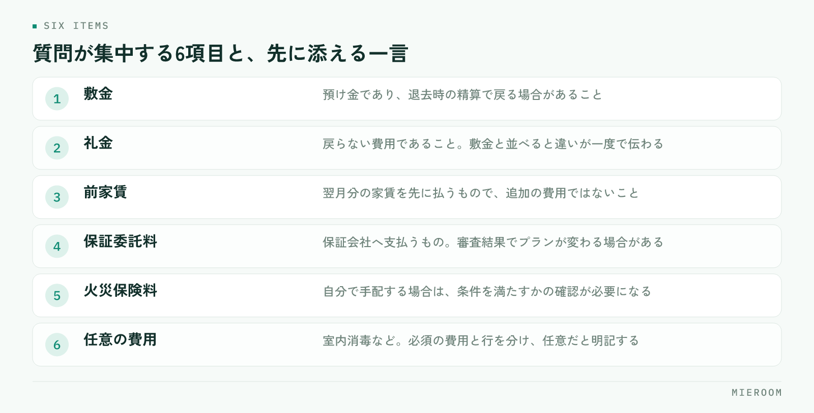

<!--META
{
  "title": "賃貸の初期費用の内訳をお客様に説明する｜つまずきやすい項目と伝え方",
  "date": "2026-09-15",
  "category": "業務効率化",
  "excerpt": "初期費用の説明で毎回手間取るのは、金額の高さではなく内訳の見え方が原因です。項目ごとの分け方、つまずきやすい費目の伝え方、見積を出すタイミングの決め方までを整理しました。",
  "hook": "初期費用の説明は、金額より出す順番で決まる",
  "tags": ["初期費用", "接客", "見積", "賃貸仲介", "業務効率化"]
}
META-->

初期費用の説明に毎回時間がかかるのは、**金額が高いからではありません**。項目の数が多く、名前だけでは中身が分からず、どれが交渉できてどれが動かないのかが伝わっていないからです。この記事では、内訳の分け方と、お客様がつまずきやすい費目の伝え方を順に整理します。

<h4>この記事の結論</h4>
初期費用の説明は、金額を安く見せる工夫ではなく<strong>内訳を性質ごとに分けて、根拠と一緒に先に出すこと</strong>で短くなります。同じ質問が毎回出るなら、説明の型が店舗で共有されていないだけです。

## 初期費用の説明でつまずくのは、金額そのものではない

内見後に金額を提示して、そこで話が止まる。この場面で問題になっているのは、総額の大きさよりも「何にいくら払うのか分からない」という状態です。総額だけを伝えられたお客様は、判断の材料を持てません。

内訳を渡していても、**項目名が専門用語のまま並んでいると同じことが起きます**。「礼金」「仲介手数料」「保証委託料」「鍵交換費」は、業界では当たり前の言葉ですが、初めて借りる方には区別がつきません。結果として「全部ひとまとめに高い」という印象だけが残ります。

説明が長くなる店舗ほど、提示の場でゼロから説明を組み立てています。逆に短く済む店舗は、説明する順番と言い回しが決まっています。差は話の上手さではなく、型があるかどうかです。

## 初期費用の内訳を、性質ごとに3つに分ける

項目を並べる順番を、金額の大きい順ではなく性質ごとに分けると、お客様の理解が一段速くなります。

- **契約時に貸主へ支払うもの**：敷金、礼金、前家賃、日割り家賃、共益費。物件の条件で決まっており、交渉の対象になる場合もある部分です
- **契約に必要な手続きの費用**：保証会社の保証委託料、火災保険料、鍵交換費、室内消毒などの任意費用。誰に支払うものかを分けて伝える必要がある部分です
- **仲介に対する費用**：仲介手数料。法令で上限が定められている部分です

この3つに分けて「これは貸主へ、これは保証会社へ、これは当店へ」と支払先を示すだけで、質問の数が減ります。お客様が知りたいのは金額の内訳というより、**誰に何のために払うのか**だからです。

## お客様がつまずきやすい項目と、その伝え方

質問が集中する項目は、ほぼ決まっています。それぞれ、先に一言添えるだけで説明が短くなります。

<figure class="fig"><figcaption>項目名だけを並べると区別がつきません。一言添えるだけで説明が短くなります。</figcaption></figure>

言い換えの例を挙げます。「敷金」は預け金であり、退去時の精算で戻る場合があること。「礼金」は戻らないこと。この2つを並べて説明すると、性質の違いが一度で伝わります。「前家賃」は翌月分の家賃を先に払うもので、追加の費用ではないこと。ここを説明しないと、家賃を二重に取られたように受け取られます。

**任意の費用は、任意だと明示してください**。室内消毒やハウスクリーニングの上乗せなどは、必須か任意かを曖昧にしたまま合計に入れると、あとから説明のやり直しになります。申込前に確認しておく項目の考え方は[入居審査が通らない理由](./nyukyo-shinsa-toranai-riyu.html)でも触れていますが、費用も同じで、先に出したほうが後戻りが少なくなります。

## 見積を出すタイミングで、説明の手間が変わる

同じ内容を伝えるのでも、出す時期によって手間がまったく違います。

| 提示のタイミング | 起きやすいこと |
|------------------|----------------|
| 物件紹介の段階で概算を出す | 予算と合わない物件を早く外せる。説明は1回で済む |
| 内見後に正式な見積を出す | 概算と差があると、その説明から始めることになる |
| 申込後に確定額を出す | 金額を理由にした取り下げが起きやすい |

おすすめは、紹介の段階で**概算のレンジを先に出しておく**ことです。家賃に対しておおよそ何か月分になるかを伝えておけば、内見後の提示で驚かれません。ただし概算であることと、物件によって変わる項目を必ず添えてください。

概算と確定額の差が毎回大きい店舗は、どの項目が読めていないのかを洗い出す価値があります。多いのは、保証会社のプラン、火災保険の内容、鍵交換の有無、日割り家賃の起算日です。

## 金額が動く場面と、その伝え方

初期費用は、提示後に変わることがあります。変わる可能性を先に伝えておくかどうかで、信頼の残り方が変わります。

- **入居日が動いたとき**：日割り家賃と前家賃の対象月が変わります
- **保証会社の審査結果でプランが変わったとき**：保証委託料が変わる場合があります
- **火災保険を自分で手配するとき**：条件を満たすかの確認が必要です
- **貸主との交渉が通ったとき**：礼金やフリーレントの条件が変わります

!「あとで変わるかもしれない」を省略しない

提示時に動く可能性のある項目を伝えていないと、金額が増えたときに「話が違う」という受け取り方になります。増額の可能性がある項目は、その場で名前だけでも挙げておいてください。

## 説明の型を店舗でそろえる

説明の質が担当者ごとにばらつくと、同じ物件で違う金額や違う条件が伝わります。そろえるべきものは3つです。

**見積の様式を1つに固定する**。項目の並び順、任意費用の表記、概算か確定かの明記。様式が同じなら、担当が代わっても引き継げます。

**言い換えの一覧を作る**。敷金・礼金・前家賃・保証委託料・仲介手数料について、1〜2文の説明を店舗で決めておきます。新人が最初につまずくのはここで、一覧が1枚あれば同行なしでも説明できるようになります。

**提示した金額を案件ごとに記録する**。概算をいくらで出したか、確定額がいくらになったかを残しておくと、差が出やすい項目が見えてきます。案件の情報を1か所にまとめる考え方は[申込管理表の作り方](./moushikomi-kanrihyo-tsukurikata.html)と同じで、契約書類まで同じ情報を使う流れは[契約書・重説の作成時間を短くする方法](./chintai-keiyakusho-jusetsu-jitan.html)にまとめています。

✓ばらつきは、悪意ではなく様式の問題

説明が人によって違うのは、担当者の姿勢というより、拠り所になる様式がないことが原因です。1枚そろえるだけで、注意喚起よりも早く改善します。

## よくある質問

概算を先に出すと、金額で断られやすくなりませんか？

断られる件数は増えることがありますが、断られるタイミングが早くなるだけで、成約の数は減りにくくなります。内見や申込まで進んでから金額で止まると、そこまでの時間がそのまま失われます。早い段階で予算と合わない物件を外せるほうが、店舗全体の効率は上がります。

任意の費用は、見積に入れるべきですか？

入れて構いませんが、必須の費用と行を分け、任意であることを明記してください。合計に混ぜたまま提示すると、あとから外す説明が必要になり、そこで不信感が生まれます。

説明の型は、どのくらいの粒度で決めればよいですか？

台本まで作る必要はありません。項目の並び順と、主要な費目の1〜2文の言い換え、任意費用の表記ルール。この3つが決まっていれば、あとは担当者の言葉で話して問題ありません。

## まとめ：先に出して、根拠を添える

初期費用の説明が長引くのは、金額の大きさではなく内訳の見え方の問題です。性質ごとに分けて支払先を示し、つまずきやすい費目には一言添える。概算は紹介の段階で先に出し、動く可能性のある項目は名前を挙げておく。この4つで、同じ説明を繰り返す時間はかなり減ります。

今日からできるのは、主要な費目の言い換えを1枚にまとめることです。敷金・礼金・前家賃・保証委託料・仲介手数料の5つだけでも、店舗で言い方がそろいます。

[ミエルーム](../index.html)は、申込から入金までの情報を案件ごとに1か所で持ち、一部入金や分割入金、後ADの記録にも対応しています。Excelデータの取り込みと初期設定の代行、デモアカウントの発行、最短即日でのスタートが可能です。今の様式のまま運用を整えたい段階からご相談ください。
