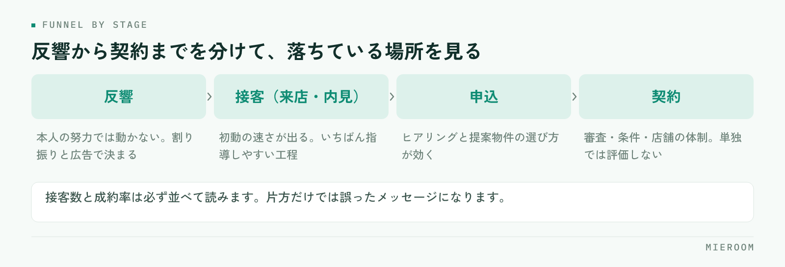

<!--META
{
  "title": "賃貸仲介スタッフの成績管理｜反響数・接客数・成約率で育てる評価の作り方",
  "date": "2026-09-12",
  "category": "組織・育成",
  "excerpt": "スタッフの成績を契約本数だけで見ていると、育て方が分からなくなります。反響・接客・申込・契約の工程ごとに数字を分け、本人の努力で動く数字とそうでない数字を切り分ける評価の作り方を整理しました。",
  "hook": "成績管理は結果ではなく工程に分けて見る",
  "tags": ["成績管理", "評価制度", "組織・育成", "賃貸仲介", "KPI"]
}
META-->

スタッフの成績を契約本数だけで見ていると、伸び悩んでいる人に何を直せばいいか伝えられません。契約は**いくつもの工程の結果として出てくる数字**であり、途中のどこで落ちているかは、そこだけを見ても分からないからです。この記事では、反響から契約までを工程に分け、育成につながる形で成績を管理する手順を整理します。

  <h4>この記事の結論</h4>
  
成績管理は契約本数ではなく、<strong>反響・接客・申込・契約の工程ごとの数字</strong>で見ます。工程に分けて初めて、本人の努力で動く数字と、割り振りや市況で決まる数字を切り分けられます。

## 契約本数だけで見ると、指導の言葉が「頑張れ」になる

月末に並ぶのが契約本数だけだと、成績の良い人と悪い人は分かっても、その差がどこで生まれたかは分かりません。そうなると面談の言葉が「もっと件数をこなそう」「気合いを入れて」といった形になり、本人も何を変えればいいか分からないまま次の月に入ります。

もう一つ起きやすいのが、**評価が不公平に感じられる**ことです。反響の割り振りが偏っていれば、接客の質が同じでも契約数は変わります。数字を工程に分けていないと、この差を説明できません。感覚で評価することの危うさは[スタッフの成績を数字で見せる](./staff-visualization.html)でも触れています。

## 見るべき数字を工程に分ける

賃貸仲介の成約までは、いくつかの関門があります。まずはこの流れを分けて、それぞれの件数を数えられる状態にします。

<figure class="fig"><figcaption>隣り合う数字の割合を見ると、指導する内容が1つに絞れます。</figcaption></figure>

数えるのは次の4つで足ります。

- **反響数**：問い合わせが本人に何件渡ったか
- **接客数**：来店・内見まで進んだ件数
- **申込数**：申込に至った件数
- **契約数**：実際に契約まで到達した件数

そして、隣り合う数字の割合を見ます。反響に対する接客の割合、接客に対する申込の割合、申込に対する契約の割合です。**落ちている場所が1つに絞れれば、指導する内容も1つに決まります**。

### 反響数は、本人の成績として扱わない

反響の件数は、広告の出し方と割り振りで決まります。本人の努力で増える数字ではありません。ここを成績表の上のほうに置いてしまうと、割り振りの差がそのまま評価の差になります。

反響数は**評価する数字ではなく、他の数字を読むための前提**として置いてください。同じ接客数でも、渡った反響が少ない人と多い人では意味が違います。割り振りに偏りがある場合は、まずそちらを直すのが先です。反響の受け方そのものを整えたい場合は[賃貸仲介の反響管理](./hankyo-kanri-hoho.html)を先にご覧ください。

## 接客数は、いちばん指導しやすい数字

反響から接客（来店・内見）に進んだ割合は、本人の動きがはっきり出ます。初動の速さ、返信の内容、日程の提案の仕方。どれも教えれば変わる部分です。

ここが低い人に共通しやすいのは、次のような状態です。

- 反響への一次返信が遅く、他社で内見が決まっている
- 返信が「ご連絡ありがとうございます」だけで、次の行動を提案していない
- 条件に合う物件を探してから返そうとして、返信そのものが遅れる
- 追客の連絡が一度きりで、返事が無いとそのまま終わっている

改善の打ち手も具体的です。一次返信の型を用意する、返信の期限を店舗として決める、物件提案は二通目に回す。**指導の中身が行動に落ちる**のが、この数字を見る利点です。

## 成約率は単独で評価しない

申込率・成約率は分母が小さいため、月によって大きく動きます。接客数が少ない人の成約率が高く出ることもあり、その数字だけを取り出して評価すると、**件数をこなさないほうが有利**という誤ったメッセージになります。

見方としては、接客数と成約率を必ず並べて読みます。接客数が確保できていて成約率が低いなら、物件の選び方や条件のヒアリング、クロージングに課題があります。接客数が少なくて成約率が高い場合は、対応できる件数を増やすことが先です。

| 見る数字 | 誰の要因が大きいか | 低いときの打ち手 |
|---|---|---|
| 反響数 | 広告・割り振り | 配分の見直し、媒体の調整 |
| 反響→接客 | 本人の初動 | 一次返信の型と期限を決める |
| 接客→申込 | 本人＋物件の在庫 | ヒアリングと提案物件の見直し |
| 申込→契約 | 審査・条件・店舗の体制 | 審査前の確認項目をそろえる |

## 評価は数字と行動を分けて伝える

面談では、数字をそのまま評価として突きつけないほうが、結果的に伝わります。順番としては、まず工程のどこで落ちているかを一緒に確認し、次にその工程で取る行動を1つだけ決めます。

  
✓1か月に変える行動は1つに絞る

  
複数を同時に指示すると、どれも中途半端になり、翌月に何が効いたのかも分かりません。「一次返信を当日中に返す」のように、実行したかどうかを本人が判断できる形にします。

そして翌月、同じ工程の数字だけを見て振り返ります。数字が動いていれば、その行動を続ける。動いていなければ、行動の設計を変える。**評価ではなく検証として使う**と、数字を見ることへの抵抗が下がります。

  
!数字を賞罰だけに使わない

  
成績を賞与や順位付けだけに使うと、報告そのものが不正確になっていきます。入力されない数字は管理できません。まずは育成のために見る、という位置づけから始めてください。

## 数字を集める手間を先に減らす

成績管理が続かない店舗のほとんどは、評価の方法ではなく**集計の手間**で止まります。月末にスタッフ全員の反響と接客をさかのぼって数えていれば、忙しい月から順に飛びます。

現実的な進め方は、記録の形を先に決めることです。反響を受けた時点で担当者を残し、来店・内見・申込のタイミングでその案件の状態を更新する。この2つが徹底されていれば、集計は数えるだけの作業になります。表計算ソフトで始める場合でも、担当者名と状態の欄を最初から固定しておくと、あとで分析できる形になります。

## よくある質問

スタッフが数名の小さな店舗でも必要ですか？

人数が少ないほど、1人の状態が売上に直結します。全員の顔が見えていても、どの工程で落ちているかは印象では分かりません。項目を増やす必要はないので、反響・接客・申込・契約の4つだけ数えることから始めてください。

数字で管理すると、スタッフが窮屈に感じませんか？

結果の数字だけを並べて順位付けすると、そうなりやすいです。工程に分けて「どこを直すか」を話す道具として使えば、本人にとっては何をすればいいかが明確になります。伝え方の順番のほうが影響します。

新人とベテランを同じ基準で見てよいですか？

見る項目は同じで構いませんが、評価の重点を変えてください。新人は接客数と一次返信など行動量の工程を、経験のある人は申込・契約への転換を中心に見ると、それぞれに合った指導ができます。

## まとめ：成績は結果ではなく工程で見る

スタッフの成績管理でつまずくのは、契約本数という結果だけを見ているからです。反響・接客・申込・契約に分け、本人の努力で動く工程と、割り振りや市況で決まる工程を切り分ける。そのうえで、落ちている工程の行動を1つ決めて翌月に検証する。この順番にすると、評価が育成の道具になります。

まず来月分から、反響を受けた時点で担当者を記録することだけ始めてください。それだけで、翌月には工程ごとの数字が見えるようになります。

ミエルームは、反響・接客の記録から成績の可視化までを1つの画面で扱えるようにしており、集計のための転記を無くすことを重視しています。機能の詳細は[機能・事例のページ](../features.html)をご覧ください。デモアカウントの発行もできますので、自店の運用に合うかどうかを実際の画面で確かめていただけます。
