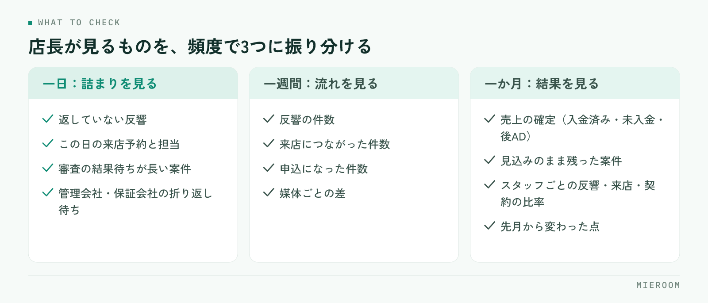

<!--META
{
  "title": "賃貸仲介の店長がやること｜一日・一週間・一か月の見る順番",
  "date": "2026-10-11",
  "category": "組織・育成",
  "excerpt": "賃貸仲介の店長の仕事を、一日・一週間・一か月で見るものに分けて整理しました。朝と夕方に確認する項目、週次で見る反響と来店の流れ、月次で見る売上とスタッフごとの差、自分でやることと任せることの分け方までまとめています。",
  "hook": "店長の仕事は、見る順番を決めると軽くなる",
  "tags": ["店長", "店舗運営", "組織づくり", "数字管理", "賃貸仲介"]
}
META-->

店長になった直後にいちばん困るのは、やることが多いことではありません。**何をどの頻度で見ればいいのかが決まっていないこと**です。目の前の接客に入れば一日は終わりますが、それだけでは店の数字は動きません。見るものを一日・一週間・一か月に振り分けておくと、同じ時間でも手が届く範囲が変わります。

<h4>この記事の結論</h4>
店長の仕事は、<strong>頻度ごとに見るものを決めて、毎回同じ項目を見ること</strong>で軽くなります。一日は動いている案件の詰まり、一週間は反響から来店までの流れ、一か月は売上の確定とスタッフごとの差。毎回違う項目を見ていると、気づくのが遅れます。

## 店長の仕事は、見る順番が決まっていないと重くなる

店長の仕事を並べると、接客、スタッフの指導、物件の確保、管理会社やオーナーとのやり取り、売上の管理、シフト、クレームの対応と、きりがありません。すべてを同じ重さで持つと、結局は目の前で声が大きいものから手を付けることになります。

<figure class="fig"><figcaption>毎回同じ項目を見ることで、変化に気づけるようになります。</figcaption></figure>

ここで起きるのが、**急ぎの仕事に一日が埋まり、気づける仕事が後回しになる状態**です。申込が止まっている案件、連絡が返っていない反響、成績が落ちているスタッフ。どれも今日困るわけではないので、明日に回ります。そして困る形になって現れたときには、手を打つには遅い状態になっています。

防ぐ方法は、見る項目を頻度で固定することです。毎日見るもの、週に1回見るもの、月に1回見るもの。これを決めてしまえば、判断の回数そのものが減ります。見落としを人の記憶力で防ごうとしないことが出発点です。

## 一日：朝に見るもの、夕方に見るもの

一日のなかで店長が見るのは、**動いている案件が詰まっていないか**だけです。この日の売上を気にしても動きません。

朝に見るものを挙げます。

- 前日に入った反響で、まだ返していないものがあるか
- この日の来店予約と、担当が決まっているか
- 申込中の案件で、審査の結果待ちが長くなっているものがあるか
- 管理会社・保証会社からの折り返し待ちになっているもの

夕方に見るものは、朝に挙げたものが動いたかどうかです。返したか、来店につながったか、審査が進んだか。**ここで止まっているものだけを拾えば、翌朝に持ち越す数が減ります**。

やってはいけないのは、朝礼で前日の売上を読み上げて終わることです。数字の報告は状況の共有にはなりますが、詰まりは見つかりません。見るのは金額ではなく、止まっている案件の件数です。

## 一週間：反響から来店までの流れを見る

週に1回見るのは、入口から出口までの流れです。反響が何件入って、何件が来店につながり、何件が申込になったか。これを週単位で並べます。

ここで分かるのは、**どこで落ちているか**です。反響が少なければ集客の問題、反響はあるのに来店が少なければ一次対応の問題、来店はあるのに申込が少なければ接客か物件の問題。原因の置き場所が違えば打ち手も変わるので、まとめて「売上が足りない」と見ないことが大事です。

もう一つ週次で見たいのが、媒体ごとの差です。どの媒体からの反響が来店まで進んでいるかを見ると、広告費の掛け方の判断材料になります。見方は[反響の管理方法](./hankyo-kanri-hoho.html)にも整理しています。

✓週次は曜日を固定する

「余裕があるときに見る」にすると、忙しい週ほど見なくなります。繁忙期に見なくなるのがいちばん困るので、曜日と時間を決めて予定に入れてください。10分でも、毎週同じ項目を見ることのほうが効きます。

## 一か月：売上の確定と、スタッフごとの差

月に1回見るのは、確定した数字とスタッフごとの違いです。週次が流れを見る作業なら、月次は結果を確かめて配り方を考える作業になります。

見る順番は次のとおりです。

1. 今月の売上が確定したか（入金済み・未入金・後ADの未回収を分ける）
2. 見込みのまま残っている案件が、翌月に動くのか落ちたのか
3. スタッフごとの反響数・来店数・契約数と、その比率
4. 先月から変わった点があるか

ここで**見込みと確定を混ぜないことが、いちばん間違いを防ぎます**。申込が入った時点の金額をそのまま売上として数えていると、キャンセルや審査落ちのたびに数字が後から動き、翌月の目標設定が狂います。

スタッフごとの差は、件数より比率で見てください。反響を多く持っている人の契約数が多いのは当然で、見たいのは反響に対して何件来店につながり、来店に対して何件申込になったかです。比率で見ると、どこを教えればいいかが絞れます。並べ方は[スタッフの成績管理](./staff-seiseki-kanri.html)にまとめています。

## 自分でやることと、任せることの分け方

店長が全部を抱えると、店は店長の処理能力で止まります。分け方の基準は役職ではなく、**その仕事が止まったときに外に影響が出るか**です。

| 仕事の種類 | 扱い方 |
|---|---|
| 判断が必要なもの（条件の交渉、クレームの最終対応、例外の可否） | 店長が持つ |
| 期限があり、遅れると取引先に影響するもの（審査の依頼、契約書類の手配） | 担当を決めて任せ、期限だけ店長が見る |
| 手順が決まっているもの（物件情報の入力、反響の一次対応、資料の作成） | 任せる。手順書があれば引き継げる |
| 数字をまとめる作業（売上の集計、成績の集計） | 手で集計しない形にする |

任せるときに必要なのは、**判断の基準を先に渡しておくこと**です。「この範囲までは自分で決めていい、超えたら相談」が言語化されていないと、スタッフは全部を確認に来るか、勝手に決めて後で問題になるかのどちらかになります。手順を渡す形は[業務マニュアルの作り方](./gyomu-manual-tsukurikata.html)が参考になります。

!集計作業は任せる対象ではない

売上や成績の集計を誰かに任せても、店の手間は減りません。集計している間は数字が見えず、出てきたときには月が変わっています。これは人を割り当てる仕事ではなく、入力した時点で見える形にする仕事です。

## よくある失敗：全部を見ようとして、どれも見ていない

店長になって気合が入っている時期に起きやすいのが、毎日すべての数字を見ようとすることです。日次で売上、日次でスタッフ成績、日次で媒体ごとの反響。これは続きません。そして続かなくなったときに、見る習慣そのものが消えます。

もう一つ多いのが、**数字を見る目的が「報告のため」になること**です。本部や経営者に出す資料を作ることが目的になると、作った時点で終わり、打ち手につながりません。見るのは自分が次に何をするかを決めるためです。

逆に、繁忙期だけ数字を見るのも遅れます。繁忙期に打てる手は限られており、仕込みは閑散期にしかできません。閑散期に何をするかは[閑散期にやること](./kansanki-yarukoto.html)、繁忙期の目標の立て方は[繁忙期の売上目標](./hanbouki-uriage-mokuhyo.html)に整理しています。

店長も接客に入るべきですか？

店の規模によります。人数が少ない店では入らざるを得ませんが、その場合は「店長が接客に入っている時間は、見る仕事ができない」と前提を置いてください。問題になるのは、接客に入る前提でいながら週次・月次の確認も予定に入れていない状態です。接客に入るなら、見る時間は別に確保して予定として押さえておく必要があります。

スタッフの成績を本人に開示したほうがよいですか？

開示するほうが機能しますが、順番があります。件数だけを並べて貼り出すと、反響の配り方が違うことへの不満が出ます。先に比率で見る形を説明し、何を改善してほしいのかを添えてから開示してください。評価のためではなく、教えるための材料だと伝わる形にすることが前提です。

店長になったばかりで、何から手を付ければよいですか？

まず日次の確認項目を4つ程度に絞って、毎朝同じものを見ることから始めてください。止まっている案件が見えるようになると、週次・月次で見たいものが自然に決まります。逆に最初から月次の資料づくりを整えようとすると、日々の詰まりに気づけないまま時間が過ぎます。

## まとめ：頻度を決めて、毎回同じ項目を見る

賃貸仲介の店長の仕事は、一日・一週間・一か月で見るものを振り分けると軽くなります。一日は動いている案件の詰まり、一週間は反響から来店・申込への流れと媒体ごとの差、一か月は売上の確定とスタッフごとの比率。毎回同じ項目を見ることで、変化に気づけるようになります。

任せる基準は、判断が必要かどうか。手順が決まっているものは渡し、集計作業は人に割り当てずに見える形へ寄せる。**店長が抱えるべきは判断で、作業ではありません**。

案件の詰まりと売上の確定、スタッフごとの反響・来店・契約を同じ画面で追える形にしたい場合は、[ミエルーム](../index.html)の売上管理・接客管理の画面をご覧ください。いまお使いのExcelデータのインポートと初期設定の代行にも対応しており、デモアカウントを発行して店舗の運用に合うかどうかからご確認いただけます。
