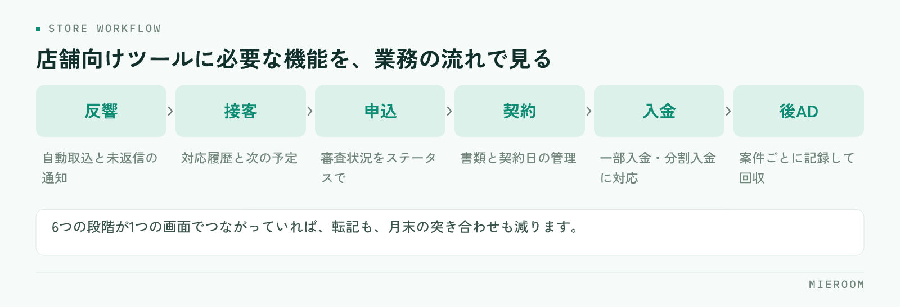

<!--META
{
  "title": "賃貸仲介の店舗向けツールに必要な機能｜1店舗から使える業務管理の条件",
  "date": "2026-09-04",
  "category": "業務効率化",
  "excerpt": "賃貸仲介の店舗向けツールに必要な機能を、反響から接客・申込・契約・入金・後ADまでの流れごとに整理。多店舗向けとの違い、現場が使い続ける画面の条件、導入前に決める運用、大きすぎるシステムを避ける判断基準を解説します。",
  "tags": ["店舗向けツール", "賃貸仲介", "業務管理", "業務効率化", "申込管理表"]
}
META-->

賃貸仲介の店舗向けツールに必要なのは、機能の多さではなく、反響から入金までの流れが1つの画面でつながっていることです。1店舗の規模なら、大がかりな基幹システムより、現場が毎日触れる軽さと、後ADや一部入金まで追える賃貸特化の設計を優先すべきです。この記事では、店舗単位で必要な機能を業務の流れごとに整理し、多店舗向けとの違い、導入前に決めておく運用、大きすぎるシステムを避ける判断基準まで解説します。

## 賃貸仲介の店舗向けツールに必要な機能を、業務の流れで整理する

店舗の業務は、反響を受けてから入金を確認するまで一本の流れになっています。必要な機能もこの流れに沿って考えると抜けがありません。

<figure class="fig"><figcaption>前半は取りこぼしを防ぐ機能、後半は売上を確定させる機能です。</figcaption></figure>

- 反響：ポータルの反響メールや自社フォームの自動取込、未返信の見える化、媒体別の反響数
- 接客：来店予約と接客記録、他決・申込といった結果、担当別の接客数
- 申込：申込管理表（審査状況、契約予定日、仲介手数料、AD、付帯の内容）
- 契約：社内の契約書・重説フォーマットへの顧客情報の差し込み
- 入金：仲介手数料・AD・付帯それぞれの入金確認、一部入金や分割入金の残額
- 後AD：案件ごとの入金予定と実績、未入金だけを抜き出したリスト

賃貸店舗の業務システムを選ぶときは、この六つの段階のどこかが欠けていないか、段階の間で情報が切れていないかを見ます。反響の記録と申込の記録が別のツールにあると、**どの媒体の反響が契約になったのか**を追えなくなります。

## 反響から申込まで：取りこぼしを防ぐ機能

前半の流れで重要なのは、対応の漏れをなくすことです。反響は待ってくれないため、ポータルからのメールが自動で一覧に入り、未返信のものがひと目で分かる状態が要ります。手作業で転記している店舗では、転記そのものが初動の遅れになります。

追客も店舗向けツールの守備範囲です。来店に至らなかった反響へLINEやSMSで定期的に連絡する仕組みがあれば、担当者が忘れても接点が続きます。接客管理表には来店日、提案した物件、結果（申込・他決・検討中）を残し、担当別の接客数と申込数が自動で集計される形が理想です。

初動の速さがなぜ成約に効くのかは、[反響の初動5分。返信スピードが成約率を左右する理由。](./lead-response-speed.html)で詳しく解説しています。

## 契約から入金・後ADまで：売上を確定させる機能

後半の流れで重要なのは、契約した案件を「本当の売上」まで持っていくことです。賃貸仲介では契約と入金のタイミングがずれ、ADが後から入ることも多いため、申込管理表には**確定売上と見込みを分けて持つ**設計が欠かせません。

具体的には、案件ごとに仲介手数料・AD・付帯の請求額と入金額を持ち、一部入金なら残額が見える。後ADは入金予定日を登録し、予定日を過ぎた未入金だけを抽出できる。この二つがあるだけで、月末に「入っているはずのお金」を探す作業が消えます。申込管理表の列設計は[賃貸仲介の申込管理表の作り方｜Excelで漏れが出る原因と項目設計の正解](./moushikomi-kanrihyo-tsukurikata.html)で解説しています。

契約書類の作成も、この段階の負担を左右します。自社の契約書や重説のフォーマットに申込管理表の顧客情報をそのまま差し込める機能があれば、転記ミスと作成時間の両方を減らせます。

## 多店舗向けと1店舗向けで、何が違うのか

同じ賃貸仲介の店舗管理ツールでも、多店舗向けと1店舗向けでは重視する点が異なります。

- 多店舗向けで重要なこと：店舗を横断した集計、店舗ごとの権限設定、本部から全店の売上・反響・ランキングを見る画面
- 1店舗向けで重要なこと：入力の軽さ、初期設定の少なさ、担当者が兼務でも回ること、外出先からスマホで確認できること
- 両方に共通すること：確定売上と見込みの定義、後ADや一部入金の扱いといった数字の作り方

1店舗の段階で多店舗向けの重い設定を求められると、使い始める前に力尽きます。一方で、店舗が増えたときにツールごと入れ替えるのも大きな負担です。理想は、**1店舗から始められて、増えても同じ画面のまま使える**設計です。判断するときは、店舗が2つになった日に何を設定し直すことになるのかを、導入前に確認しておくと確実です。

## 現場が使い続ける画面の条件

機能が揃っていても、現場が触らなければ数字は溜まりません。使い続けられる画面には共通点があります。

- 1件の入力が接客の合間に終わる。必須項目が少なく、選択肢で入力できる
- 入力した結果が自分に返ってくる。自分の未対応反響、申込中の案件、今月の成績が見える
- スマホで開ける。案内の移動中や物確の合間に確認できる
- 自動で入る部分が多い。反響メールやフォームの取込、契約書類への差し込み
- 画面の言葉が現場の言葉。反響・追客・申込・審査・ADと、呼び方がそのまま一致している

とくに二つ目は見落とされがちです。入力が上に報告するための作業になると、忙しい月から止まります。自分の成績や未対応が見える画面なら、入力は自分のための行為になり、指示しなくても続きます。

## 導入前に決めておく運用：誰が・いつ・何を入力するか

ツールを選ぶ前に、入力の担当と期限を決めておくと、導入後の混乱がなくなります。1店舗の標準的な形は次のとおりです。

- 反響：受け付けた人がその場で登録する。自動取込なら媒体と担当の確認だけ
- 接客：担当者が接客後、当日中に結果まで記録する
- 申込：担当者が申込受付時に登録し、審査結果が出たら更新する
- 契約・入金：店長または事務担当が、入金を確認するたびに消し込む
- 後AD：契約時に入金予定を登録し、入金時に実績を入れる
- 締め：店長が締め日に、未入力と未入金を確認する

この一覧をそのまま設定できないツールは、店舗の業務に合っていない可能性があります。逆に、ここが埋まっていれば導入後に迷うことはほぼありません。選び方の基本は[賃貸仲介の業務改善ツール完全ガイド](./chintai-gyomu-kaizen-tool.html)にまとめています。

## 「大きすぎるシステム」を避ける判断基準

多機能なシステムほど安心に見えますが、1店舗にとっては過剰な場合があります。次のどれかに当てはまるなら、慎重に検討してください。

- 使わない機能の設定を済ませないと、使い始められない
- 導入に専任の担当者や長い準備期間が必要になる
- 入力項目が、自店舗の業務で実際に使う項目より明らかに多い
- 1店舗だけで試せない。契約前に実際の画面を触って確かめられない
- やめるときにデータを持ち出せない

どれも「1店舗で完結するか」を測る質問です。当てはまる項目が多いほど、導入の準備そのものが本業を圧迫します。

サービスごとの守備範囲の違いは、[賃貸仲介の業務管理システム比較](../compare.html)で確認できます。

## まとめ：1店舗から使える店舗向けツールの条件

賃貸仲介の店舗向けツールに必要なのは、反響→接客→申込→契約→入金→後ADの六つの段階が1つの画面でつながっていること、確定売上と見込みを分けて持てること、現場が接客の合間に入力を終えられる軽さの三つです。導入前に「誰が・いつ・何を入力するか」を決めておけば、大きすぎるシステムに振り回されることもありません。

店舗向けツールの価値は、毎日の業務を軽くしながら数字が自然に溜まることにあります。

この六つの段階を1つの画面にまとめた賃貸仲介向けの業務管理SaaSが [ミエルーム](../index.html) です。反響管理・接客管理・申込管理表・売上管理がつながり、後ADの入金予定と実績、一部入金・分割入金、確定売上と見込みの分離まで扱えます。フォーム・メールの自動取込や社内契約フォーマットへの自動取込もあり、1店舗から多店舗まで同じ仕組みのまま使え、最短即日で使い始められます。1店舗の規模で過剰にならないかを確かめたい方には実際の画面をお見せしますので、まずはご連絡ください。
