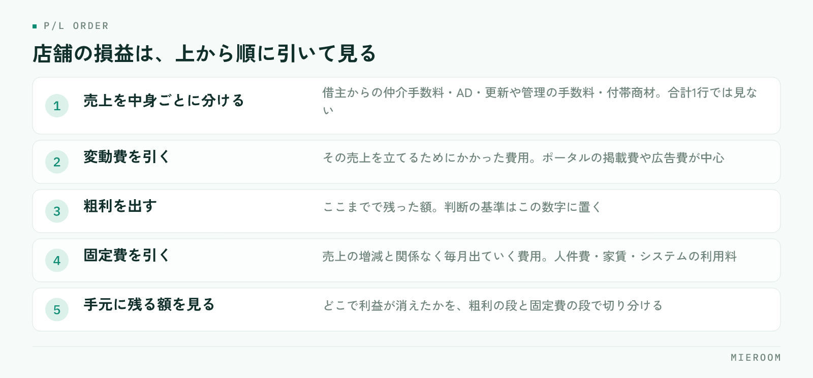

<!--META
{
  "title": "店舗の損益の見方｜売上ではなく粗利で判断するための整理",
  "date": "2026-09-28",
  "category": "売上管理",
  "excerpt": "賃貸仲介の店舗の損益の見方を、売上ではなく粗利で判断するという観点で整理しました。売上を中身ごとに分ける、広告費を媒体ごとに突き合わせる、人件費を粗利で見る、という順番でまとめています。",
  "hook": "売上は出ているのに利益が残らない理由",
  "tags": ["損益管理", "粗利", "売上管理", "広告費", "店舗運営"]
}
META-->

月の売上は目標に届いた。それでも通帳の残りは増えていない。賃貸仲介の店舗運営で、この感覚は珍しくありません。原因はたいてい、**判断の基準を売上に置いたまま、粗利を見ていないこと**にあります。

<h4>この記事の結論</h4>
店舗の損益は、売上の合計ではなく<strong>粗利（売上から広告費などの変動費を引いた額）</strong>で判断します。売上は中身によって費用のかかり方が違うため、合計だけを見ていると「稼いだつもりで減っている」状態に気づけません。

## 売上が伸びても利益が残らない理由

賃貸仲介の売上は、1件ごとに費用のかかり方が違います。ポータルサイトの掲載費をかけて取った反響から決まった契約と、以前のお客様の紹介で決まった契約では、同じ金額の売上でも手元に残る額が変わります。

売上の合計だけを見ていると、この違いが消えます。目標に届いたかどうかは分かりますが、**どの売上が利益を生み、どの売上が費用を食っていたのか**は分かりません。

翌月の判断に必要なのは、まさにこの部分です。掲載を増やすのか、絞るのか。売上の合計からは答えが出てきません。

## 賃貸仲介の売上は、中身が均質ではない

まず、売上を中身ごとに分けて見ます。賃貸仲介の店舗で立つ売上には、少なくとも次のような種類があります。

- 借主からの仲介手数料
- 貸主・管理会社からの広告料（AD）
- 更新や管理に関わる手数料
- 付帯商材の紹介手数料

これらは、獲得にかかる費用がまったく違います。広告費をかけた反響から生まれるものと、既存の取引先との関係から生まれるものが混ざっています。

合計を1行で見ていると、**広告費をかけずに立った売上が、広告費をかけた売上の効率の悪さを隠します**。逆もあります。掲載を増やした月に売上が伸びたように見えても、増えた分がすべて掲載費で消えていることがあります。

## 店舗の損益は、この順番で見る

損益を見る順番は決まっています。上から順に引いていきます。

<figure class="fig"><figcaption>粗利の段階で薄いなら広告費の使い方、粗利は出ているのに残らないなら固定費の水準を見ます。</figcaption></figure>

売上を中身ごとに分けて出したら、次に**その売上を立てるためにかかった費用（変動費）**を引きます。賃貸仲介では、ポータルサイトの掲載費や広告費が中心です。ここまでで残った額が粗利になります。

粗利から、**売上の増減とは関係なく毎月出ていく費用（固定費）**を引きます。人件費、家賃、システムの利用料などです。ここまで引いて残ったものが、店舗として手元に残った額です。

この順番を守ると、どこで利益が消えているかが見えます。粗利の段階で薄いなら広告費の使い方、粗利は出ているのに残らないなら固定費の水準、という切り分けができます。

## 売上で判断する場合と、粗利で判断する場合の違い

同じ数字を見ていても、基準を変えると打ち手が変わります。

| | 売上で判断する | 粗利で判断する |
|---|---|---|
| 目標の立て方 | 月の売上合計 | 粗利の額 |
| 広告を増やすか | 反響数が増えるなら増やす | 媒体ごとの粗利が残るなら増やす |
| 好調の判断 | 前年より売上が多い | 前年より粗利が多い |
| 不調のときの打ち手 | 掲載を増やす | どこで利益が消えたかを先に特定する |
| 見落としやすいこと | 掲載費の増加 | ―― |

売上で判断すると、不調のときに「掲載を増やす」という結論になりやすくなります。反響は増えますが、粗利が残るかどうかは別の話です。

## 広告費は、媒体ごとに粗利と突き合わせる

広告費を1つの合計として見ている店舗は少なくありません。ですが、掲載している媒体は複数あり、それぞれ反響の質が違います。

見るのは、媒体ごとの**「掲載費」と「その媒体から生まれた契約の売上」**です。反響数ではありません。反響が多い媒体と、契約になる媒体は一致しないことがあります。媒体ごとの判断のしかたは[広告費のROIを見る](./media-roi.html)にまとめています。

この突き合わせには、反響がどの媒体から来たかを契約まで追える記録が必要です。反響の記録と契約の記録が別の場所にあると、この計算は毎月の手作業になります。

## 人件費は、粗利で割って考える

人を増やすかどうかの判断も、売上ではなく粗利で見ます。売上に対して人件費が何割か、という見方をしていると、広告費が膨らんだ月に判断を誤ります。

見るべきは、**粗利に対して人件費がどれくらいを占めているか**です。粗利が薄い月に人を増やすと、固定費だけが増えます。

もうひとつ、スタッフ1人あたりの粗利も並べて見ます。1人あたりが下がっているなら、人数ではなく反響の配分か接客の進め方に原因があることが多いです。記録の付け方は[スタッフの成績管理](./staff-seiseki-kanri.html)を参考にしてください。

## 月末にまとめて集計すると、判断が1か月遅れる

粗利で判断すると決めても、集計が月末にまとめて行われていると、数字が出るのは翌月の中旬です。その時点で分かった不調は、すでに1か月分進んでいます。

避けたいのは、月末に売上と広告費を別々のExcelから拾い集める形です。この作業は時間がかかるうえ、間に合わなかった月は集計そのものが飛びます。判断のための数字が、忙しい月にだけ欠ける状態になります。

日々の契約入力の時点で、売上の中身と媒体が記録に残っていれば、月中でも粗利の見通しが立ちます。集計を自動化する考え方は[月末の売上集計を自動化する](./getsumatsu-uriage-shukei-jidoka.html)にまとめています。

粗利はどこまでを変動費として引けばよいですか？

「その売上を立てるために、その月に追加で発生した費用」を目安にしてください。賃貸仲介ではポータルサイトの掲載費や広告費が中心です。家賃や固定給のように、契約件数が増えても変わらない費用は固定費として後段で引きます。厳密な会計基準より、毎月同じ区分で続けられることが大切です。

売上目標と粗利目標は、両方立てるべきですか？

両方あって構いませんが、判断の基準は粗利に置いてください。売上目標だけを追うと、掲載費を増やして反響を積む方向に寄りやすくなります。粗利の目標を先に決め、そこから必要な売上と使える広告費を逆算する形が整理しやすいです。

店舗が1つで、経理も自分でやっています。ここまで細かく見る必要がありますか？

全部を一度に始める必要はありません。まず売上を「借主からの手数料」「AD」「その他」に分け、広告費を媒体ごとに分ける。この2つだけでも、粗利の動きは見えるようになります。項目を増やすのは、続けられる形になってからで構いません。

## まとめ：判断の基準を、売上から粗利に移す

店舗の損益の見方は、売上の合計を追うことではありません。売上を中身ごとに分け、広告費などの変動費を引いて粗利を出し、そこから固定費を引く。この順番で見ると、利益がどこで消えているかが分かります。

そして、広告費は媒体ごとに、人件費は粗利に対して見る。この2つを月中に確認できる状態にしておくと、翌月の打ち手が早く決まります。逆に、月末にまとめて集計している限り、判断はいつも1か月遅れます。

反響から契約、売上の中身までを一か所に記録し、確定した売上と見込みを分けて見られる形を探している場合は、[ミエルーム](../index.html)が対応しています。デモアカウントの発行と、既存のExcelデータの取り込み・初期設定の代行にも対応していますので、まずは今の集計のしかたを見てほしいという段階でもお気軽にご相談ください。
